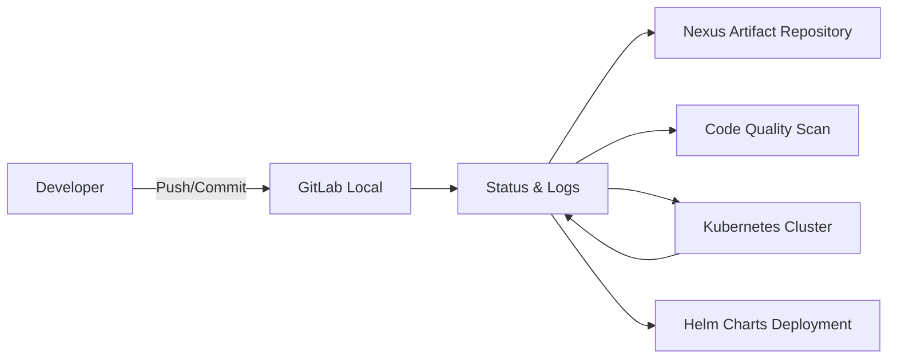

# 🧩 Local CI/CD Lab Environment on M1 Mac

This document describes the setup of a **fully local CI/CD lab environment** on an Apple M1 Mac (16GB RAM) using **Jenkins, Nexus, SonarQube, GitLab (local), Minikube**, and **Helm** for Kubernetes deployments.

---

## Table of Contents

1. [🔹 Objective](#-objective)
2. [🔹 Architecture Overview](#-architecture-overview)
3. [🔹 Step-by-Step Setup](#-step-by-step-setup)

---

## 🔹 Objective

- Fully offline, no external resources
- Local GitLab instance for version control
- Jenkins as CI/CD pipeline engine
- Nexus as artifact repository (Docker images / Helm charts / Maven/NPM packages)
- SonarQube for code quality analysis
- Minikube as local Kubernetes cluster
- Helm for declarative, reusable deployments
- Optimal resource utilization for M1 (ARM64)

---

## 🔹 Architecture Overview



- **GitLab:** Local version control system
- **Jenkins:** CI/CD pipeline
- **Nexus:** Storage for Docker images, Helm charts, packages
- **SonarQube:** Source code quality analysis
- **Minikube:** Local Kubernetes environment
- **Helm:** Template-based deployment pipelines

---

## 🔹 Step-by-Step Setup

### 1) Local GitLab Repository

```bash
mkdir -p ~/ci-lab/gitlab/data
docker run --name gitlab \
--hostname gitlab.local \
-p 8929:8929 -p 2289:22 \
-v ~/ci-lab/gitlab/data:/var/opt/gitlab \
gitlab/gitlab-ce:latest
```

- Access: `http://localhost:8929`
- Set root password locally
- Create offline repositories

---

### 2) Jenkins Installation

```bash
mkdir -p ~/ci-lab/jenkins
docker run -d --name jenkins \
-p 8080:8080 -p 50000:50000 \
-v ~/ci-lab/jenkins:/var/jenkins_home \
jenkins/jenkins:lts
```

- Offline plugins: Upload `.hpi` files locally
- Create pipeline projects using local GitLab repos

---

### 3) Nexus Repository

```bash
mkdir -p ~/ci-lab/nexus/data
docker run -d --name nexus \
-p 8081:8081 \
-v ~/ci-lab/nexus/data:/nexus-data \
sonatype/nexus3:latest
```

- Create local Maven/NPM/Raw and Docker registries
- Helm charts can be stored as `.tgz` packages in Nexus

---

### 4) SonarQube

```bash
mkdir -p ~/ci-lab/sonarqube/data
docker run -d --name sonarqube \
-p 9000:9000 \
-v ~/ci-lab/sonarqube/data:/opt/sonarqube/data \
sonarqube:community
```

- Access: `http://localhost:9000`
- Analyze local projects

---

### 5) Minikube + Helm Setup

```bash
brew install minikube helm
minikube start --driver=docker --memory=4096 --cpus=2

# Configure Helm repository locally
helm repo add local-nexus http://localhost:8081/repository/helm-hosted/
helm repo update
```

- Use local Docker images in Minikube:

```bash
eval $(minikube docker-env)
docker build -t myapp:latest ~/ci-lab/workspace/myapp
```

---

### 6) Helm Chart Example

**Structure:**

```text
myapp-chart/
├── Chart.yaml
├── values.yaml
├── templates/
│   ├── deployment.yaml
│   └── service.yaml
```

**templates/deployment.yaml**

```yaml
apiVersion: apps/v1
kind: Deployment
metadata:
    name: {{ .Release.Name }}
spec:
  replicas: {{ .Values.replicaCount }}
  selector:
    matchLabels:
      app: {{ .Release.Name }}
  template:
    metadata:
      labels:
        app: {{ .Release.Name }}
    spec:
      containers:
        - name: {{ .Release.Name }}
          image: {{ .Values.image.repository }}:{{ .Values.image.tag }}
          ports:
          - containerPort: 80
```

**values.yaml**

```yaml
replicaCount: 2
image:
  repository: myapp
  tag: latest
service:
  type: ClusterIP
  port: 80
```

---

### 7) Jenkinsfile Pipeline mit Helm

```groovy
pipeline {
    agent any
    environment {
        DOCKER_HOST = 'unix:///var/run/docker.sock'
    }
    stages {
        stage('Checkout') {
            steps { git url: 'http://localhost:8929/mygroup/myapp.git' }
        }
        stage('Build Docker') {
            steps { sh 'docker build -t myapp:latest .' }
        }
        stage('Test') {
            steps { sh './run_tests.sh' }
        }
        stage('Code Quality') {
            steps { sh 'sonar-scanner -Dsonar.projectKey=myapp -Dsonar.host.url=http://localhost:9000' }
        }
        stage('Push Artifact') {
            steps {
                sh '''
                docker save myapp:latest -o myapp.tar
                mv myapp.tar ~/ci-lab/nexus/data/
                '''
            }
        }
        stage('Helm Deploy') {
            steps {
                sh '''
                helm package myapp-chart
                mv myapp-chart-*.tgz ~/ci-lab/nexus/data/
                helm install myapp ~/ci-lab/nexus/data/myapp-chart-*.tgz --namespace dev --create-namespace
                '''
            }
        }
    }
}
```

---

### 8) Resource Management on M1 (16GB RAM)

| Component  | CPU | RAM |
|------------|-----|-----|
| Jenkins    | 1   | 2GB |
| Nexus      | 1   | 2GB |
| SonarQube  | 1   | 2GB |
| GitLab     | 1   | 2GB |
| Minikube   | 2   | 4GB |

- Reserve remaining for macOS and swapping

---

### 9) Logging & Monitoring

- Jenkins web UI for job logs
- SonarQube web UI for code quality
- Nexus web UI for artifacts & Helm charts
- Minikube `kubectl logs <pod>` for container logs

---

### 🔹 Advantages of This Helm-Based Lab Environment

- Fully offline
- Realistic CI/CD pipelines including Helm deployments
- Reproducible Kubernetes deployments
- All components ARM64 M1 compatible
- Flexible and extensible

---

### 🔹 Advanced Topics

- Manage local Helm repositories in Nexus
- Rollbacks via `helm rollback`
- Local testing of multiple microservices in Minikube
- Integration of Prometheus/Grafana for monitoring
- Offline plugin management for Jenkins & SonarQube

```text
