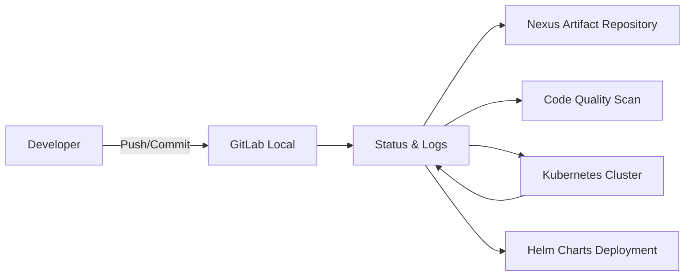

# 🧩 Local CI/CD Lab Environment on Ubuntu Host

This document describes the setup of a **fully local CI/CD lab environment** on an Ubuntu Linux host (22.04/24.04 LTS with 16GB+ RAM) using **Jenkins, Nexus, SonarQube, GitLab (local), Minikube**, and **Helm** for Kubernetes deployments.

---

## Table of Contents

1. [🔹 Objective](#-objective)
2. [🔹 Architecture Overview](#-architecture-overview)
3. [🔹 Step-by-Step Setup](#-step-by-step-setup)

---

## 🔹 Objective

- Fully offline, no external resources
- Local GitLab instance for version control
- Jenkins as CI/CD pipeline engine
- Nexus as artifact repository (Docker images / Helm charts / Maven/NPM packages)
- SonarQube for code quality analysis
- Minikube or K3s as local Kubernetes cluster
- Helm for declarative, reusable deployments
- Optimal resource utilization for Ubuntu (x86_64)

---

## 🔹 Architecture Overview



- **GitLab:** Local version control system
- **Jenkins:** CI/CD pipeline
- **Nexus:** Storage for Docker images, Helm charts, packages
- **SonarQube:** Source code quality analysis
- **Minikube/K3s:** Local Kubernetes environment
- **Helm:** Template-based deployment pipelines

---

## 🔹 Step-by-Step Setup

### 0) Host Preparation (Ubuntu)

```bash
# System update
sudo apt update && sudo apt upgrade -y

# Install Docker
sudo apt install -y docker.io docker-compose
sudo systemctl enable --now docker
sudo usermod -aG docker $USER

# Reboot or re-login for group changes
newgrp docker

# Install essential tools
sudo apt install -y git curl wget net-tools
```

---

### 1) Local GitLab Repository

```bash
# Create data directory
mkdir -p ~/ci-lab/gitlab/data

# Run GitLab container
docker run -d --name gitlab \
  --hostname gitlab.local \
  --restart always \
  -p 8929:8929 -p 2289:22 \
  -v ~/ci-lab/gitlab/data:/var/opt/gitlab \
  -v ~/ci-lab/gitlab/logs:/var/log/gitlab \
  -v ~/ci-lab/gitlab/config:/etc/gitlab \
  -e GITLAB_OMNIBUS_CONFIG="external_url 'http://gitlab.local:8929'; gitlab_rails['gitlab_shell_ssh_port'] = 2289;" \
  gitlab/gitlab-ce:latest

# Wait for GitLab to start (5-10 minutes)
docker logs -f gitlab
```

- Access: `http://localhost:8929`
- Get initial root password: `docker exec -it gitlab grep 'Password:' /etc/gitlab/initial_root_password`
- Set new root password via web UI
- Create offline repositories

**Add to /etc/hosts:**

```bash
echo "127.0.0.1 gitlab.local" | sudo tee -a /etc/hosts
```

---

### 2) Jenkins Installation

```bash
# Create Jenkins home directory
mkdir -p ~/ci-lab/jenkins

# Run Jenkins container
docker run -d --name jenkins \
  --restart always \
  -p 8080:8080 -p 50000:50000 \
  -v ~/ci-lab/jenkins:/var/jenkins_home \
  -v /var/run/docker.sock:/var/run/docker.sock \
  -v $(which docker):/usr/bin/docker \
  jenkins/jenkins:lts

# Get initial admin password
docker exec jenkins cat /var/jenkins_home/secrets/initialAdminPassword
```

- Access: `http://localhost:8080`
- Install suggested plugins
- Create admin user
- Install additional plugins:
  - Docker Pipeline
  - Kubernetes
  - GitLab Plugin
  - SonarQube Scanner
  - Nexus Artifact Uploader

**Fix Docker permissions in Jenkins container:**

```bash
docker exec -u root jenkins chmod 666 /var/run/docker.sock
```

---

### 3) Nexus Repository

```bash
# Create Nexus data directory
mkdir -p ~/ci-lab/nexus/data
sudo chown -R 200:200 ~/ci-lab/nexus/data

# Run Nexus container
docker run -d --name nexus \
  --restart always \
  -p 8081:8081 -p 8082:8082 \
  -v ~/ci-lab/nexus/data:/nexus-data \
  sonatype/nexus3:latest

# Wait for Nexus to start (2-3 minutes)
docker logs -f nexus
```

- Access: `http://localhost:8081`
- Get admin password: `docker exec nexus cat /nexus-data/admin.password`
- Login with admin / initial password, set new password
- Create repositories:
  - **docker-hosted** (port 8082) for Docker images
  - **maven2-hosted** for Maven artifacts
  - **npm-hosted** for NPM packages
  - **raw-hosted** for Helm charts (or use helm-hosted)

**Configure Docker registry:**

```bash
# Add insecure registry to Docker daemon
sudo nano /etc/docker/daemon.json
```

```json
{
  "insecure-registries": ["localhost:8082"]
}
```

```bash
sudo systemctl restart docker
```

---

### 4) SonarQube

```bash
# Increase vm.max_map_count for Elasticsearch
sudo sysctl -w vm.max_map_count=262144
echo "vm.max_map_count=262144" | sudo tee -a /etc/sysctl.conf

# Create SonarQube directories
mkdir -p ~/ci-lab/sonarqube/{data,logs,extensions}

# Run SonarQube container
docker run -d --name sonarqube \
  --restart always \
  -p 9000:9000 \
  -v ~/ci-lab/sonarqube/data:/opt/sonarqube/data \
  -v ~/ci-lab/sonarqube/logs:/opt/sonarqube/logs \
  -v ~/ci-lab/sonarqube/extensions:/opt/sonarqube/extensions \
  -e SONAR_ES_BOOTSTRAP_CHECKS_DISABLE=true \
  sonarqube:community

# Wait for SonarQube to start (2-3 minutes)
docker logs -f sonarqube
```

- Access: `http://localhost:9000`
- Default credentials: admin / admin
- Change password on first login
- Create project tokens for Jenkins integration

---

### 5) Minikube + Helm Setup

**Install Minikube:**

```bash
# Install Minikube
curl -LO https://storage.googleapis.com/minikube/releases/latest/minikube-linux-amd64
sudo install minikube-linux-amd64 /usr/local/bin/minikube

# Start Minikube with Docker driver
minikube start --driver=docker --memory=4096 --cpus=2

# Verify installation
minikube status
kubectl cluster-info
```

**Install Helm:**

```bash
# Install Helm
curl https://raw.githubusercontent.com/helm/helm/main/scripts/get-helm-3 | bash

# Verify installation
helm version

# Configure Helm repository locally (after Nexus setup)
helm repo add local-nexus http://localhost:8081/repository/helm-hosted/
helm repo update
```

**Use local Docker images in Minikube:**

```bash
# Point Docker CLI to Minikube's Docker daemon
eval $(minikube docker-env)

# Build image in Minikube's Docker
docker build -t myapp:latest ~/ci-lab/workspace/myapp

# Reset to host Docker
eval $(minikube docker-env -u)
```

---

### 6) Helm Chart Example

**Structure:**

```text
myapp-chart/
├── Chart.yaml
├── values.yaml
├── templates/
│   ├── deployment.yaml
│   └── service.yaml
```

**Chart.yaml:**

```yaml
apiVersion: v2
name: myapp
description: A Helm chart for myapp
version: 1.0.0
appVersion: "1.0"
```

**values.yaml:**

```yaml
replicaCount: 2
image:
  repository: localhost:8082/myapp
  tag: latest
  pullPolicy: IfNotPresent
service:
  type: ClusterIP
  port: 80
```

**templates/deployment.yaml:**

```yaml
apiVersion: apps/v1
kind: Deployment
metadata:
  name: {{ .Release.Name }}
  labels:
    app: {{ .Release.Name }}
spec:
  replicas: {{ .Values.replicaCount }}
  selector:
    matchLabels:
      app: {{ .Release.Name }}
  template:
    metadata:
      labels:
        app: {{ .Release.Name }}
    spec:
      containers:
        - name: {{ .Release.Name }}
          image: {{ .Values.image.repository }}:{{ .Values.image.tag }}
          imagePullPolicy: {{ .Values.image.pullPolicy }}
          ports:
            - containerPort: 80
```

**templates/service.yaml:**

```yaml
apiVersion: v1
kind: Service
metadata:
  name: {{ .Release.Name }}-service
spec:
  type: {{ .Values.service.type }}
  ports:
    - port: {{ .Values.service.port }}
      targetPort: 80
  selector:
    app: {{ .Release.Name }}
```

---

### 7) Jenkinsfile Pipeline with Helm

**Create Jenkinsfile in project root:**

```groovy
pipeline {
    agent any
    
    environment {
        DOCKER_REGISTRY = 'localhost:8082'
        IMAGE_NAME = 'myapp'
        IMAGE_TAG = "${env.BUILD_NUMBER}"
        SONAR_HOST = 'http://localhost:9000'
        NEXUS_URL = 'http://localhost:8081'
    }
    
    stages {
        stage('Checkout') {
            steps {
                git branch: 'main',
                    url: 'http://gitlab.local:8929/root/myapp.git'
            }
        }
        
        stage('Build Docker Image') {
            steps {
                script {
                    sh """
                        docker build -t ${DOCKER_REGISTRY}/${IMAGE_NAME}:${IMAGE_TAG} .
                        docker tag ${DOCKER_REGISTRY}/${IMAGE_NAME}:${IMAGE_TAG} ${DOCKER_REGISTRY}/${IMAGE_NAME}:latest
                    """
                }
            }
        }
        
        stage('Run Tests') {
            steps {
                sh './run_tests.sh || echo "No tests defined"'
            }
        }
        
        stage('Code Quality Analysis') {
            steps {
                script {
                    sh """
                        sonar-scanner \
                        -Dsonar.projectKey=myapp \
                        -Dsonar.sources=. \
                        -Dsonar.host.url=${SONAR_HOST} \
                        -Dsonar.login=<SONAR_TOKEN>
                    """
                }
            }
        }
        
        stage('Push to Nexus') {
            steps {
                sh """
                    docker login -u admin -p admin123 ${DOCKER_REGISTRY}
                    docker push ${DOCKER_REGISTRY}/${IMAGE_NAME}:${IMAGE_TAG}
                    docker push ${DOCKER_REGISTRY}/${IMAGE_NAME}:latest
                """
            }
        }
        
        stage('Package Helm Chart') {
            steps {
                sh """
                    helm package myapp-chart
                    curl -u admin:admin123 --upload-file myapp-chart-*.tgz \
                    ${NEXUS_URL}/repository/helm-hosted/
                """
            }
        }
        
        stage('Deploy to Minikube') {
            steps {
                sh """
                    eval \$(minikube docker-env)
                    helm upgrade --install myapp ./myapp-chart \
                    --set image.repository=${DOCKER_REGISTRY}/${IMAGE_NAME} \
                    --set image.tag=${IMAGE_TAG} \
                    --namespace dev --create-namespace
                """
            }
        }
        
        stage('Verify Deployment') {
            steps {
                sh """
                    kubectl rollout status deployment/myapp -n dev
                    kubectl get pods -n dev
                    kubectl get services -n dev
                """
            }
        }
    }
    
    post {
        always {
            cleanWs()
        }
        success {
            echo 'Pipeline completed successfully!'
        }
        failure {
            echo 'Pipeline failed!'
        }
    }
}
```

---

### 8) Resource Management on Ubuntu (16GB RAM)

| Component  | CPU | RAM  | Purpose |
|------------|-----|------|---------|
| Jenkins    | 1   | 2GB  | CI/CD Engine |
| Nexus      | 1   | 2GB  | Artifact Repository |
| SonarQube  | 1   | 2GB  | Code Quality |
| GitLab     | 2   | 4GB  | Version Control |
| Minikube   | 2   | 4GB  | Kubernetes Cluster |

Total: **14GB** (leaving 2GB for OS and overhead)

**Docker resource limits:**

```bash
# Edit docker-compose.yml or add to docker run:
--memory="2g" --cpus="1"
```

---

### 9) Networking & Container Communication

All containers run on Docker bridge network by default. For better isolation:

```bash
# Create custom network
docker network create ci-lab-network

# Connect containers to network
docker network connect ci-lab-network jenkins
docker network connect ci-lab-network gitlab
docker network connect ci-lab-network nexus
docker network connect ci-lab-network sonarqube

# Containers can now communicate by name:
# jenkins -> http://gitlab:8929
# jenkins -> http://nexus:8081
```

---

### 10) Logging & Monitoring

**View container logs:**

```bash
docker logs -f jenkins
docker logs -f gitlab
docker logs -f nexus
docker logs -f sonarqube
```

**Kubernetes logs:**

```bash
kubectl logs -f deployment/myapp -n dev
kubectl describe pod <pod-name> -n dev
```

**System monitoring:**

```bash
# Monitor resource usage
docker stats

# Monitor Minikube
minikube dashboard
```

---

### 11) Backup & Persistence

**Backup strategy:**

```bash
#!/bin/bash
# backup-ci-lab.sh

BACKUP_DIR=~/ci-lab-backups/$(date +%Y%m%d)
mkdir -p $BACKUP_DIR

# Stop containers
docker stop jenkins gitlab nexus sonarqube

# Backup volumes
sudo tar -czf $BACKUP_DIR/jenkins.tar.gz ~/ci-lab/jenkins
sudo tar -czf $BACKUP_DIR/gitlab.tar.gz ~/ci-lab/gitlab
sudo tar -czf $BACKUP_DIR/nexus.tar.gz ~/ci-lab/nexus
sudo tar -czf $BACKUP_DIR/sonarqube.tar.gz ~/ci-lab/sonarqube

# Start containers
docker start jenkins gitlab nexus sonarqube

echo "Backup completed: $BACKUP_DIR"
```

---

### 🔹 Advantages of This Helm-Based Lab Environment

- ✅ Fully offline and local
- ✅ Realistic CI/CD pipelines with Helm deployments
- ✅ Reproducible Kubernetes deployments
- ✅ All components x86_64 compatible
- ✅ Production-like workflow
- ✅ Cost-free (open source)
- ✅ Flexible and extensible

---

### 🔹 Advanced Topics

- **Multi-environment deployments:** dev, staging, prod namespaces
- **Helm rollbacks:** `helm rollback myapp 1 -n dev`
- **Secret management:** Kubernetes Secrets, Sealed Secrets
- **CI/CD for microservices:** Multiple pipelines with shared libraries
- **Monitoring stack:** Prometheus + Grafana in Kubernetes
- **GitOps with ArgoCD:** Automated deployments from Git
- **Local container registry:** Harbor instead of Nexus
- **Service mesh:** Istio for advanced traffic management

---

### 🔹 Troubleshooting

**GitLab container won't start:**

```bash
# Check logs
docker logs gitlab

# Increase shared memory
docker run --shm-size 256m ...
```

**Jenkins can't access Docker:**

```bash
# Fix socket permissions
docker exec -u root jenkins chmod 666 /var/run/docker.sock
```

**Nexus port conflicts:**

```bash
# Check for port conflicts
sudo netstat -tulpn | grep 8081

# Use different ports
docker run -p 8091:8081 ...
```

**Minikube won't start:**

```bash
# Delete and restart
minikube delete
minikube start --driver=docker --memory=4096

# Check driver compatibility
minikube start --driver=kvm2  # Alternative driver
```

---

### 🔹 Quick Start Commands

```bash
# Start all services
docker start gitlab jenkins nexus sonarqube
minikube start

# Stop all services
docker stop gitlab jenkins nexus sonarqube
minikube stop

# Check status
docker ps
minikube status

# Access services
# GitLab: http://localhost:8929
# Jenkins: http://localhost:8080
# Nexus: http://localhost:8081
# SonarQube: http://localhost:9000
# Minikube Dashboard: minikube dashboard
```

---

**Important:** This lab is for **learning and development purposes only**. Use strong passwords, keep software updated, and isolate the lab from production networks.
