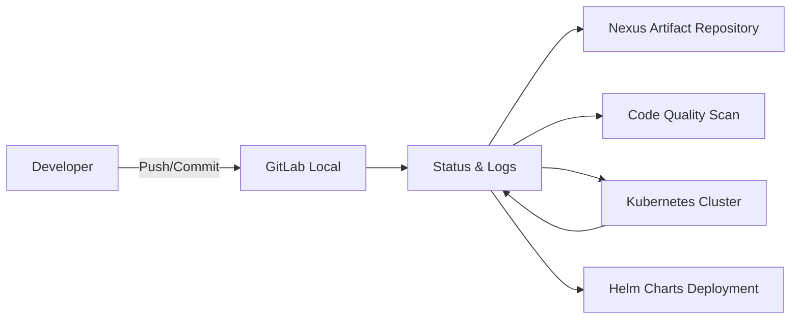

# 🧩 Local CI/CD Lab Environment on Windows Host

This document describes the setup of a **fully local CI/CD lab environment** on a Windows host (Windows 10/11 Pro or Enterprise with 16GB+ RAM) using **Jenkins, Nexus, SonarQube, GitLab (local), Minikube/Docker Desktop**, and **Helm** for Kubernetes deployments.

---

## Table of Contents

1. [🔹 Objective](#-objective)
2. [🔹 Architecture Overview](#-architecture-overview)
3. [🔹 Step-by-Step Setup](#-step-by-step-setup)

---

## 🔹 Objective

- Fully offline, no external resources
- Local GitLab instance for version control
- Jenkins as CI/CD pipeline engine
- Nexus as artifact repository (Docker images / Helm charts / Maven/NPM packages)
- SonarQube for code quality analysis
- Docker Desktop with Kubernetes or Minikube as local cluster
- Helm for declarative, reusable deployments
- Optimal resource utilization for Windows (x86_64)

---

## 🔹 Architecture Overview



- **GitLab:** Local version control system
- **Jenkins:** CI/CD pipeline
- **Nexus:** Storage for Docker images, Helm charts, packages
- **SonarQube:** Source code quality analysis
- **Docker Desktop Kubernetes or Minikube:** Local Kubernetes environment
- **Helm:** Template-based deployment pipelines

---

## 🔹 Step-by-Step Setup

### 0) Host Preparation (Windows)

**Install Docker Desktop:**

```powershell
# Using winget
winget install Docker.DockerDesktop

# Or download from: https://www.docker.com/products/docker-desktop/
```

- Enable Kubernetes in Docker Desktop settings (Settings → Kubernetes → Enable Kubernetes)
- Allocate resources: 4 CPUs, 8GB RAM minimum in Docker Desktop settings

**Install essential tools:**

```powershell
# Using winget
winget install Git.Git
winget install Microsoft.PowerShell
winget install Microsoft.VisualStudioCode

# Using Chocolatey (alternative)
choco install -y git powershell-core vscode
```

**Create lab directories:**

```powershell
# Create CI lab directory
New-Item -ItemType Directory -Path C:\ci-lab -Force
New-Item -ItemType Directory -Path C:\ci-lab\gitlab -Force
New-Item -ItemType Directory -Path C:\ci-lab\jenkins -Force
New-Item -ItemType Directory -Path C:\ci-lab\nexus -Force
New-Item -ItemType Directory -Path C:\ci-lab\sonarqube -Force
```

---

### 1) Local GitLab Repository

```powershell
# Run GitLab container
docker run -d --name gitlab `
  --hostname gitlab.local `
  --restart always `
  -p 8929:8929 -p 2289:22 `
  -v C:\ci-lab\gitlab\data:/var/opt/gitlab `
  -v C:\ci-lab\gitlab\logs:/var/log/gitlab `
  -v C:\ci-lab\gitlab\config:/etc/gitlab `
  -e GITLAB_OMNIBUS_CONFIG="external_url 'http://gitlab.local:8929'; gitlab_rails['gitlab_shell_ssh_port'] = 2289;" `
  gitlab/gitlab-ce:latest

# Wait for GitLab to start (5-10 minutes)
docker logs -f gitlab
```

- Access: `http://localhost:8929`
- Get initial root password:

```powershell
docker exec -it gitlab grep 'Password:' /etc/gitlab/initial_root_password
```

- Set new root password via web UI
- Create offline repositories

**Add to hosts file:**

```powershell
# Open Notepad as Administrator
notepad C:\Windows\System32\drivers\etc\hosts

# Add line:
# 127.0.0.1 gitlab.local
```

Or via PowerShell (Administrator):

```powershell
Add-Content -Path C:\Windows\System32\drivers\etc\hosts -Value "127.0.0.1 gitlab.local"
```

---

### 2) Jenkins Installation

```powershell
# Run Jenkins container
docker run -d --name jenkins `
  --restart always `
  -p 8080:8080 -p 50000:50000 `
  -v C:\ci-lab\jenkins:/var/jenkins_home `
  -v //var/run/docker.sock:/var/run/docker.sock `
  jenkins/jenkins:lts

# Get initial admin password
docker exec jenkins cat /var/jenkins_home/secrets/initialAdminPassword
```

- Access: `http://localhost:8080`
- Install suggested plugins
- Create admin user
- Install additional plugins:
  - Docker Pipeline
  - Kubernetes
  - GitLab Plugin
  - SonarQube Scanner
  - Nexus Artifact Uploader

**Note for Docker-in-Docker on Windows:**

If Jenkins needs to build Docker images, use Docker Desktop's shared socket or run Jenkins with DinD:

```powershell
docker run -d --name jenkins `
  --restart always `
  -p 8080:8080 -p 50000:50000 `
  -v C:\ci-lab\jenkins:/var/jenkins_home `
  -v //var/run/docker.sock:/var/run/docker.sock `
  -e DOCKER_HOST=tcp://host.docker.internal:2375 `
  jenkins/jenkins:lts
```

Enable "Expose daemon on tcp://localhost:2375 without TLS" in Docker Desktop settings.

---

### 3) Nexus Repository

```powershell
# Run Nexus container
docker run -d --name nexus `
  --restart always `
  -p 8081:8081 -p 8082:8082 `
  -v C:\ci-lab\nexus\data:/nexus-data `
  sonatype/nexus3:latest

# Wait for Nexus to start (2-3 minutes)
docker logs -f nexus
```

- Access: `http://localhost:8081`
- Get admin password:

```powershell
docker exec nexus cat /nexus-data/admin.password
```

- Login with admin / initial password, set new password
- Create repositories:
  - **docker-hosted** (port 8082) for Docker images
  - **maven2-hosted** for Maven artifacts
  - **npm-hosted** for NPM packages
  - **helm-hosted** for Helm charts

**Configure Docker insecure registry:**

In Docker Desktop: Settings → Docker Engine → Add to JSON:

```json
{
  "insecure-registries": ["localhost:8082"]
}
```

Click "Apply & restart"

---

### 4) SonarQube

```powershell
# Run SonarQube container
docker run -d --name sonarqube `
  --restart always `
  -p 9000:9000 `
  -v C:\ci-lab\sonarqube\data:/opt/sonarqube/data `
  -v C:\ci-lab\sonarqube\logs:/opt/sonarqube/logs `
  -v C:\ci-lab\sonarqube\extensions:/opt/sonarqube/extensions `
  -e SONAR_ES_BOOTSTRAP_CHECKS_DISABLE=true `
  sonarqube:community

# Wait for SonarQube to start (2-3 minutes)
docker logs -f sonarqube
```

- Access: `http://localhost:9000`
- Default credentials: admin / admin
- Change password on first login
- Create project tokens for Jenkins integration

---

### 5) Kubernetes + Helm Setup

**Option A: Docker Desktop Kubernetes (Recommended)**

```powershell
# Kubernetes is already running if enabled in Docker Desktop
# Verify installation
kubectl cluster-info
kubectl get nodes

# Install Helm
winget install Helm.Helm

# Or using Chocolatey
choco install -y kubernetes-helm

# Verify installation
helm version

# Configure Helm repository
helm repo add local-nexus http://localhost:8081/repository/helm-hosted/
helm repo update
```

**Option B: Minikube (Alternative)**

```powershell
# Install Minikube
winget install Kubernetes.minikube

# Start Minikube with Docker driver
minikube start --driver=docker --memory=4096 --cpus=2

# Verify installation
minikube status
kubectl cluster-info
```

---

### 6) Helm Chart Example

**Structure:**

```text
myapp-chart/
├── Chart.yaml
├── values.yaml
├── templates/
│   ├── deployment.yaml
│   └── service.yaml
```

**Chart.yaml:**

```yaml
apiVersion: v2
name: myapp
description: A Helm chart for myapp
version: 1.0.0
appVersion: "1.0"
```

**values.yaml:**

```yaml
replicaCount: 2
image:
  repository: localhost:8082/myapp
  tag: latest
  pullPolicy: IfNotPresent
service:
  type: ClusterIP
  port: 80
```

**templates/deployment.yaml:**

```yaml
apiVersion: apps/v1
kind: Deployment
metadata:
  name: {{ .Release.Name }}
  labels:
    app: {{ .Release.Name }}
spec:
  replicas: {{ .Values.replicaCount }}
  selector:
    matchLabels:
      app: {{ .Release.Name }}
  template:
    metadata:
      labels:
        app: {{ .Release.Name }}
    spec:
      containers:
        - name: {{ .Release.Name }}
          image: {{ .Values.image.repository }}:{{ .Values.image.tag }}
          imagePullPolicy: {{ .Values.image.pullPolicy }}
          ports:
            - containerPort: 80
```

**templates/service.yaml:**

```yaml
apiVersion: v1
kind: Service
metadata:
  name: {{ .Release.Name }}-service
spec:
  type: {{ .Values.service.type }}
  ports:
    - port: {{ .Values.service.port }}
      targetPort: 80
  selector:
    app: {{ .Release.Name }}
```

---

### 7) Jenkinsfile Pipeline with Helm

**Create Jenkinsfile in project root:**

```groovy
pipeline {
    agent any
    
    environment {
        DOCKER_REGISTRY = 'localhost:8082'
        IMAGE_NAME = 'myapp'
        IMAGE_TAG = "${env.BUILD_NUMBER}"
        SONAR_HOST = 'http://host.docker.internal:9000'
        NEXUS_URL = 'http://host.docker.internal:8081'
    }
    
    stages {
        stage('Checkout') {
            steps {
                git branch: 'main',
                    url: 'http://gitlab.local:8929/root/myapp.git'
            }
        }
        
        stage('Build Docker Image') {
            steps {
                script {
                    bat """
                        docker build -t ${DOCKER_REGISTRY}/${IMAGE_NAME}:${IMAGE_TAG} .
                        docker tag ${DOCKER_REGISTRY}/${IMAGE_NAME}:${IMAGE_TAG} ${DOCKER_REGISTRY}/${IMAGE_NAME}:latest
                    """
                }
            }
        }
        
        stage('Run Tests') {
            steps {
                bat 'run_tests.bat || echo No tests defined'
            }
        }
        
        stage('Code Quality Analysis') {
            steps {
                script {
                    withSonarQubeEnv('SonarQube') {
                        bat """
                            sonar-scanner ^
                            -Dsonar.projectKey=myapp ^
                            -Dsonar.sources=. ^
                            -Dsonar.host.url=${SONAR_HOST}
                        """
                    }
                }
            }
        }
        
        stage('Push to Nexus') {
            steps {
                bat """
                    docker login -u admin -p admin123 ${DOCKER_REGISTRY}
                    docker push ${DOCKER_REGISTRY}/${IMAGE_NAME}:${IMAGE_TAG}
                    docker push ${DOCKER_REGISTRY}/${IMAGE_NAME}:latest
                """
            }
        }
        
        stage('Package Helm Chart') {
            steps {
                bat """
                    helm package myapp-chart
                    curl -u admin:admin123 --upload-file myapp-chart-*.tgz ${NEXUS_URL}/repository/helm-hosted/
                """
            }
        }
        
        stage('Deploy to Kubernetes') {
            steps {
                bat """
                    helm upgrade --install myapp .\\myapp-chart ^
                    --set image.repository=${DOCKER_REGISTRY}/${IMAGE_NAME} ^
                    --set image.tag=${IMAGE_TAG} ^
                    --namespace dev --create-namespace
                """
            }
        }
        
        stage('Verify Deployment') {
            steps {
                bat """
                    kubectl rollout status deployment/myapp -n dev
                    kubectl get pods -n dev
                    kubectl get services -n dev
                """
            }
        }
    }
    
    post {
        always {
            cleanWs()
        }
        success {
            echo 'Pipeline completed successfully!'
        }
        failure {
            echo 'Pipeline failed!'
        }
    }
}
```

**Note:** Use `bat` instead of `sh` for Windows commands in Jenkins pipelines. Use `^` for line continuation in batch files instead of `\`.

---

### 8) Resource Management on Windows (16GB RAM)

| Component  | CPU | RAM  | Purpose |
|------------|-----|------|---------|
| Jenkins    | 1   | 2GB  | CI/CD Engine |
| Nexus      | 1   | 2GB  | Artifact Repository |
| SonarQube  | 1   | 2GB  | Code Quality |
| GitLab     | 2   | 4GB  | Version Control |
| Kubernetes | 2   | 4GB  | Container Orchestration |

Total: **14GB** (leaving 2GB for Windows OS)

**Docker Desktop resource limits:**

Settings → Resources → Advanced:

- CPUs: 4
- Memory: 12GB
- Swap: 2GB
- Disk image size: 100GB

---

### 9) Networking & Container Communication

**Access host services from containers:**

Use `host.docker.internal` instead of `localhost`:

```groovy
// In Jenkinsfile
SONAR_HOST = 'http://host.docker.internal:9000'
GITLAB_URL = 'http://host.docker.internal:8929'
```

**Custom Docker network (optional):**

```powershell
# Create custom network
docker network create ci-lab-network

# Connect containers
docker network connect ci-lab-network jenkins
docker network connect ci-lab-network gitlab
docker network connect ci-lab-network nexus
docker network connect ci-lab-network sonarqube
```

---

### 10) Logging & Monitoring

**View container logs:**

```powershell
docker logs -f jenkins
docker logs -f gitlab
docker logs -f nexus
docker logs -f sonarqube
```

**Kubernetes logs:**

```powershell
kubectl logs -f deployment/myapp -n dev
kubectl describe pod <pod-name> -n dev
```

**System monitoring:**

```powershell
# Monitor resource usage
docker stats

# Docker Desktop dashboard
# Open Docker Desktop → Containers
```

---

### 11) Backup & Persistence

**Backup strategy (PowerShell script):**

```powershell
# backup-ci-lab.ps1

$BackupDir = "C:\ci-lab-backups\$(Get-Date -Format 'yyyyMMdd')"
New-Item -ItemType Directory -Path $BackupDir -Force

# Stop containers
docker stop jenkins gitlab nexus sonarqube

# Backup volumes
Compress-Archive -Path C:\ci-lab\jenkins -DestinationPath "$BackupDir\jenkins.zip"
Compress-Archive -Path C:\ci-lab\gitlab -DestinationPath "$BackupDir\gitlab.zip"
Compress-Archive -Path C:\ci-lab\nexus -DestinationPath "$BackupDir\nexus.zip"
Compress-Archive -Path C:\ci-lab\sonarqube -DestinationPath "$BackupDir\sonarqube.zip"

# Start containers
docker start jenkins gitlab nexus sonarqube

Write-Host "Backup completed: $BackupDir"
```

**Run backup script:**

```powershell
powershell -ExecutionPolicy Bypass -File C:\ci-lab\backup-ci-lab.ps1
```

**Schedule backups with Task Scheduler:**

```powershell
# Create scheduled task
$Action = New-ScheduledTaskAction -Execute 'powershell.exe' -Argument '-ExecutionPolicy Bypass -File C:\ci-lab\backup-ci-lab.ps1'
$Trigger = New-ScheduledTaskTrigger -Weekly -DaysOfWeek Sunday -At 2am
Register-ScheduledTask -Action $Action -Trigger $Trigger -TaskName "CI-Lab-Backup" -Description "Weekly backup of CI/CD lab"
```

---

### 12) Windows-Specific Considerations

**Windows Defender exclusions:**

```powershell
# Add Docker and CI lab to exclusions
Add-MpPreference -ExclusionPath "C:\Program Files\Docker"
Add-MpPreference -ExclusionPath "C:\ci-lab"
Add-MpPreference -ExclusionProcess "dockerd.exe"
Add-MpPreference -ExclusionProcess "docker.exe"
```

**File path considerations:**

- Use forward slashes `/` in Docker volume mounts
- Use backslashes `\` in Windows paths
- Escape paths in Jenkins: `C:\\ci-lab\\workspace`

**WSL2 integration (optional):**

Docker Desktop can use WSL2 for better performance:

- Enable WSL2 in Docker Desktop settings
- Access WSL filesystems: `\\wsl$\docker-desktop-data`

---

### 🔹 Advantages of This Helm-Based Lab Environment

- ✅ Fully offline and local
- ✅ Realistic CI/CD pipelines with Helm deployments
- ✅ Reproducible Kubernetes deployments
- ✅ Native Windows integration
- ✅ Docker Desktop provides excellent GUI
- ✅ Production-like workflow
- ✅ Cost-free (open source)
- ✅ Flexible and extensible

---

### 🔹 Advanced Topics

- **Multi-environment deployments:** dev, staging, prod namespaces
- **Helm rollbacks:** `helm rollback myapp 1 -n dev`
- **Secret management:** Kubernetes Secrets, Azure Key Vault integration
- **CI/CD for microservices:** Multiple pipelines with shared libraries
- **Monitoring stack:** Prometheus + Grafana in Kubernetes
- **GitOps with ArgoCD:** Automated deployments from Git
- **Local container registry:** Harbor instead of Nexus
- **Windows containers:** Mix Linux and Windows containers in hybrid cluster
- **Azure DevOps integration:** Hybrid pipelines with local agents

---

### 🔹 Troubleshooting

**GitLab container won't start:**

```powershell
# Check logs
docker logs gitlab

# Check disk space
Get-PSDrive C

# Increase Docker resources in Docker Desktop settings
```

**Jenkins can't access Docker:**

```powershell
# Enable Docker API in Docker Desktop
# Settings → General → Expose daemon on tcp://localhost:2375 without TLS

# Update Jenkins container environment
docker stop jenkins
docker rm jenkins
docker run -d --name jenkins `
  -e DOCKER_HOST=tcp://host.docker.internal:2375 `
  -p 8080:8080 -p 50000:50000 `
  -v C:\ci-lab\jenkins:/var/jenkins_home `
  jenkins/jenkins:lts
```

**Nexus port conflicts:**

```powershell
# Check for port conflicts
netstat -ano | findstr :8081

# Kill process using port
taskkill /PID <process_id> /F
```

**Kubernetes won't start:**

```powershell
# Reset Kubernetes in Docker Desktop
# Settings → Kubernetes → Reset Kubernetes Cluster

# Or use Minikube
minikube delete
minikube start --driver=docker --memory=4096
```

**Volume mount issues:**

```powershell
# Ensure drive is shared in Docker Desktop
# Settings → Resources → File Sharing → Add C:\
```

---

### 🔹 Quick Start Commands

```powershell
# Start all services
docker start gitlab jenkins nexus sonarqube

# Stop all services
docker stop gitlab jenkins nexus sonarqube

# Check status
docker ps
kubectl get nodes

# Access services
# GitLab: http://localhost:8929
# Jenkins: http://localhost:8080
# Nexus: http://localhost:8081
# SonarQube: http://localhost:9000
# Kubernetes Dashboard: kubectl proxy (then access http://localhost:8001/api/v1/namespaces/kubernetes-dashboard/services/https:kubernetes-dashboard:/proxy/)
```

**Install Kubernetes Dashboard (optional):**

```powershell
kubectl apply -f https://raw.githubusercontent.com/kubernetes/dashboard/v2.7.0/aio/deploy/recommended.yaml

# Create admin user
kubectl create serviceaccount dashboard-admin -n kubernetes-dashboard
kubectl create clusterrolebinding dashboard-admin --clusterrole=cluster-admin --serviceaccount=kubernetes-dashboard:dashboard-admin

# Get token
kubectl -n kubernetes-dashboard create token dashboard-admin

# Start proxy
kubectl proxy

# Access: http://localhost:8001/api/v1/namespaces/kubernetes-dashboard/services/https:kubernetes-dashboard:/proxy/
```

---

**Important:** This lab is for **learning and development purposes only**. Use strong passwords, keep software updated, and isolate the lab from production networks. Consider using Windows Firewall rules to restrict access to lab services.
