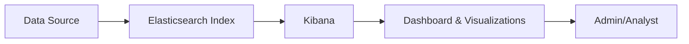
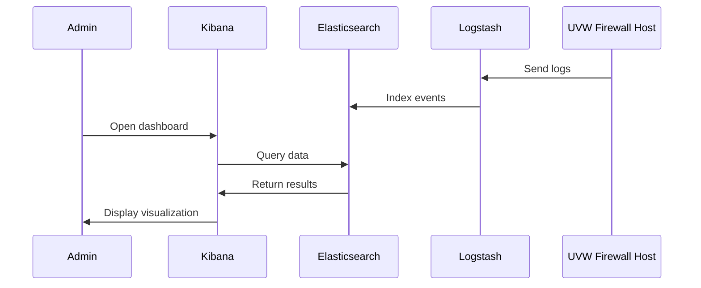

# Kibana

## Table of Contents

1. [Basics](#1-basics)
2. [Architecture Diagram](#2-architecture-diagram)
3. [Platform-Specific Installation](#3-platform-specific-installation)
    - [3.1 Linux Installation (Debian/Ubuntu)](#31-linux-installation-debianubuntu)
    - [3.2 Linux Installation (RHEL/CentOS)](#32-linux-installation-rhelcentos)
    - [3.3 MacOS Installation](#33-macos-installation)
    - [3.4 Windows Installation](#34-windows-installation)
    - [3.5 Docker Installation](#35-docker-installation)
    - [3.6 Kubernetes Installation](#36-kubernetes-installation)
4. [Dashboard Examples](#4-dashboard-examples)
5. [Dashboard Workflow](#5-dashboard-workflow)
6. [Practical Examples](#6-practical-examples)
7. [Best Practices](#7-best-practices)
8. [Conclusion](#8-conclusion)

---

## 1. Basics

- **Main Features:**
  - Data visualization (charts, tables, maps)
  - Dashboard creation
  - Data exploration via Discover
  - Alerts and reporting

- **Index Patterns:**
  - Define which Elasticsearch indices Kibana analyzes
  - Example: `uvw-firewall-*` or `dhcp-leases-*`

---

## 2. Architecture Diagram



---

## 3. Platform-Specific Installation

### 3.1 Linux Installation (Debian/Ubuntu)

```bash
wget -qO - https://artifacts.elastic.co/GPG-KEY-elasticsearch | sudo apt-key add -
sudo apt-get install apt-transport-https
echo "deb https://artifacts.elastic.co/packages/8.x/apt stable main" | sudo tee /etc/apt/sources.list.d/elastic-8.x.list
sudo apt update
sudo apt install kibana
sudo systemctl enable kibana
sudo systemctl start kibana
sudo systemctl status kibana
```

### 3.2 Linux Installation (RHEL/CentOS)

```bash
sudo rpm --import https://artifacts.elastic.co/GPG-KEY-elasticsearch
cat <<EOF | sudo tee /etc/yum.repos.d/elastic.repo
[elastic-8.x]
name=Elastic repository for 8.x packages
baseurl=https://artifacts.elastic.co/packages/8.x/yum
gpgcheck=1
gpgkey=https://artifacts.elastic.co/GPG-KEY-elasticsearch
enabled=1
autorefresh=1
type=rpm-md
EOF
sudo yum install kibana
sudo systemctl enable kibana
sudo systemctl start kibana
```

### 3.3 MacOS Installation

```brew
brew tap elastic/tap
brew install elastic/tap/kibana
brew services start kibana
```

### 3.4 Windows Installation

1. Download and extract ZIP, e.g., `C:\kibana`
2. Configuration in `C:\kibana\config\kibana.yml`  

   ```powershell
   cd C:\kibana\bin
   kibana.bat
   ```

### 3.5 Docker Installation

```bash
docker pull docker.elastic.co/kibana/kibana:8.9.0
docker run -d --name kibana -p 5601:5601 -e ELASTICSEARCH_HOSTS=http://elasticsearch:9200 docker.elastic.co/kibana/kibana:8.9.0
```

### Docker Compose Example

```yaml
version: '3.8'
services:
  elasticsearch:
    image: docker.elastic.co/elasticsearch/elasticsearch:8.9.0
    environment:
      - discovery.type=single-node
    ports:
      - "9200:9200"

  kibana:
    image: docker.elastic.co/kibana/kibana:8.9.0
    environment:
      - ELASTICSEARCH_HOSTS=http://elasticsearch:9200
    ports:
      - "5601:5601"
    depends_on:
      - elasticsearch
```

### 3.6 Kubernetes Installation

```bash
helm repo add elastic https://helm.elastic.co
helm repo update
helm install kibana elastic/kibana --set service.type=LoadBalancer --set elasticsearchHosts=http://elasticsearch:9200
```

### Kubernetes Manifests (Example)

```yaml
apiVersion: apps/v1
kind: Deployment
metadata:
  name: kibana
spec:
    replicas: 1
    selector:
      matchLabels:
        app: kibana
    template:
      metadata:
        labels:
          app: kibana
      spec:
        containers:
          - name: kibana
            image: docker.elastic.co/kibana/kibana:8.9.0
            ports:
              - containerPort: 5601
            env:
              - name: ELASTICSEARCH_HOSTS
                value: "http://elasticsearch:9200"

---
apiVersion: v1
kind: Service
metadata:
  name: kibana
spec:
  type: LoadBalancer
  ports:
    - port: 5601
      targetPort: 5601
  selector:
    app: kibana
```

---

## 4. Dashboard Examples

### a) Index Pattern

- Name: `uvw-firewall-*`
- Time field: `@timestamp`

### b) Visualizations

1. **Events over time** - Line chart, X: `@timestamp`, Y: Count
2. **Top blocked IPs** - Bar chart, X: `src_ip.keyword`, Y: Count
3. **Top ports** - Pie chart, Slice: `dst_port`
4. **Event table** - Data table, Columns: `@timestamp`, `uvw_tag`, `src_ip`, `dst_ip`, `uvw_message`

---

## 5. Dashboard Workflow



---

## 6. Practical Examples

### Export/Import Dashboards

```bash
# Export
curl -X POST "http://localhost:5601/api/saved_objects/_export" \
-H "kbn-xsrf: true" \
-H "Content-Type: application/json" \
-d '{"objects":[{"type":"dashboard","id":"uvw-firewall-dashboard"}],"includeReferencesDeep":true}' \
-o uvw-dashboard.json

# Import
curl -X POST "http://localhost:5601/api/saved_objects/_import" \
-H "kbn-xsrf: true" \
--form file=@uvw-dashboard.json
```

---

## 7. Best Practices

1. **Index management:** Time-based indices, use ILM
2. **Structure dashboards:** Dashboard per use case, meaningful visualizations
3. **Alerting:** Alerts for critical events (brute force, high error rate)
4. **Performance:** Test efficient filters and aggregations
5. **Access control:** Role-based permissions, limit write access
6. **Backup & export:** Version dashboards, backup regularly

---

## 8. Conclusion

- Kibana is a powerful tool for **monitoring, visualization, and analysis**
- Combined with Elasticsearch & Logstash enables a **complete data analysis and SIEM ecosystem**
- Platform-independent: Installations available for Linux, Mac, Windows, Docker, and Kubernetes

---
