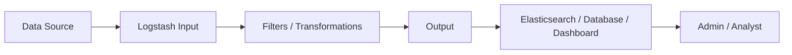

# Logstash

Logstash is an **open-source data processing pipeline tool** from the ELK Stack that collects, transforms, and forwards data from various sources to Elasticsearch or other destinations.

---

## Table of Contents

1. [Basics](#1-basics)
2. [Architecture Diagram](#2-architecture-diagram)
3. [Platform-Specific Installation](#3-platform-specific-installation)
    - [3.1 Linux Installation](#31-linux-installation-debianubuntu)
    - [3.2 MacOS Installation](#32-macos-installation)
    - [3.3 Windows Installation](#33-windows-installation)
    - [3.4 Docker Installation](#34-docker-installation)
    - [3.5 Kubernetes Installation](#35-kubernetes-installation)
4. [Configuration](#4-configuration)
5. [Pipeline Examples](#5-pipeline-examples)
6. [Filters and Transformations](#6-filters-and-transformations)
7. [Best Practices](#7-best-practices)
8. [Conclusion](#8-conclusion)

---

## 1. Basics

- **Main Features:**

  - Collect logs from various sources (Syslog, files, databases, APIs)
  - Transform, parse, and enrich data
  - Forward to Elasticsearch, Grafana Loki, Kafka, or other systems

- **Core Components:**

  - **Input:** Data sources
  - **Filter:** Transformation and parsing
  - **Output:** Target systems

---

## 2. Architecture Diagram



---

## 3. Platform-Specific Installation

### 3.1 Linux Installation (Debian/Ubuntu)

```bash
wget -qO - https://artifacts.elastic.co/GPG-KEY-elasticsearch | sudo apt-key add -
sudo apt-get install apt-transport-https
echo "deb https://artifacts.elastic.co/packages/8.x/apt stable main" | sudo tee /etc/apt/sources.list.d/elastic-8.x.list
sudo apt update
sudo apt install logstash
sudo systemctl enable logstash
sudo systemctl start logstash
sudo systemctl status logstash
```

### 3.2 MacOS Installation

```brew
brew tap elastic/tap
brew install elastic/tap/logstash
brew services start logstash
```

### 3.3 Windows Installation

1. Download ZIP from [https://www.elastic.co/downloads/logstash](https://www.elastic.co/downloads/logstash)
2. Extract, e.g., `C:\logstash`
3. Start: `C:\logstash\bin\logstash.bat -f C:\logstash\config\logstash.conf`

---

### 3.4 Docker Installation

```bash
docker pull docker.elastic.co/logstash/logstash:8.9.0
docker run -d -p 5044:5044 --name logstash \
-v /path/to/logstash.conf:/usr/share/logstash/pipeline/logstash.conf \
docker.elastic.co/logstash/logstash:8.9.0
```

### Docker Compose Example

```yaml
version: '3.8'
services:
  logstash:
    image: docker.elastic.co/logstash/logstash:8.9.0
    ports:
      - "5044:5044"
    volumes:
      - ./logstash.conf:/usr/share/logstash/pipeline/logstash.conf
```

### 3.5 Kubernetes Installation

```bash
helm repo add elastic https://helm.elastic.co
helm repo update
helm install logstash elastic/logstash
```

---

## 4. Configuration

### logstash.conf Example

```text
input {
    file {
        path => "/var/log/syslog"
        start_position => "beginning"
    }
}

filter {
    grok {
        match => { "message" => "%{SYSLOGLINE}" }
    }
    date {
        match => [ "timestamp", "MMM  d HH:mm:ss", "MMM dd HH:mm:ss" ]
    }
}

output {
    elasticsearch {
        hosts => ["http://elasticsearch:9200"]
        index => "syslog-%{+YYYY.MM.dd}"
    }
    stdout { codec => rubydebug }
}
```

---

## 5. Pipeline Examples

- **Syslog processing**
- **Firewall logs** (UVW, pfSense)
- **Application logs** (Java, Node.js)
- **Metrics forwarding** (Prometheus Pushgateway -> Elasticsearch)

---

## 6. Filters and Transformations

- **Grok:** Parse unstructured logs
- **Mutate:** Modify, rename, remove fields
- **Date:** Set timestamps correctly
- **GeoIP:** Convert IP addresses to geographic data
- **CSV / JSON / KV:** Process structured data

---

## 7. Best Practices

1. **Build pipelines modularly:** Clearly separate input, filter, output
2. **Reuse Grok patterns:** Custom patterns in `patterns` directory
3. **Error handling:** Use dead-letter queues for faulty events
4. **Optimize performance:** Threads, batch size, filter order
5. **Monitoring:** Monitor Logstash itself (monitoring APIs, Metricbeat)
6. **Backup & versioning:** Version pipeline configurations (Git)

---

## 8. Conclusion

- Logstash is a **flexible tool for ETL of logs and metrics**
- Ideal in combination with Elasticsearch and Kibana/Grafana
- Platform-independent: Linux, Mac, Windows, Docker, Kubernetes
- Supports complex transformations and pipeline optimizations

---
