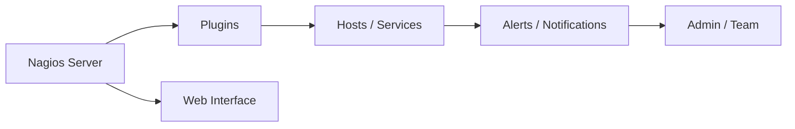

# Nagios

Nagios is an **open-source monitoring system** that monitors IT infrastructures, controls services, servers, networks, and applications, and sends alerts in case of problems.

---

## Table of Contents

1. [Basics](#1-basics)
2. [Architecture Diagram](#2-architecture-diagram)
3. [Platform-Specific Installation](#3-platform-specific-installation)
    - [3.1 Linux Installation](#31-linux-installation-debianubuntu)
    - [3.2 MacOS Installation](#32-macos-installation)
    - [3.3 Windows Installation](#33-windows-installation)
    - [3.4 Docker Installation](#34-docker-installation)
    - [3.5 Kubernetes Installation](#35-kubernetes-installation)
4. [Configuration](#4-configuration)
5. [Monitoring Hosts and Services](#5-monitoring-hosts-and-services)
6. [Alerting](#6-alerting)
7. [Best Practices](#7-best-practices)
8. [Conclusion](#8-conclusion)

---

## 1. Basics

- **Main Features:**
  - Monitor servers, network devices, services, and applications
  - Notifications via email, SMS, or other mechanisms
  - Web-based interface for visualizing status and reports

- **Core Components:**
  - **Nagios Core:** Monitoring engine
  - **Plugins:** Collect metrics and check services
  - **NRPE (Nagios Remote Plugin Executor):** Remote checks on hosts
  - **Web Interface:** Status overview and configuration

---

## 2. Architecture Diagram



---

## 3. Platform-Specific Installation

### 3.1 Linux Installation (Debian/Ubuntu)

```bash
sudo apt update
sudo apt install -y autoconf gcc libc6 make wget unzip apache2 php libapache2-mod-php libgd-dev
wget https://github.com/NagiosEnterprises/nagioscore/releases/download/nagios-4.4.12/nagios-4.4.12.tar.gz
tar zxvf nagios-4.4.12.tar.gz
cd nagios-4.4.12
./configure --with-httpd-conf=/etc/apache2/sites-enabled
make all
sudo make install
sudo make install-init
sudo make install-commandmode
sudo make install-config
sudo systemctl enable apache2
sudo systemctl start apache2
```

### 3.2 MacOS Installation

```brew
brew install nagios
# Configure web interface via Apache
```

### 3.3 Windows Installation

- Windows is not officially supported, but there are precompiled packages like **Nagios XI** or via WSL
- Alternative: Use Docker container

---

### 3.4 Docker Installation

```bash
docker pull jasonrivers/nagios:latest
docker run -d -p 8080:80 --name nagios jasonrivers/nagios:latest
# Web UI: http://localhost:8080 (default user: nagiosadmin / nagiosadmin)
```

### 3.5 Kubernetes Installation

- Deployment via Helm charts for Nagios is possible (e.g., [nagios-helm](https://github.com/hannob/nagios-helm))  

```bash
  helm repo add nagios https://hannob.github.io/nagios-helm
  helm repo update
  helm install nagios nagios/nagios
```

---

## 4. Configuration

### hosts.cfg Example

```text
define host{
    use                     linux-server
    host_name               server1
    alias                   Webserver 1
    address                 192.168.1.10
    max_check_attempts      5
    check_interval          5
    retry_interval          1
    check_command           check_ping!100.0,20%!500.0,60%
}
```

### services.cfg Example

```text
define service{
    use                     generic-service
    host_name               server1
    service_description     HTTP
    check_command           check_http
    check_interval          5
    retry_interval          1
}
```

---

## 5. Monitoring Hosts and Services

- **Host Checks:** Verify if servers are reachable (ping, SSH, RDP)
- **Service Checks:** Check services like HTTP, DNS, SMTP, databases
- **Remote Checks:** Collect metrics on remote hosts via NRPE

---

## 6. Alerting

- Notifications via:
  - Email
  - SMS (via third-party providers)
  - Slack or webhooks

### contact.cfg Example

```text
define contact{
    contact_name                    admin
    use                            generic-contact
    email                           admin@example.com
    service_notification_period     24x7
    host_notification_period        24x7
    service_notification_options    w,u,c,r
    host_notification_options       d,u,r
    service_notification_commands   notify-service-by-email
    host_notification_commands      notify-host-by-email
}
```

---

## 7. Best Practices

1. **Use templates:** Consistent configuration for hosts and services
2. **Prioritize monitoring:** Critical services first
3. **Optimize alerting:** No spam notifications
4. **Keep plugins updated:** Update security-relevant checks
5. **Redundancy:** Optional multiple Nagios servers for high availability
6. **Secure web interface:** Configure HTTPS and user permissions

---

## 8. Conclusion

- Nagios is a **reliable monitoring system for IT infrastructures**
- Supports classic checks, remote checks, and alerting
- Platform-independent: Linux preferred, MacOS via Homebrew, Windows via Docker/WSL
- Ideal for infrastructure and service monitoring in enterprises

---
