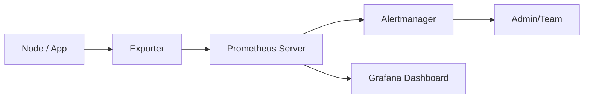

# Prometheus

Prometheus is an **open-source monitoring and alerting system** specialized in metrics and time-series data. It collects, stores, and analyzes metrics from servers, applications, and network devices.

---

## Table of Contents

1. [Basics](#1-basics)
2. [Architecture Diagram](#2-architecture-diagram)
3. [Platform-Specific Installation](#3-platform-specific-installation)
    - [3.1 Linux Installation](#31-linux-installation-debianubuntu)
    - [3.2 MacOS Installation](#32-macos-installation)
    - [3.3 Windows Installation](#33-windows-installation)
    - [3.4 Docker Installation](#34-docker-installation)
    - [3.5 Kubernetes Installation](#35-kubernetes-installation)
4. [Configuration](#4-configuration)
5. [Collecting Metrics](#5-collecting-metrics)
6. [Alerting](#6-alerting)
7. [Best Practices](#7-best-practices)
8. [Conclusion](#8-conclusion)

---

## 1. Basics

- **Main Features:**
  - Store time-series data
  - Collect metrics via HTTP (pull mechanism)
  - Define alert rules
  - Integration with Grafana for visualization

- **Core Components:**
  - **Prometheus Server:** Stores time series and executes queries
  - **Exporters:** Provide metrics for Prometheus (e.g., Node Exporter, Blackbox Exporter)
  - **Alertmanager:** Sends notifications for defined alerts
  - **Pushgateway:** For short-lived or batch jobs

---

## 2. Architecture Diagram



---

## 3. Platform-Specific Installation

### 3.1 Linux Installation (Debian/Ubuntu)

```bash
wget https://github.com/prometheus/prometheus/releases/download/v2.49.0/prometheus-2.49.0.linux-amd64.tar.gz
tar xvfz prometheus-2.49.0.linux-amd64.tar.gz
cd prometheus-2.49.0.linux-amd64
./prometheus --config.file=prometheus.yml
```

### 3.2 MacOS Installation

```bash
brew install prometheus
prometheus --config.file=/usr/local/etc/prometheus.yml
```

### 3.3 Windows Installation

1. Download ZIP from [https://prometheus.io/download/](https://prometheus.io/download/)
2. Extract, e.g., `C:\prometheus`
3. Start via `prometheus.exe --config.file=prometheus.yml`
4. Web UI: `http://localhost:9090`

### 3.4 Docker Installation

```bash
docker pull prom/prometheus:latest
docker run -d -p 9090:9090 --name prometheus \
-v /path/to/prometheus.yml:/etc/prometheus/prometheus.yml \
prom/prometheus
```

### Docker Compose Example

```yaml
version: '3.8'
services:
  prometheus:
    image: prom/prometheus:latest
    ports:
      - "9090:9090"
    volumes:
      - ./prometheus.yml:/etc/prometheus/prometheus.yml
```

### 3.5 Kubernetes Installation

```bash
kubectl create namespace monitoring
helm repo add prometheus-community https://prometheus-community.github.io/helm-charts
helm repo update
helm install prometheus prometheus-community/prometheus --namespace monitoring
```

---

## 4. Configuration

### prometheus.yml Example

```yaml
global:
scrape_interval: 15s
evaluation_interval: 15s

scrape_configs:
- job_name: 'node_exporter'
  static_configs:
    - targets: ['node1:9100', 'node2:9100']

- job_name: 'app_metrics'
  static_configs:
    - targets: ['app1:8080', 'app2:8080']
```

---

## 5. Collecting Metrics

- **Node Exporter:** Hardware and OS metrics (CPU, RAM, disk, network)
- **Application Exporters:** e.g., `postgres_exporter`, `mongodb_exporter`
- **Custom Metrics:** Applications can provide metrics via HTTP endpoints

### Example PromQL Queries

- CPU usage: `100 - (avg by(instance)(irate(node_cpu_seconds_total{mode="idle"}[5m])) * 100)`
- Memory usage: `node_memory_MemTotal_bytes - node_memory_MemAvailable_bytes`

---

## 6. Alerting

- Alerts are defined in the Prometheus server

### alert.rules.yml

```yaml
groups:
- name: node_alerts
  rules:
    - alert: HighCPU
      expr: 100 - (avg by(instance)(irate(node_cpu_seconds_total{mode="idle"}[5m])) * 100) > 80
      for: 5m
      labels:
      severity: warning
      annotations:
      summary: "CPU usage too high on {{ $labels.instance }}"
      description: "CPU > 80% for 5 minutes"
```

- Alertmanager sends notifications to email, Slack, or webhook

---

## 7. Best Practices

1. **Time-based retention:** Define metric retention period
2. **Exporter monitoring:** Only collect necessary metrics
3. **Alerting:** Only enable meaningful alerts, no spam alerts
4. **Integration with Grafana:** Create dashboards for metrics
5. **Security:** Enable HTTPS for exporters and server, restrict access
6. **Scaling:** Prometheus federation for large environments

---

## 8. Conclusion

- Prometheus is a **powerful monitoring system for metrics and time series**
- Supports pull-based data collection, alerting, and integration with Grafana
- Platform-independent: Linux, Mac, Windows, Docker, Kubernetes

---
