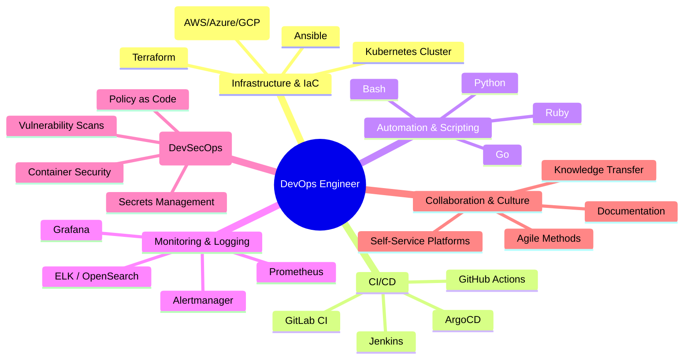
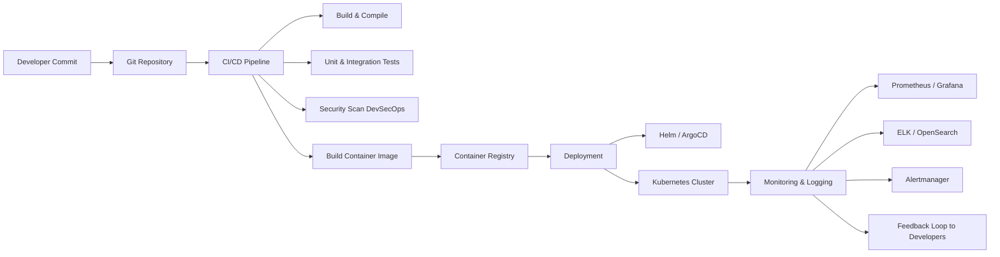

# DevOps Engineer

DevOps is a **culture, an approach, and a practice** that connects software development (Dev) and IT operations (Ops).  
The goal: **develop, test, deliver, and operate software faster, more reliably, and with automation**.

A DevOps Engineer works at the interface between development, IT infrastructure, and quality assurance.

## Table of Contents

1. [Core Principles of DevOps](#1-core-principles-of-devops)
2. [Core Tasks of a DevOps Engineer](#2-core-tasks-of-a-devops-engineer)
3. [Typical Tools in DevOps](#3-typical-tools-in-devops)
4. [Example Workflow of a DevOps Engineer](#4-example-workflow-of-a-devops-engineer)
5. [DevOps Skills](#5-devops-skills)
6. [DevOps Pipeline – End-to-End Flow](#6-devops-pipeline--end-to-end-flow)
7. [Conclusion](#7-conclusion)

---

---

## 1. Core Principles of DevOps

- **Automation**: Everything repeatable is automated (build, tests, deployments, infrastructure).
- **Continuous Integration & Deployment (CI/CD)**: Code changes are automatically integrated, tested, and rolled out.
- **Monitoring & Feedback**: Systems are monitored, metrics collected, and fed back into development.
- **Collaboration & Culture**: Developers and operations work closely together, responsibility is shared.
- **Security**: DevSecOps integrates security aspects from the beginning.

---

## 2. Core Tasks of a DevOps Engineer

### 2.1 Infrastructure Management

- Provisioning and managing **servers, networks, and cloud resources**
- Using **Infrastructure as Code (IaC)** tools like Terraform, Ansible, or Pulumi
- Building scalable environments (e.g., Kubernetes clusters, load balancers, cloud resources)
- Managing **container platforms** (Docker, Kubernetes, OpenShift)

### 2.2 Automation & Scripting

- Automated **build pipelines** (e.g., GitHub Actions, GitLab CI, Jenkins)
- Scripts in **Python, Go, Bash, or Ruby** to automate recurring tasks
- Configuring CI/CD: automated tests, code quality checks, deployments

### 2.3 Monitoring & Logging

- Setting up **monitoring systems**: Prometheus, Grafana, ELK Stack (Elasticsearch, Logstash, Kibana)
- Building **alerting** (Alertmanager, PagerDuty, Opsgenie)
- Collecting and analyzing logs for error analysis and performance optimization
- Creating **dashboards** for system status and KPIs

### 2.4 Security (DevSecOps)

- Automating **security checks** in CI/CD pipelines
- Vulnerability scans (e.g., Trivy, Anchore, Clair for containers)
- Secrets management (Vault, SOPS, AWS KMS)
- Hardening images, containers, and systems

### 2.5 Collaboration & Culture

- Close collaboration with developers (e.g., pairing during deployments)
- Creating **self-service platforms** so developers can deploy environments independently
- Documentation and training teams on tools, processes, and best practices

---

## 3. Typical Tools in DevOps

### Version Control & Collaboration

- Git (GitHub, GitLab, Bitbucket)
- Pull requests, code reviews, branching strategies

### CI/CD

- GitHub Actions, GitLab CI/CD, Jenkins, ArgoCD, Tekton

### Container & Orchestration

- Docker, Podman
- Kubernetes, Helm, OpenShift

### Infrastructure

- Terraform, Ansible, Chef, Puppet
- Cloud: AWS, Azure, GCP

### Monitoring & Observability

- Prometheus, Grafana
- ELK / OpenSearch
- Jaeger (Tracing)

### Security

- Trivy (Container Scans)
- HashiCorp Vault (Secrets Management)
- Falco (Runtime Security)

---

## 4. Example Workflow of a DevOps Engineer

1. **Developer** pushes new code to GitHub
2. **CI/CD Pipeline** starts automatically:
    - Build -> Test -> Security Scan -> Create container image
3. Container image is stored in **Registry** (e.g., DockerHub or Harbor)
4. **Deployment** via Helm/ArgoCD to Kubernetes
5. **Monitoring** checks if the new pod is running without errors
6. In case of problems: Analyze logs in ELK Stack, respond to alerts

---

## 5. DevOps Skills

A DevOps Engineer needs:

- **Technical Skills**
  - Programming (Python, Go, Ruby, Bash)
  - Infrastructure (Linux, Cloud, Containers, Networks)
  - Automation & Tools

- **Methodological Skills**
  - Agile methods (Scrum, Kanban)
  - Understand and optimize CI/CD pipelines
  - Troubleshooting & root cause analysis

- **Soft Skills**
  - Communication & teamwork
  - Understanding of developers and ops
  - Proactive error prevention (shift-left approach)

---

## 6. DevOps Pipeline – End-to-End Flow

---

## 7. Conclusion

A DevOps Engineer is **not just an "admin" or "developer"**, but a **bridge builder between both worlds**.  
Main tasks are **automation, infrastructure management, CI/CD, monitoring, and security**.  
The goal: **fast, stable, and secure software delivery**.
