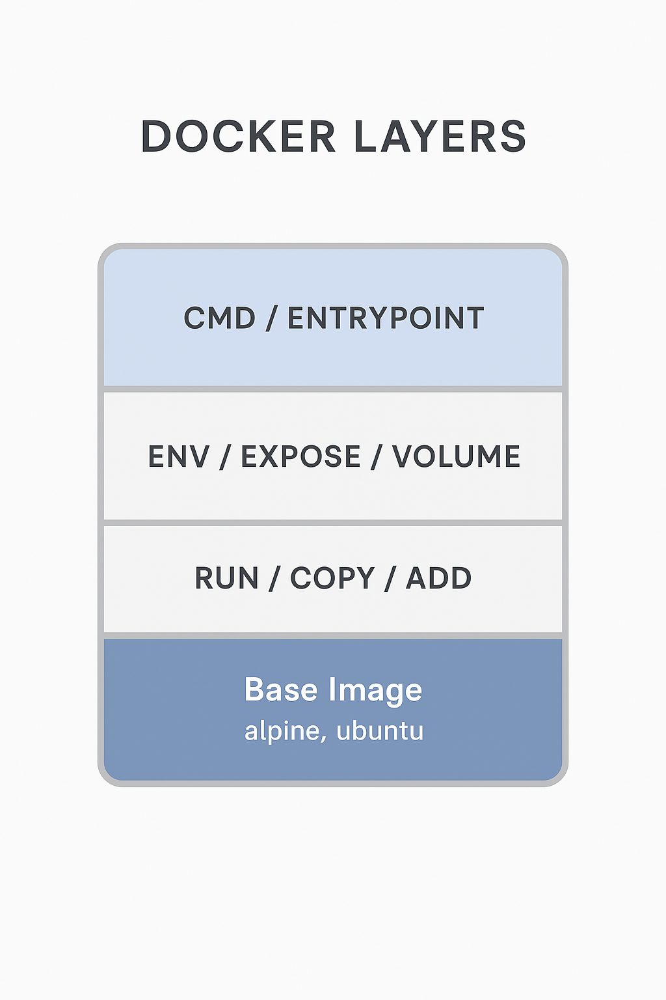
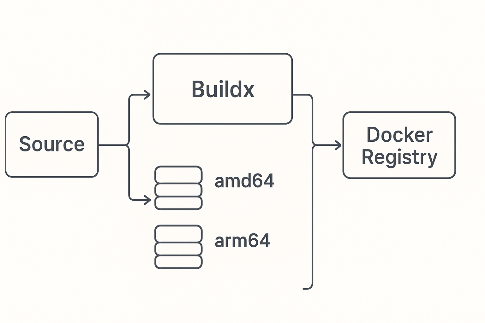
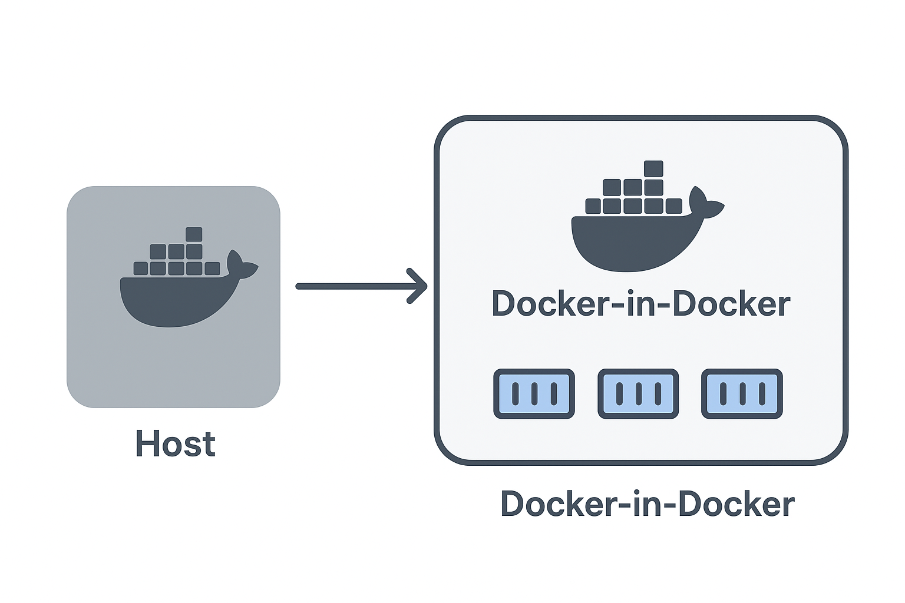
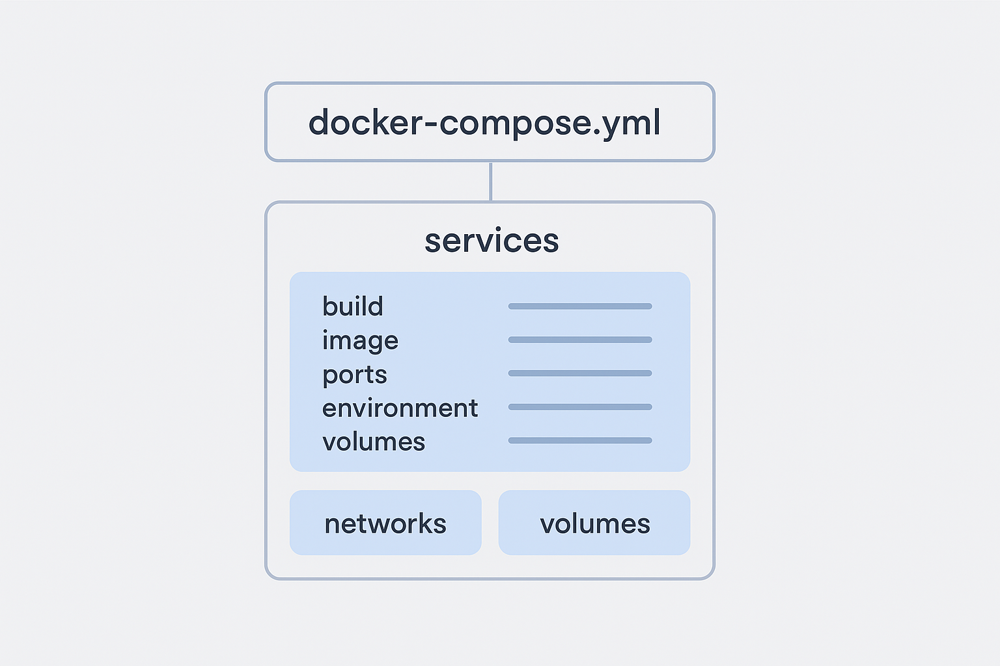
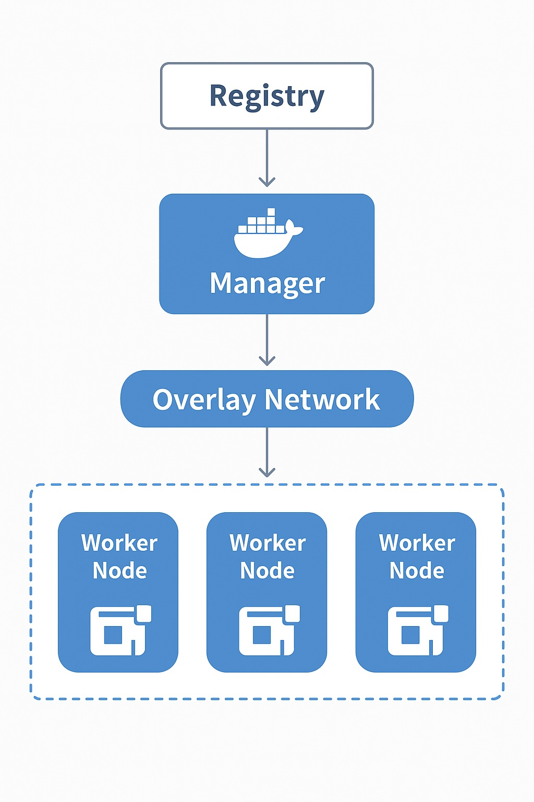
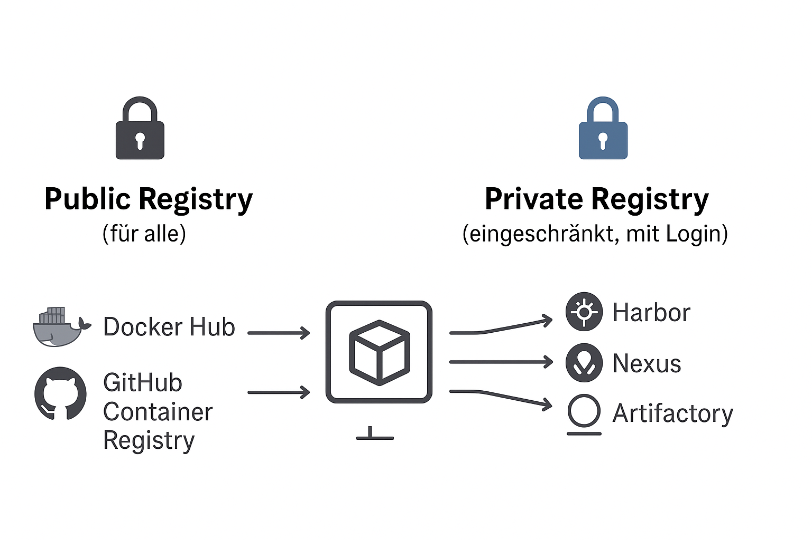

# Docker, Docker Compose and Docker Swarm

Short: This text provides a practical and comprehensive guide to Docker, Docker Compose and Docker Swarm. It covers basics, installation, Dockerfile details (including RUN, CMD, ENTRYPOINT), Compose files, Swarm stacks, Buildx (multi-arch), Docker-in-Docker (DinD), volumes, networks, registries (public & private), build arguments, secrets, Multi-Stage builds, best practices and cheat-sheets. Figures are referenced (./images/...) but are not included in this archive.

---

## Table of Contents

1. [Introduction](#introduction)  
2. [System Requirements](#system-requirements)  
3. [Installation](#installation)  
4. [Docker — Basics & Commands](#docker--basics--commands)  
   - [Dockerfile: structure & important instructions](#dockerfile--structure--important-instructions)  
   - [ENTRYPOINT vs CMD / Exec vs Shell form](#entrypoint-vs-cmd--detailed)  
   - [Buildx (Multi-Arch)](#buildx-multi-arch-builds)  
   - [Docker-in-Docker (DinD)](#docker-in-docker-dind)  
5. [Docker Compose](#docker-compose)  
   - [Compose file structure & subkeys](#compose-file-structure-major-subkeys)  
   - [build vs image — detailed](#build-vs-image--detailed)  
   - [Important commands & flags](#important-compose-commands--flags)  
   - [Compose v1 vs v2 (brief)](#compose-v1-vs-v2-brief)  
6. [Docker Swarm](#docker-swarm)  
   - [Concepts & quickstart](#concepts)  
   - [Services / Stack / Networks / Volumes in Swarm](#services--example)  
   - [Secrets & Configs](#secrets--configs)  
7. [Registry (public vs private)](#registry-public-vs-private)  
8. [Container configuration: Volumes, Networks, Secrets, Build Args, Priority](#container-configuration--volumes-networks-secrets-build-args-priority)  
9. [Multi-Stage Builds — detailed](#multi-stage-builds--detailed)  
10. [Best Practices (Docker, Compose, Swarm)](#best-practices-docker-compose-swarm)  
11. [Cheat-sheets](#cheat-sheets)  
12. [Glossary & Sources](#glossary--sources)

---

## Introduction

Docker packages applications and their dependencies into images and runs them as containers. A container is a lightweight, isolated runtime that shares the host kernel. Docker Compose helps define and run multi-container applications locally. Docker Swarm provides built-in container orchestration across multiple Docker hosts.

---

## System Requirements

- CPU: x86_64 or ARM64 (for multi-arch builds)  
- RAM: minimum 4 GB (8 GB recommended)  
- Disk: ≥ 20 GB free recommended  
- Network access to registries (Docker Hub, GHCR, private registries)

---

## Installation

### Ubuntu (quick)

```bash
sudo apt update
sudo apt install -y docker.io docker-compose-plugin
sudo usermod -aG docker $USER   # takes effect after re-login
```

(Alternative: install via Docker's official repository to get the latest releases — see Docker docs.)

### Alpine

```bash
apk add --no-cache docker docker-cli-compose
rc-update add docker boot
service docker start
```

### macOS / Windows

Install Docker Desktop (bundles Docker Engine, CLI and Compose v2).  
macOS: `<https://docs.docker.com/desktop>`
Windows: WSL2 recommended.

---

## Docker — Basics & Commands

### Quickstart examples

```bash
# Build an image (Dockerfile in current directory)
docker build -t myapp:1.0 .

# Run a container in the background
docker run -d --name webapp -p 8080:80 myapp:1.0

# Exec into a running container
docker exec -it webapp /bin/sh

# Tail logs
docker logs -f webapp

# Stop and remove a container
docker stop webapp && docker rm webapp
```

### Dockerfile — structure & important instructions



A Dockerfile is a recipe that creates image layers:

```dockerfile
FROM python:3.11-slim
LABEL maintainer="dev@example.org"
ARG BUILD_VERSION=1.0
WORKDIR /app
COPY requirements.txt .
RUN pip install --no-cache-dir -r requirements.txt
COPY . .
ENV APP_ENV=production
EXPOSE 8080
ENTRYPOINT ["python", "app.py"]
CMD ["--help"]
```

**Important instructions (short):**

- `FROM` — base image (can use `AS <name>` for multi-stage).  
- `ARG` — build-time argument (only available during build).  
- `ENV` — environment variable persisted into the image.  
- `RUN` — executed at build time; creates a new layer.  
- `COPY` / `ADD` — copy files into the image (`ADD` can extract archives / fetch remote resources).  
- `WORKDIR` — set working directory.  
- `EXPOSE` — documents the port (metadata).  
- `ENTRYPOINT` / `CMD` — runtime start behavior.

---

### ENTRYPOINT vs CMD — detailed

- `ENTRYPOINT` defines the executable that will always run.  
- `CMD` provides default arguments to `ENTRYPOINT` (or acts as the default command if `ENTRYPOINT` is not set).  
- Combination: `ENTRYPOINT ["prog"]` + `CMD ["arg1"]` → running the container runs `prog arg1`.  
- CLI overrides: `docker run image custom-arg` replaces `CMD`; `docker run --entrypoint other image` replaces `ENTRYPOINT`.

**Examples:**
Dockerfile:

```dockerfile
ENTRYPOINT ["python", "app.py"]
CMD ["--help"]
```

- `docker run myimage` → `python app.py --help`
- `docker run myimage --version` → `python app.py --version`
- `docker run --entrypoint /bin/sh myimage` → runs `/bin/sh` (ENTRYPOINT replaced)

**Shell form vs Exec form**

- Shell form: `RUN apt-get update && ...` → runs via `/bin/sh -c` (allows shell features).  
- Exec form: `ENTRYPOINT ["cmd","arg"]` → runs directly (better PID 1 behavior, signals). Use exec-form for ENTRYPOINT/CMD for correct signal handling.

**Order in Dockerfile (RUN, CMD, ENTRYPOINT)**

- `RUN` executes at build time and typically appears earlier (produces layers).  
- `ENTRYPOINT` and `CMD` define runtime behavior and are evaluated when the container starts.  
Therefore `RUN` comes before `ENTRYPOINT`/`CMD` in most Dockerfiles because builds must finish before runtime configuration is set.

---

### Useful Docker CLI flags & examples

```bash
# Build with build-args and custom Dockerfile
docker build -t myapp:1.0 -f Dockerfile.prod --build-arg VERSION=1.0 .

# Run with port, volume and env
docker run -d --name web -p 8080:80 -v myvol:/data -e APP_ENV=prod myapp:1.0

# Override entrypoint
docker run --rm --entrypoint /bin/bash myimage -c "echo hi"

# Exec into a running container (interactive)
docker exec -it web /bin/bash

# Remove image
docker rmi myapp:1.0

# List images / containers
docker images
docker ps -a
```

### When to rebuild vs restart

**Rebuild required** when:

- Dockerfile changed (new RUN/COPY/BASE).  
- Dependencies or build artifacts changed.  
- Build arguments that affect the build were changed.

**Restart sufficient** when:

- Only runtime configuration changed (configs mounted via volume, ENV variables changed).  
- Container crashed and simply needs restarting.

---

## Buildx (Multi-Arch Builds)

`buildx` (BuildKit) enables multi-architecture builds and advanced build features.



**Setup (short):**

```bash
# QEMU emulation for other architectures (one-time)
docker run --rm --privileged multiarch/qemu-user-static --reset -p yes

# Create and use a buildx builder
docker buildx create --name mybuilder --use
docker buildx inspect --bootstrap
```

**Multi-arch build example:**

```bash
docker buildx build --platform linux/amd64,linux/arm64 \
  -t registry.example.com/myorg/myapp:multiarch \
  --push .
```

- `--platform` selects target architectures.  
- `--push` pushes the multi-arch manifest and images to the registry.

**BuildKit features:** `--secret` and `--ssh` for secure build-time secrets (not persisted in image layers).

---

## Docker-in-Docker (DinD)



**Use-cases:** CI runners that need to build images inside containerized jobs; isolated sandboxes.  
**Variants:**

- DinD (privileged): `docker run --privileged docker:dind` → runs a separate Docker daemon inside the container.  
- Socket sharing: `-v /var/run/docker.sock:/var/run/docker.sock` → container talks to host Docker daemon (no privileged container but gives host access).

**Risks:** Socket mount grants full host Docker control; `--privileged` grants wide capabilities. Use only in trusted CI environments.

---

## Docker Compose

### Why Compose?

Compose standardizes multi-container apps via a YAML file (services, volumes, networks). Ideal for development and local integration testing.



### Compose file structure (major subkeys)

```yaml
version: "3.9"
services:
  web:
    build:
      context: ./web
      dockerfile: Dockerfile.prod
      args:
        NODE_ENV: production
      target: final
    image: registry.example.com/myorg/web:1.0.0
    ports:
      - "8080:80"
    environment:
      - DATABASE_URL=${DATABASE_URL}
    volumes:
      - web_data:/var/lib/web
    secrets:
      - db_password
    deploy:
      resources:
        limits:
          cpus: "0.5"
          memory: 512M

volumes:
  web_data:

secrets:
  db_password:
    file: ./secrets/db_password.txt
```

**Important subkeys (short):**

- `build.context` — build context (folder).  
- `build.dockerfile` — alternate Dockerfile path/name.  
- `build.args` — build arguments.  
- `build.target` — target stage for multi-stage builds.  
- `image` — name/tag to use or to tag built image.  
- `ports`, `volumes`, `environment`, `secrets`, `networks`, `depends_on`, `deploy` (deploy is for Swarm stack).

---

### build vs image — detailed

- `build` instructs Compose to build an image from local sources (subkeys: `context`, `dockerfile`, `args`, `target`, `cache_from`).  
- `image` tells Compose to use a named image (from registry) or to tag the built image.  
- **Both present**: Compose builds according to `build` and then tags the resulting image with the `image:` value. Compose will not pull the registry image if `build` is defined.

**When to use which:**  

- Development: `build` for fast local iteration.  
- CI pipelines: `build` + `image` (build, tag, push).  
- Production: `image` (deploy an already built and tested image).

**Example:**

```yaml
services:
  api:
    build:
      context: ./api
      dockerfile: Dockerfile
      args:
        BUILD_VERSION: ${BUILD_VERSION:-1.0}
    image: registry.example.com/myorg/api:${BUILD_VERSION}
```

---

### Important Compose commands & flags

```bash
# Start (build if needed)
docker compose up -d --build

# Start existing containers (no build)
docker compose start

# Stop containers (keep resources)
docker compose stop

# Down (remove containers, networks; -v removes volumes)
docker compose down -v --remove-orphans

# Build (options)
docker compose build --no-cache --parallel --build-arg NODE_ENV=production

# Logs
docker compose logs -f --tail=200 service_name

# Pull / Push
docker compose pull
docker compose push   # only if image is set and credentials available
```

---

### Compose v1 vs v2 (brief)

- v1: `docker-compose` (standalone binary).  
- v2: `docker compose` (CLI plugin integrated with Docker).  
Install the `docker-compose-plugin` on Linux or use Docker Desktop (which includes v2).

---

## Docker Swarm



### Concepts

- **Manager**: manages cluster state (Raft) and orchestrates.  
- **Worker**: runs tasks (container instances).  
- **Service**: logical definition (replicated or global).  
- **Task**: a single container scheduled by the manager.  
- **Stack**: a group of services deployed from a Compose file via `docker stack deploy`.

### Quickstart

```bash
# init on the first manager
docker swarm init --advertise-addr 192.168.1.10

# show join tokens
docker swarm join-token worker

# on worker: join using token
docker swarm join --token SWMTKN-1-... 192.168.1.10:2377

# list nodes
docker node ls
```

### Services & example

```bash
docker service create --name web -p 80:80 --replicas 3 nginx:alpine
docker service ls
docker service ps web
docker service scale web=5
docker service update --image registry.example.com/myorg/web:2.0 --update-parallelism 1 --update-delay 10s web
docker service update --rollback web
```

### Stack Deployment (Compose → Swarm)

Example `stack.yml` (Compose v3+):

```yaml
version: "3.9"
services:
  web:
    image: registry.example.com/myorg/web:1.0
    deploy:
      mode: replicated
      replicas: 3
      update_config:
        parallelism: 1
        delay: 10s
    networks:
      - frontend
  db:
    image: postgres:15
    volumes:
      - db_data:/var/lib/postgresql/data
    networks:
      - backend

volumes:
  db_data:

networks:
  frontend:
    driver: overlay
  backend:
    driver: overlay
```

Deploy:

```bash
docker stack deploy -c stack.yml mystack
docker stack services mystack
docker stack ps mystack
```

### Volumes & persistence in Swarm

Use distributed storage drivers (NFS, cloud block storage) for persistent data so tasks on other nodes can access the same data. Host bind mounts are node-local and not suitable for HA databases.

### Secrets & Configs

```bash
echo "s3cr3t" | docker secret create db_password -
```

In stack files, reference secrets and configs. Swarm stores secrets encrypted in Raft; they are not baked into images.

### High-availability & manager quorum

- Use an odd number of manager nodes (3 or 5) for Raft quorum.  
- Back up Raft data and manager keys regularly.  
- Restrict manager access (firewalls, management network).

---

## Registry (public vs private)



### Public registries

- Docker Hub (public & private repos)  
- GitHub Container Registry (GHCR)  
- GitLab Container Registry, Google Artifact Registry, AWS ECR

### Private Registry — simple self-hosted example

```bash
docker run -d -p 5000:5000 --restart=always --name registry registry:2
docker tag myapp:1.0 localhost:5000/myapp:1.0
docker push localhost:5000/myapp:1.0
docker pull localhost:5000/myapp:1.0
```

For production, consider Harbor, Nexus or Artifactory with TLS, authentication, scanning and replication.

### How to choose push target

The registry target is derived from the image name: `registry.example.com/org/repo:tag`. Tag the image accordingly and `docker login` to the registry:

```bash
docker tag myapp:1.0 registry.example.com/myorg/myapp:1.0
docker login registry.example.com
docker push registry.example.com/myorg/myapp:1.0
```

---

## Container configuration — Volumes, Networks, Secrets, Build Args, Priority

### Volumes — types & examples

- Named volume (recommended for production): `docker volume create myvol`  
- Bind mount (host path): `-v ./data:/var/lib/data` — useful for development  
- Anonymous volume: Docker creates automatically (less controllable)

**Compose example**

```yaml
services:
  db:
    image: postgres:15
    volumes:
      - db_data:/var/lib/postgresql/data

volumes:
  db_data:
    driver: local
```

**Mount options**

- `:ro` → read-only  
- `:rw` → read-write (default)  
- SELinux: `:z` / `:Z` (RHEL/CentOS)

### Networks — types & examples

- `bridge` — default on single host  
- `host` — container shares host network stack  
- `overlay` — multi-host (Swarm)  
- `macvlan` — containers get their own IPs on the LAN

**Bridge example**

```bash
docker network create --driver bridge mynet
docker run --network mynet nginx
```

**Compose example**

```yaml
services:
  web:
    networks: [ frontend ]
  db:
    networks: [ backend ]

networks:
  frontend:
    driver: bridge
  backend:
    driver: bridge
```

---

### Secrets & Configs

- Use `docker secret` (Swarm) or external secret stores (Vault) in production.  
- **Never** persist sensitive secrets as `ENV` in images.

### Build Args vs ENV & precedence order

- `ARG` — build-time only; not persisted in final image (unless written into image).  
- `ENV` — persisted in the image; visible via `docker inspect` / `docker run env`.

**Precedence (highest first):**

1. CLI / shell environment (`docker run -e`, `docker build --build-arg`)  
2. `.env` file (when using `docker compose`)  
3. Compose defaults (`docker-compose.yml`)  
4. Dockerfile `ENV` (fallback)

**Override example**

```bash
BUILD_VERSION=2.0 docker compose build
docker run -e APP_ENV=staging myapp:2.0
```

---

## Multi-Stage Builds — detailed

### What & why?

Multi-stage builds let you use heavy build tools in a builder stage and copy only the final artifacts into a small runtime image → smaller images and smaller attack surface.

### Example (Node + Nginx)

```dockerfile
# Builder stage
FROM node:18 AS builder
WORKDIR /app
COPY package*.json .
RUN npm ci
COPY . .
RUN npm run build

# Runtime stage
FROM nginx:alpine
COPY --from=builder /app/dist /usr/share/nginx/html
```

### ARG vs ENV in multi-stage

- `ARG` is scoped to the stage where it is declared.  
- To use an `ARG` across stages, declare it in each stage or declare it globally before the first `FROM`.  
- `ENV` persists in the final image — do not use for secrets.

### BuildKit / secrets / SSH (secure handling)

BuildKit supports secure mounts:

```bash
DOCKER_BUILDKIT=1 docker build --secret id=npm_token,src=.npmrc -t myapp:latest .
```

Dockerfile (BuildKit syntax):

```dockerfile
# syntax = docker/dockerfile:1.3
FROM node:18 AS build
RUN --mount=type=secret,id=npm_token \
    npm ci && npm run build
```

Secrets are **not** persisted in image layers — safe for private tokens.

### `--target` debugging

Use `--target` to build only up to an intermediate stage for debugging:

```bash
docker build --target builder -t myapp:builder .
```

---

## Best Practices (Docker, Compose, Swarm)

### General rules

- Pin base images (e.g. `python:3.11-slim`) for reproducibility.  
- Use `.dockerignore` to keep the build context small.  
- Never bake secrets into images.  
- Keep images small (multi-stage, alpine / distroless).

### Docker (build & runtime)

- Use exec-form for `ENTRYPOINT`/`CMD` for proper signal handling.  
- Use `DOCKER_BUILDKIT=1` in CI for secure mounts and better caching.  
- Optimize Dockerfiles for cache: install dependencies before copying full source.  
- Expose only required ports.

### Docker Compose

- Separate compose files per environment (`docker-compose.yml`, `docker-compose.prod.yml`) and combine with `-f`.  
- Use `build` during development; use `build` + `image` in CI pipelines to tag & push.  
- Use secrets or external secret stores in production.

### Docker Swarm

- Use `deploy.resources` for limits and reservations.  
- Use distributed storage for persistent volumes.  
- Keep an odd number of managers (3/5) and back up Raft state.  
- Use `update_config` and enable rollbacks for controlled rollouts.

---

## Cheat-sheets

### Docker (short)

```bash
docker build -t myapp:1.0 .
docker run -d --name web -p 8080:80 myapp:1.0
docker ps -a
docker logs -f web
docker exec -it web /bin/sh
docker stop web && docker rm web
docker images
docker rmi myapp:1.0
docker volume ls
docker network ls
```

### Docker Compose (short)

```bash
docker compose up -d --build
docker compose start
docker compose stop
docker compose down -v
docker compose build --no-cache
docker compose logs -f
docker compose -f docker-compose.prod.yml up -d
```

### Docker Swarm (short)

```bash
docker swarm init --advertise-addr <MANAGER-IP>
docker swarm join-token worker
docker service create --name web -p 80:80 --replicas 3 nginx
docker service ls
docker service ps web
docker stack deploy -c stack.yml mystack
```

---

## Glossary & Sources

**Glossary (short):**

- Image — an immutable artifact used to create containers.  
- Container — a running instance of an image.  
- Volume — persistent storage for containers.  
- Registry — image storage (Docker Hub, GHCR, private registries).  
- BuildKit / Buildx — modern build engine with multi-arch and secret support.

**Sources & further reading:**  

- `<https://docs.docker.com>`  
- `<https://docs.docker.com/compose>`  
- `<https://docs.docker.com/engine/swarm>`  
- `<https://github.com/docker/buildx>`

---
