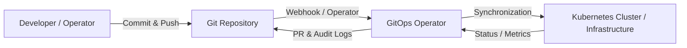
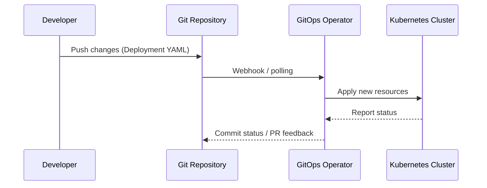

# 🧩 GitOps

**GitOps** is an approach to manage cloud infrastructure and applications in a **declarative, version-controlled, and automated** way.  
It combines **Infrastructure as Code (IaC)**, **Continuous Deployment**, and **Git as Single Source of Truth (SSOT)**.

---

## Table of Contents

1. [🔹 Core Principles of GitOps](#-core-principles-of-gitops)
2. [🔹 Architecture Overview](#-architecture-overview)
3. [🔹 Typical GitOps Tools](#-typical-gitops-tools)
4. [🔹 GitOps Workflow (Kubernetes Example)](#-gitops-workflow-kubernetes-example)
5. [🔹 Examples](#-examples)
6. [🔹 GitOps Advantages](#-gitops-advantages)
7. [🔹 Best Practices](#-best-practices)
8. [🔹 Conclusion](#-conclusion)

---

## 🔹 Core Principles of GitOps

1. **Version everything in Git**
   - Infrastructure, Kubernetes manifest files, Helm charts, or Kustomize configurations.
   - Git serves as **Single Source of Truth**.
2. **Automated deployment**
   - An operator or CI/CD pipeline monitors Git and automatically synchronizes changes.
3. **Observability & monitoring**
   - Every change is logged and can be audited.
4. **Rollbacks & security**
   - Git history allows easy rollbacks.
   - Policies/PR reviews improve security.

---

## 🔹 Architecture Overview



- **Git Repository**: contains all manifest files.
- **GitOps Operator**: monitors Git, synchronizes state with cluster.
- **Kubernetes Cluster**: target infrastructure, receives declarative configuration.
- **Feedback Loop**: Operator reports status back to Git or monitoring tools.

---

## 🔹 Typical GitOps Tools

| Tool                 | Purpose                                                        |
|----------------------|----------------------------------------------------------------|
| Argo CD              | Kubernetes GitOps operator, synchronizes Git repo ↔ cluster    |
| Flux                 | GitOps operator for Kubernetes, supports Helm & Kustomize      |
| Jenkins X            | GitOps for CI/CD pipelines                                     |
| Terraform + Atlantis | GitOps for cloud infrastructure                                |

---

## 🔹 GitOps Workflow (Kubernetes Example)



---

## 🔹 Examples

### 1) Kubernetes Deployment via Argo CD

**Repository Structure:**

```text
k8s-apps/
├── base/
│   ├── deployment.yaml
│   └── service.yaml
├── overlays/
│   └── prod/
│       └── kustomization.yaml
```

**Base Deployment (base/deployment.yaml)**

```yaml
apiVersion: apps/v1
kind: Deployment
metadata:
  name: nginx
spec:
  replicas: 2
  selector:
    matchLabels:
      app: nginx
  template:
    metadata:
      labels:
        app: nginx
    spec:
      containers:
        - name: nginx
      image: nginx:stable
      ports:
        - containerPort: 80
```

**Kustomize Overlay (overlays/prod/kustomization.yaml)**

```yaml
resources:
  - ../../base
namespace: prod
images:
  - name: nginx
    newTag: stable
  ```

- Developer changes e.g. the number of replicas in the overlay.
- Push → GitOps operator (Argo CD) detects change → automatically synchronizes with cluster.

---

### 2) Rollback

- Every change in Git is a commit.
- To return to the previous version:
  
```
  git revert <commit_hash>
# Operator automatically synchronizes the previous state
```text

---

## 🔹 GitOps Advantages

- **Versioning & audit**: Every change is traceable.
- **Automation**: No manual `kubectl apply`.
- **Consistency**: Cluster state matches Git exactly.
- **Fast rollbacks**: Git history allows instant reversion.
- **Teamwork**: Pull requests, reviews, and branch policies for changes.

---

## 🔹 Best Practices

1. **Separate repositories / branches**
    - Infrastructure vs. applications separated.
    - e.g., `dev`, `staging`, `prod` branches.
2. **Pull request workflow**
    - Changes via PR, review and tests.
3. **Operator monitoring**
    - Alerts for drift or failed sync.
4. **Secrets management**
    - Sops, SealedSecrets or Vault; never plain text in Git.
5. **Testing**
    - Linting, Kustomize/Helm template tests, policy checks (OPA/Gatekeeper).

---

## 🔹 Conclusion

GitOps brings **version control, automation, and observability** together.  
By using Git as a single source of truth, deployments become more secure, consistent, and auditable.

- Ideal for Kubernetes environments, cloud infrastructure (IaC), or multi-cluster management.
- Combines Git, CI/CD, operators, and policy enforcement.

```
