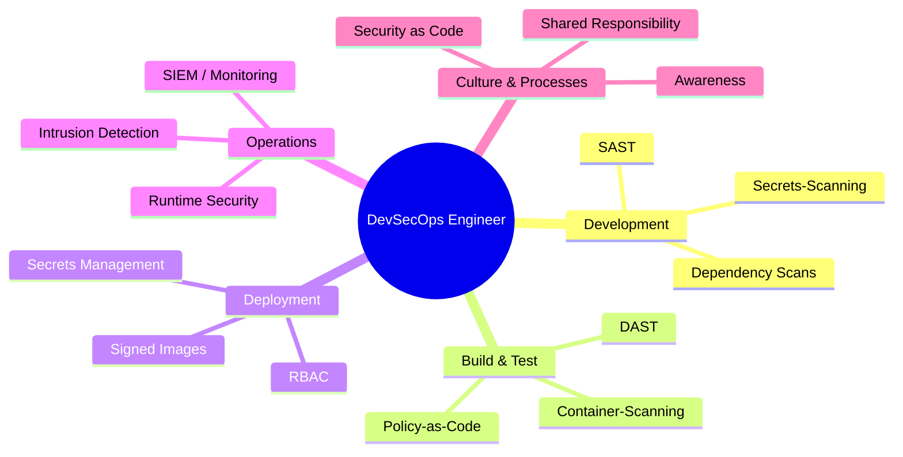
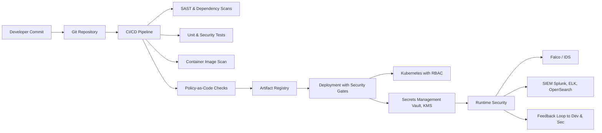

# DevSecOps

DevSecOps is the **evolution of DevOps**, where **security** is integrated into all phases of the software lifecycle.  
The goal: **"Security by Design"** – security is not an afterthought, but an integral part of development, operations, and deployment.

## Table of Contents

1. [What is DevSecOps?](#1-what-is-devsecops)
2. [Core Tasks in DevSecOps](#2-core-tasks-in-devsecops)
3. [Tools in DevSecOps](#3-tools-in-devsecops)
4. [DevSecOps Pipeline](#4-devsecops-pipeline)
5. [Conclusion](#5-conclusion)

---

---

## 1. What is DevSecOps?

- DevOps + Security = **DevSecOps**
- Automation of **security checks** in CI/CD pipelines
- Integration of **compliance and security policies** in the development process
- Responsibility for security is **distributed across all team members**, not just a security team

---

## 2. Core Tasks in DevSecOps

### 2.1 Security in Development (Shift Left)

- Static code analysis (SAST)
- Dependency scans (e.g., Pip, NPM, Go Modules)
- Automated code reviews with security policies
- Secrets scanning (e.g., Gitleaks, TruffleHog)

### 2.2 Security in Build and Test Phase

- Dynamic application testing (DAST)
- Container image scanning (Trivy, Anchore, Clair)
- Policy-as-Code (OPA, Kyverno, Conftest)
- Automated compliance checks

### 2.3 Security in Deployment

- Signed container images
- Security gates in CI/CD
- Least Privilege and RBAC in Kubernetes
- Secrets management (Vault, SOPS, KMS)

### 2.4 Security in Operations

- Runtime security (Falco, AppArmor, SELinux)
- Intrusion detection & incident response
- Continuous monitoring (SIEM systems)
- Threat modeling & penetration testing

### 2.5 Culture & Collaboration

- **Security as Code** – treat security policies like code
- Shared responsibility of Dev, Ops, and Sec
- Transparent communication of risks
- Training & awareness in the team

---

## 3. Tools in DevSecOps

- **Code Scanning**: SonarQube, Bandit, Brakeman
- **Dependency Scanning**: Snyk, OWASP Dependency-Check
- **Container Security**: Trivy, Anchore, Clair
- **Secrets Management**: HashiCorp Vault, Mozilla SOPS, AWS KMS
- **Policy as Code**: OPA, Kyverno, Conftest
- **Runtime Security**: Falco, Sysdig Secure
- **Compliance Monitoring**: OpenSCAP, Cloud Custodian

---

## 4. DevSecOps Pipeline

---

## 5. Conclusion

- DevSecOps extends DevOps with a security-focused approach
- Security is integrated from the beginning (Shift Left)
- Automation plays a central role (SAST, DAST, container scanning, Policy-as-Code)
- DevSecOps is not just a toolset, but a culture and shared responsibility

---
