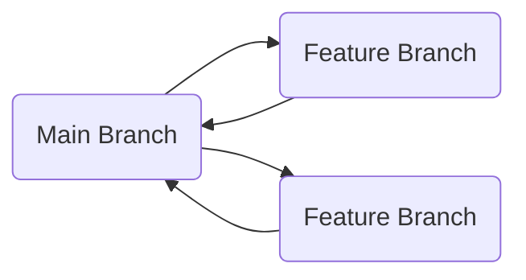
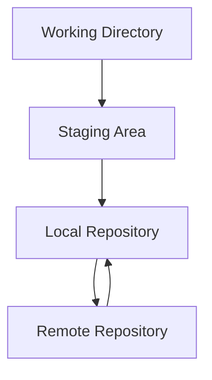

# Git – Fundamentals

**Git** is a distributed version control system (VCS) that allows developers to:

- Track changes in code
- Store project history
- Organize team collaboration efficiently

## Table of Contents

1. [What is Git](#what-is-git)
2. [What is Git used for](#what-is-git-used-for)
3. [Installation](#installation)
4. [Basic Git Commands](#basic-git-commands)
    - [Create Repository](#create-repository)
    - [Add and Commit Files](#add-and-commit-files)
    - [Check Status](#check-status)
    - [Branches](#branches)
    - [Merge & Conflicts](#merge--conflicts)
    - [Remote Repositories](#remote-repositories)
5. [Best Practices](#best-practices)
6. [Graphical Representation](#graphical-representation)
7. [Summary](#summary)

---

## What is Git

- **Distributed System**: Every developer has the complete repository locally
- **Fast Operations**: Commits, branches, merges locally
- **Secure**: History cannot be easily lost

---

## What is Git used for

- Version control of source code
- Collaboration of multiple developers
- Experimenting with branches
- Restore or compare history
- Continuous Integration / Deployment

---

## Installation

### Linux

```bash
sudo apt update
sudo apt install git
git --version
```

### MacOS

```bash
brew install git
git --version
```

---

## Basic Git Commands

### Create Repository

```bash
git init
```

- Creates a new Git repository in the current directory
- Creates a `.git` folder

### Add and Commit Files

```bash
git add file.txt
git commit -m "Initial commit"
```

- `git add` → Stages the file for commit
- `git commit` → Saves changes with message

### Check Status

```bash
git status
```

- Shows changed files, untracked files and staged files

### Branches

```bash
git branch           # Show all branches
git branch feature   # Create new branch
git checkout feature # Switch to branch
git switch feature   # Alternative to checkout
```

### Merge & Conflicts

```bash
git checkout main
git merge feature
```

- Combines changes from one branch into another
- In case of conflicts, they must be resolved manually

### Remote Repositories

```bash
git remote add origin https://github.com/user/repo.git
git push -u origin main
git pull origin main
```

- `remote add` → Links local repo with GitHub/Remote
- `push` → Transfers local commits
- `pull` → Fetches changes from remote

---

## Best Practices

- Small, frequent commits
- Meaningful commit messages
- Use branching strategy (e.g., `main`, `develop`, `feature/*`)
- Code review before merge
- Resolve conflicts early
- Use `.gitignore` to exclude temporary files

---

## Graphical Representation

### Git Workflow with Branches



---

### Git Commit & Workflow



---

## Summary

- Git = distributed version control system
- Enables easy collaboration and history management
- Basic commands: `init`, `add`, `commit`, `status`, `branch`, `merge`, `push`, `pull`
- Best Practices: small commits, branches, code review
- Graphical Mermaid diagrams help visualize workflows
