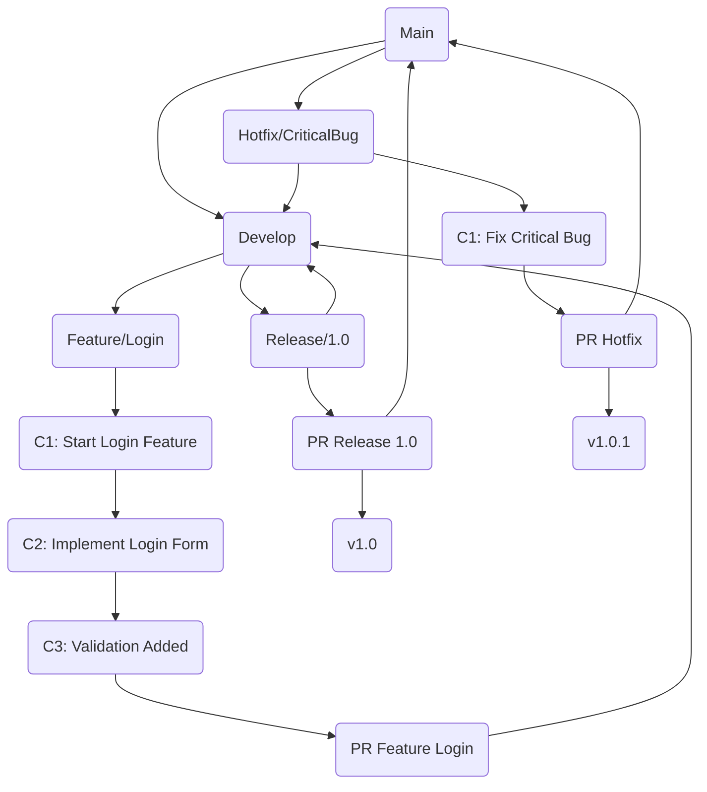

# Git-Flow

## Table of Contents

1. [Introduction](#introduction)
2. [Branches and Commits](#branches-and-commits)
3. [Complete Lifecycle](#complete-lifecycle)
4. [Explanation](#explanation)

---

## Introduction

This diagram visualizes:

- Feature branch development
- Staging and commits
- Pull request process
- Merge into develop
- Release branch + merge into main
- Tagging
- Hotfixes

---

## Branches and Commits

| Branch            | Purpose                                       |
|------------------|----------------------------------------------|
| main              | Production code                              |
| develop           | Integration branch for features              |
| feature/*         | Feature development                          |
| release/*         | Release preparation                          |
| hotfix/*          | Critical bugfixes directly in production     |

---

## Complete Lifecycle

---

## Explanation

1. **Feature Branch Development**
    - Branch off from `develop`
    - Multiple commits (C1, C2, C3) show progress
    - Pull Request → Merge into `develop`

2. **Release Branch**
    - Branch off from `develop`
    - Stabilization, bugfixes, tests
    - PR → Merge into `main`
    - Merge back into `develop`
    - Version tagging (v1.0)

3. **Hotfix Branch**
    - Branch off from `main` for critical errors
    - Commit hotfix
    - PR → Merge into `main` + `develop`
    - Tagging (v1.0.1)

4. **Pull Requests**
    - Code review before merge
    - Safe merge into target branch

5. **Advantages**
    - Parallel feature development possible
    - Clean versioning
    - Hotfixes without interrupting normal development

---

This diagram shows **the complete lifecycle of a feature** from development through PR, merge, release to hotfix including tagging.
