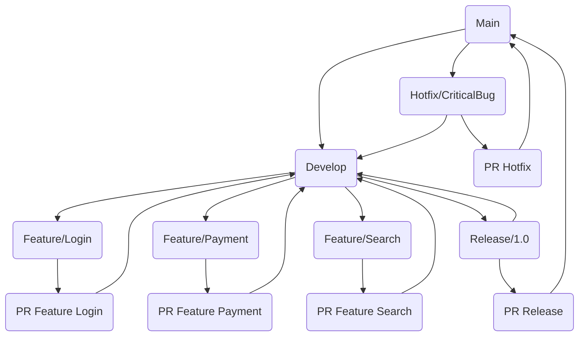
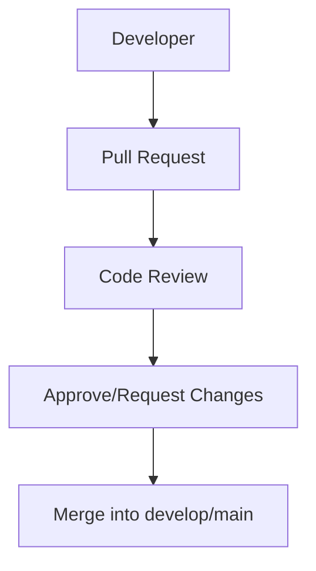

# Git-Flow & Pull Requests

## Table of Contents

1. [What is Git-Flow](#what-is-git-flow)
2. [Branches in Git-Flow](#branches-in-git-flow)
3. [Pull Requests (PR)](#pull-requests-pr)
4. [Workflow Example](#workflow-example)
5. [Important Commands](#important-commands)
6. [Gitflow Branching](#git-flow-branching)
7. [PR Workflow](#pr-workflow)
8. [Best Practices](#best-practices)
9. [Summary](#summary)

---

## What is Git-Flow

**Git-Flow** is a branching model for Git that facilitates team collaboration:

- `main` (or `master`) → Production code
- `develop` → Integration of all features for next release
- Feature branches → For new features
- Release branches → Release preparation
- Hotfix branches → Critical bug fixes directly in production code

---

## Branches in Git-Flow

| Branch            | Purpose                                           |
|------------------|--------------------------------------------------|
| main              | Production code                                  |
| develop           | Current development integration                  |
| feature/*         | New features                                     |
| release/*         | Release preparation                              |
| hotfix/*          | Critical bugfixes directly for production        |

---

## Pull Requests (PR)

- PRs are **code reviews before merge** into a branch
- Team members can provide **comments, feedback and approvals**
- Safe way to integrate changes into `develop` or `main`

---

## Workflow Example

1. Create feature branch

   ```bash
   git checkout -b feature/login
   ```

2. Develop changes, add & commit

   ```bash
   git add .
   git commit -m "Implement login page"
   ```

3. Push to remote

   ```bash
   git push origin feature/login
   ```

4. Open pull request against `develop`

5. After review merge into `develop`

   ```bash
   git checkout develop
   git merge feature/login
   ```

6. Prepare release

   ```bash
   git checkout -b release/1.0
   git push origin release/1.0
   ```

7. Merge release → main + tag

   ```bash
   git checkout main
   git merge release/1.0
   git tag -a v1.0 -m "Release 1.0"
   git push origin main --tags
   ```

8. Merge release → develop

   ```bash
   git checkout develop
   git merge release/1.0
   ```

---

## Important Commands

- List branches:

  ```bash
  git branch -a
  ```

- Delete local branch:

  ```bash
  git branch -d feature/login
  ```

- Delete remote branch:

  ```bash
  git push origin --delete feature/login
  ```

- Stash changes:

  ```bash
  git stash
  git stash pop
  ```

---

## Git-Flow Branching



### Workflow Explanation

1. **Feature Branches**:
    - Branch off from `develop`
    - Development of new features
    - PR → Merge back into `develop`

2. **Release Branches**:
    - Branch off from `develop`
    - Testing, stabilization, bugfixes
    - PR → Merge into `main` (production)
    - Merge back into `develop`

3. **Hotfix Branches**:
    - Branch off from `main`
    - Critical bug fixes
    - PR → Merge into `main` and `develop`

4. **Pull Requests**:
    - Serve as code review and approval process
    - Ensure clean merge into target branches

5. **Main Advantage**:
    - Parallel development possible
    - Cleanly structured releases
    - Bug fixes without interrupting main development

## PR Workflow



---

## Best Practices

- Keep feature branches **short and specific**
- Regularly **update develop** (`git pull origin develop`)
- Keep PRs **small and traceable**
- Always **test** releases before merging into main
- Use tags for **versioning**
- Merge hotfixes directly into main + develop

---

## Summary

- Git-Flow provides **structured branching workflow**
- Pull Requests **ensure code quality** before merge
- Combination of feature, release, and hotfix branches enables parallel development
- Mermaid diagrams help visualize workflow

#
