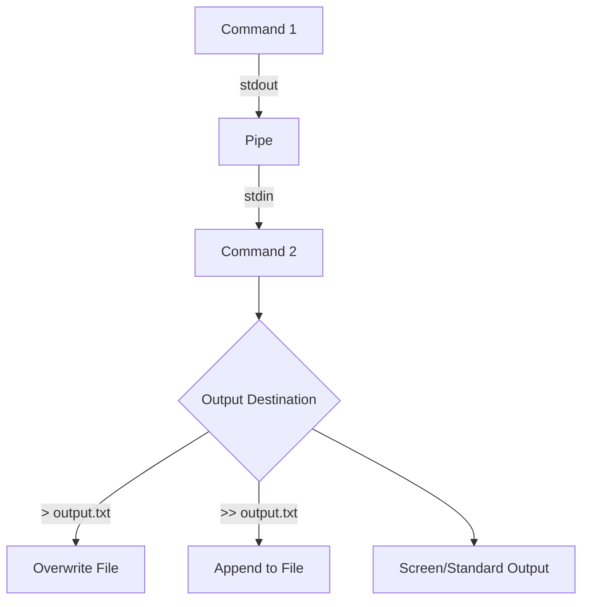

# Pipes and Redirection

## Table of Contents

1. [Piping (`|`)](#1-piping-)
2. [Redirection](#2-redirection)
3. [Combining Pipes and Redirection](#3-combining-pipes-and-redirection)
4. [Summary](#4-summary)
5. [Example Combination](#example-combination)
6. [Shell Data Flow Flowchart](#shell-data-flow-flowchart)
7. [Combined Workflows](#combined-workflows)

---

## 1. Piping (`|`)

**Concept:**

- With `|` the **output of a command** can be used as **input for another command**.
- Enables **chaining of commands** without creating temporary files.

### Examples

#### Example 1: `ls | grep`

```bash
ls -l | grep ".txt"
```

- `ls -l` lists files in the directory in detail.
- `grep ".txt"` filters only files with the `.txt` extension.
- Result: Only text files are displayed.

#### Example 2: `ps aux | less`

```bash
ps aux | less
```

- `ps aux` shows all running processes.
- `less` allows scrollable display.
- Advantage: Conveniently browse through large outputs.

#### Example 3: `cat | wc -l`

```bash
cat file.txt | wc -l
```

- `cat file.txt` outputs the content of `file.txt`.
- `wc -l` counts the number of lines.
- Result: Line count of `file.txt`.

> Note: Directly `wc -l file.txt` also works. Pipe just shows the principle.

---

## 2. Redirection

### 2.1 `>` (Redirect output, overwrite)

- Redirects the **standard output (stdout)** of a command to a file and **overwrites** the content.

```bash
echo "Hello World" > output.txt
```

- Creates `output.txt` or overwrites it.
- Content:
  Hello World

### 2.2 `>>` (Append output)

- Redirects output to a file **appending**, without deleting existing content.

```bash
echo "Another line" >> output.txt
```

- Result:
  Hello World  
  Another line

### 2.3 `<` (Redirect input)

- Redirects the **content of a file** as input to a command.

```bash
sort < names.txt
```

- `sort` sorts the file alphabetically.
- Advantage: No pipe needed (`cat names.txt | sort` would be possible, but unnecessary).

### 2.4 `<<` (Here-Document)

- Redirects **multi-line input directly into a command**.
- Practical for scripts or interactive input.

```bash
cat << EOF  
This is line 1  
This is line 2  
EOF
```

- Everything between `<< EOF` and `EOF` is passed to `cat`.
- Output:
  This is line 1  
  This is line 2

> Note: The marker `EOF` is arbitrary; beginning and end must match.

---

## 3. Combining Pipes and Redirection

```bash
ps aux | grep ssh > ssh_processes.txt
```

- Filters `ssh` processes and saves them in `ssh_processes.txt`.

```bash
cat log.txt | grep "ERROR" >> errors.log
```

- Lines with `ERROR` are **appended** to `errors.log`.

---

## 4. Summary

| Symbol   | Type           | Description                                               |
|----------|----------------|-----------------------------------------------------------|
| &#124;   | Pipe           | Output of a command as input for the next command         |
| `>`      | Redirect       | Redirect standard output to file, **overwrites**          |
| `>>`     | Redirect       | Redirect standard output to file, **appends**             |
| `<`      | Redirect       | Use file as input for a command                           |
| `<<`     | Here-Document  | Insert multi-line input directly into a command           |

---

## Example Combination

```bash
ps aux | grep ssh > ssh_processes.txt
```

- Pipe filters `ssh` processes from all running processes.
- `>` writes the result directly to the file `ssh_processes.txt`.

```bash
cat log.txt | grep "ERROR" >> errors.log
```

- Pipe filters lines with "ERROR" from the file `log.txt`.
- `>>` appends the result to the file `errors.log`.

---

## Shell Data Flow Flowchart



## Combined Workflows


# Symbol Summary

| Symbol  | Meaning                                                     |
|---------|-------------------------------------------------------------|
| &#124;  | Pipe: Output of a command as input for next command         |
| `>`     | Redirect: Output to file, overwrites content                |
| `>>`    | Redirect: Output to file, appends                           |
| `<`     | Redirect: File as input for command                         |
| `<<`    | Here-Document: multi-line input directly to command         |
