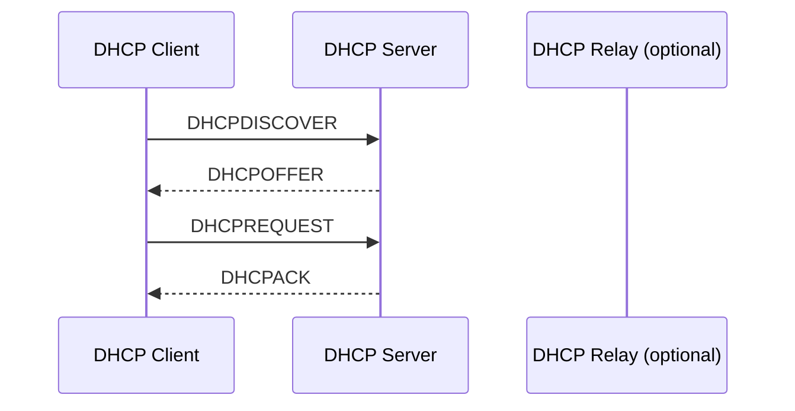
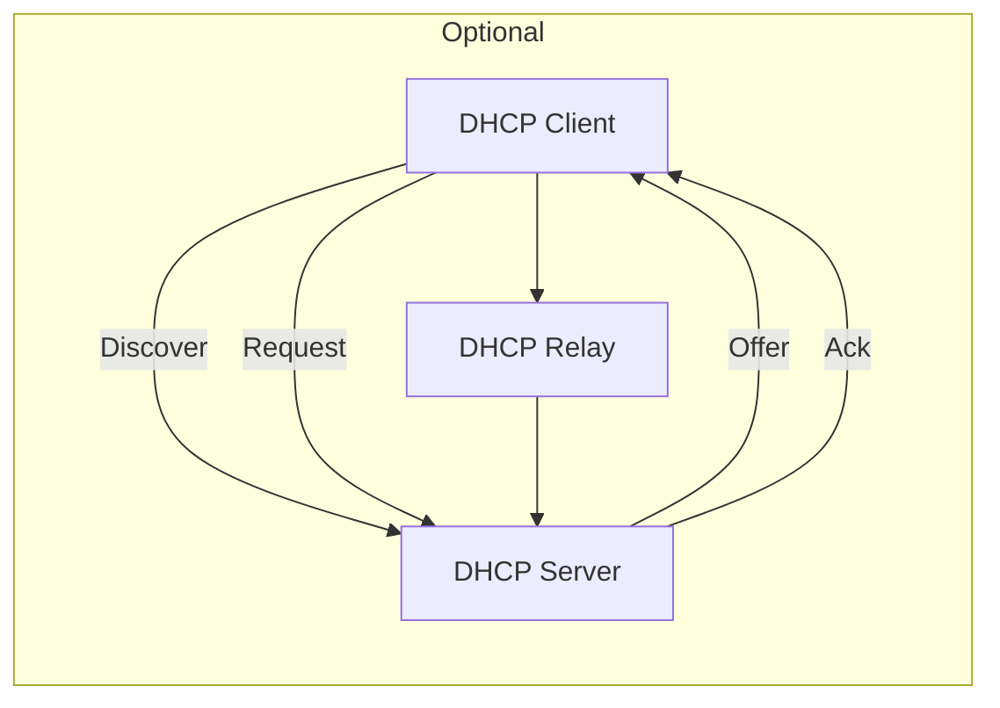

# DHCP

DHCP (Dynamic Host Configuration Protocol) is a network protocol that automatically assigns clients **IP addresses and other network information**.

---

## Table of Contents

1. [Basics](#1-basics)
2. [Flow Diagram](#2-flow-diagram)
3. [Example Configuration - ISC DHCP Server (Linux)](#3-example-configuration---isc-dhcp-server-linux)
4. [Check DHCP Client](#4-check-dhcp-client)
5. [DHCP Lease Monitoring](#5-dhcp-lease-monitoring)
6. [Architecture Diagram](#6-architecture-diagram)
7. [Best Practices](#7-best-practices)
8. [Examples of Options](#8-examples-of-options)

---

## 1. Basics

- **Purpose:** Automatic assignment of IP addresses, subnet masks, gateways, and DNS servers
- **DHCP Components:**
  - **DHCP Server:** Assigns IP addresses and configuration
  - **DHCP Client:** Requests IP address from server
  - **DHCP Relay Agent:** Forwards requests across subnets

- **DHCP Messages:**
  - `DHCPDISCOVER` -> Client searches for server
  - `DHCPOFFER` -> Server offers IP
  - `DHCPREQUEST` -> Client accepts offer
  - `DHCPACK` -> Server confirms assignment
  - `DHCPNAK` -> Server rejects (e.g., invalid lease)

---

## 2. Flow Diagram



---

## 3. Example Configuration - ISC DHCP Server (Linux)

### /etc/dhcp/dhcpd.conf

```text
option domain-name "example.com";
option domain-name-servers ns1.example.com, ns2.example.com;

default-lease-time 600;
max-lease-time 7200;

subnet 192.168.1.0 netmask 255.255.255.0 {
range 192.168.1.100 192.168.1.200;
option routers 192.168.1.1;
option broadcast-address 192.168.1.255;
}
```

```bash
# Start DHCP server
sudo systemctl start isc-dhcp-server
sudo systemctl enable isc-dhcp-server

# Check status
sudo systemctl status isc-dhcp-server
```

---

## 4. Check DHCP Client

```bash
# Linux
dhclient -v eth0

# Show IP address
ip addr show eth0
```

---

## 5. DHCP Lease Monitoring

- Leases are stored in `/var/lib/dhcp/dhcpd.leases`
- Example excerpt:

```text
lease 192.168.1.101 {
    starts 5 2025/09/29 14:00:00;
    ends 5 2025/09/29 16:00:00;
    hardware ethernet 00:11:22:33:44:55;
    client-hostname "client1";
}
```

---

## 6. Architecture Diagram



---

## 7. Best Practices

1. **Plan IP address range:**
    - Reserve space for static IPs, separate pool for dynamic assignment
2. **Choose appropriate lease times:**
    - Short leases for mobile devices, long for fixed hosts
3. **Redundant servers:**
    - Configure backup DHCP server with failover
4. **Enable logging:**
    - Regularly review DHCP logs for duplicate or unauthorized devices
5. **DHCP security:**
    - Use MAC filtering or port security to prevent rogue DHCP servers

---

## 8. Examples of Options

- Router (Gateway):

```text
option routers 192.168.1.1;
```

- DNS servers:

```text
option domain-name-servers 192.168.1.2, 192.168.1.3;
```

- Domain name:

```text
option domain-name "example.com";
```

---
