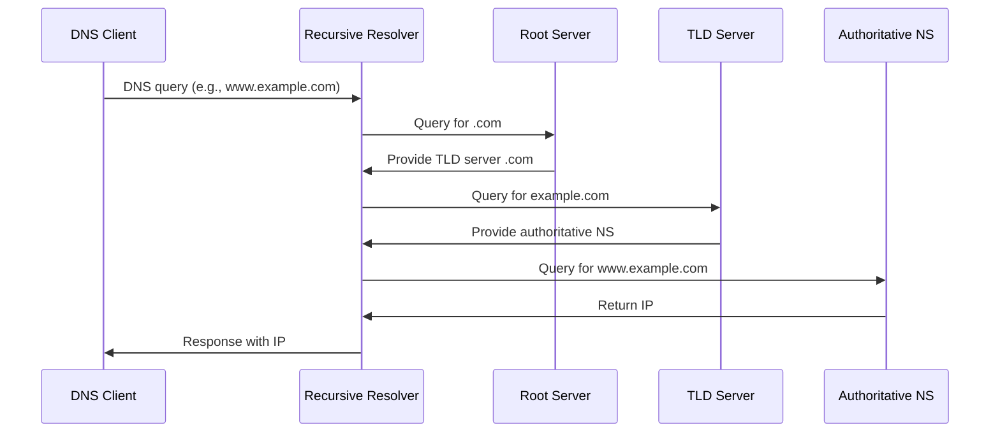
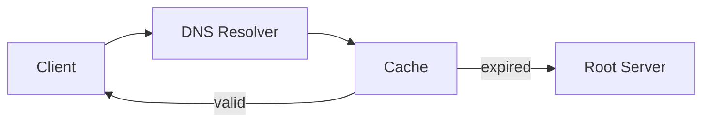

# DNS

DNS (Domain Name System) is a **distributed, hierarchical system** that resolves domain names (e.g., `example.com`) to IP addresses (e.g., `93.184.216.34`) and vice versa.

---

## Table of Contents

1. [Basics](#1-basics)
2. [How It Works (Recursive Lookup)](#2-how-it-works-recursive-lookup)
3. [Example Configuration - BIND (Linux)](#3-example-configuration---bind-linux)
4. [DNS Queries with `dig` and `nslookup`](#4-dns-queries-with-dig-and-nslookup)
5. [Caching and TTL](#5-caching-and-ttl)
6. [Security](#6-security)
7. [Examples of Common Records](#7-examples-of-common-records)
8. [Best Practices](#8-best-practices)

---

## 1. Basics

- **Purpose:** Translate human-readable domains into machine-readable IP addresses.
- **Hierarchy:**
  - Root zone (`.`)
  - Top-Level Domain (TLD, e.g., `.com`, `.de`)
  - Second-Level Domain (e.g., `example.com`)
  - Subdomains (e.g., `www.example.com`)

- **Types of DNS Records:**
  - `A` -> IPv4 address
  - `AAAA` -> IPv6 address
  - `CNAME` -> Alias to another domain name
  - `MX` -> Mail server
  - `NS` -> Nameserver
  - `PTR` -> Reverse lookup (IP -> name)
  - `TXT` -> Free text, e.g., SPF, DKIM

---

## 2. How It Works (Recursive Lookup)



---

## 3. Example Configuration - BIND (Linux)

### /etc/bind/named.conf.local

```text
zone "example.com" {
type master;
file "/etc/bind/db.example.com";
};
```

### /etc/bind/db.example.com

```text
$TTL 604800
@   IN  SOA ns1.example.com. admin.example.com. (
2025092901 ; Serial number
604800     ; Refresh
86400      ; Retry
2419200    ; Expire
604800 )   ; Negative Cache TTL
;
@       IN  NS      ns1.example.com.
@       IN  NS      ns2.example.com.
@       IN  A       93.184.216.34
www     IN  A       93.184.216.34
mail    IN  A       93.184.216.35
@       IN  MX 10   mail.example.com.
```

---

## 4. DNS Queries with `dig` and `nslookup`

```bash
# IPv4 address for www.example.com
dig A www.example.com

# Mail server for example.com
dig MX example.com

# Reverse lookup
dig -x 93.184.216.34

# Alternatively with nslookup
nslookup www.example.com
```

---

## 5. Caching and TTL

- **Resolvers cache responses** temporarily
- **TTL (Time To Live)** specifies how long a response is valid
- Example: `$TTL 3600` -> 1 hour



---

## 6. Security

- **DNSSEC:** Zone signing, protects against spoofing
- **Rate-Limiting:** Prevents amplification attacks
- **Logging & Monitoring:** Detect abusive queries

---

## 7. Examples of Common Records

### A Record

`www.example.com. IN A 93.184.216.34`

### AAAA Record

`www.example.com. IN AAAA 2606:2800:220:1:248:1893:25c8:1946`

### CNAME Record

`ftp.example.com. IN CNAME www.example.com.`

### MX Record

`example.com. IN MX 10 mail.example.com.`

### TXT Record (SPF)

`example.com. IN TXT "v=spf1 include:_spf.example.com ~all"`

---

## 8. Best Practices

1. **Use redundant nameservers** (at least 2)
2. **Enable DNSSEC** where possible
3. **Choose appropriate TTL:** short-term for dynamic services, long-term for stable domains
4. **Document zones thoroughly**
5. **Review logs regularly** for abuse

---
