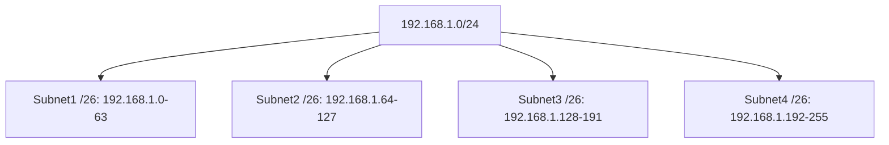
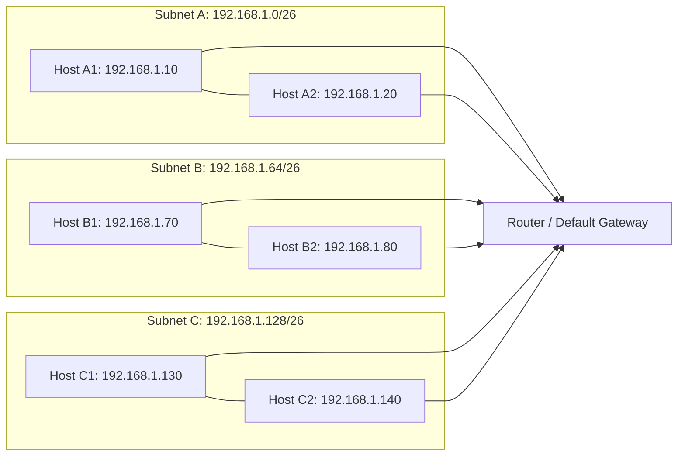

# IPv4

## Table of Contents

1. [What is IPv4](#what-is-ipv4)
2. [Structure of an IPv4 Address](#structure-of-an-ipv4-address)
3. [IPv4 Address Ranges](#ipv4-address-ranges)
    - [Private Addresses](#private-addresses)
    - [Public Addresses](#public-addresses)
4. [Subnetting in IPv4](#subnetting-in-ipv4)
    - [Subnet Mask](#subnet-mask)
    - [CIDR Notation](#cidr-notation)
5. [Communication Between Subnets](#communication-between-subnets)
6. [Subnet Calculation - Examples](#subnet-calculation---examples)
7. [Graphical Representation](#graphical-representation-communication-within-different-subnets)
8. [Summary](#summary)

---

## What is IPv4

**IPv4 (Internet Protocol Version 4)** is a network protocol that identifies devices via a **32-bit address**.  
Main functions:

- Addressing of hosts in a network
- Routing of packets between networks
- Fragmentation of packets for transmission over different media

---

## Structure of an IPv4 Address

- 32 bits, usually represented as **four octets** (0-255) in decimal: 192.168.1.10
- Each octet = 8 bits -> value range 0-255
- Example in binary: 11000000.10101000.00000001.00001010

---

### Characteristics

- **Network portion**: Identifies the subnet
- **Host portion**: Identifies the device within the subnet

---

## IPv4 Address Ranges

### Private Addresses

For internal networks (not routable on the Internet):

| Class | Range        | Usage              |
|-------|--------------|---------------------|
| A     | 10.0.0.0-10.255.255.255 | Large networks |
| B     | 172.16.0.0-172.31.255.255 | Medium-sized networks |
| C     | 192.168.0.0-192.168.255.255 | Small networks / LAN |

### Public Addresses

- All addresses that are **not private**
- Assigned by IANA / ISP
- Example: `8.8.8.8` (Google DNS)

---

## Subnetting in IPv4

Subnetting divides a large network into smaller subnets.

### Subnet Mask

- Defines which part of the address is **network** and which part is **host**.
- Example: `255.255.255.0` -> first 24 bits = network, last 8 bits = hosts

### CIDR Notation

- Shorter notation: `192.168.1.0/24` -> /24 = 24-bit network portion
- Enables flexible subnets (not classical A/B/C)

---

## Communication Between Subnets

- Devices in **different subnets** require a **router**.
- Packets from host A to host B are:

1. Check if destination is in the same subnet
2. If not -> forward to **default gateway**
3. Router delivers packet to destination subnet

---

## Subnet Calculation - Examples

### Step 1: Given Network

- Network: `192.168.1.0/24`
- Host range: 192.168.1.1 - 192.168.1.254
- Broadcast: 192.168.1.255
- Number of hosts: 2^8 - 2 = 254

### Step 2: Subnetting to /26

- New subnets: /26 -> 64 addresses per subnet
- Calculation:

| Subnet | Network | First Host | Last Host | Broadcast |
|--------|---------|------------|-----------|-----------|
| 1      | 192.168.1.0/26  | 192.168.1.1 | 192.168.1.62  | 192.168.1.63 |
| 2      | 192.168.1.64/26 | 192.168.1.65| 192.168.1.126 | 192.168.1.127 |
| 3      | 192.168.1.128/26| 192.168.1.129| 192.168.1.190 | 192.168.1.191 |
| 4      | 192.168.1.192/26| 192.168.1.193| 192.168.1.254 | 192.168.1.255 |

### Subnet Visualization

---

## Graphical Representation Communication within Different Subnets

---

## Summary

- IPv4 = 32-bit addresses, four octets
- Private and public addresses for internal/external use
- Subnetting divides networks into smaller logical subnets
- CIDR notation allows flexible network sizes
- Hosts within a subnet communicate directly, between subnets via router
- Subnet calculation: determine network, host range, broadcast  
