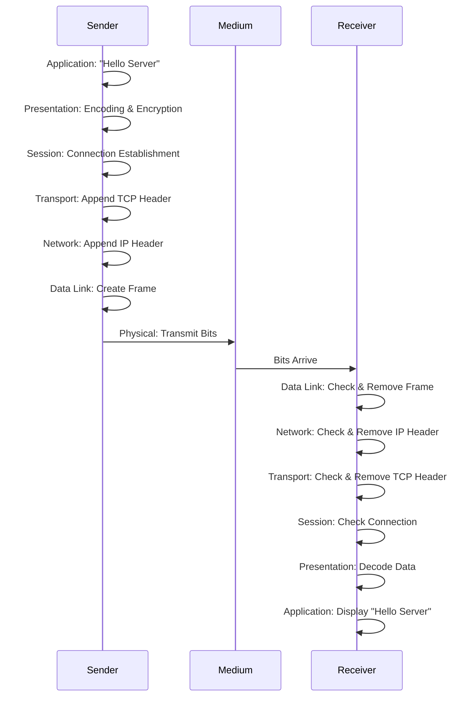

# ISO/OSI Model

The **ISO/OSI model** is a **layered model** for networks that explains how data is transmitted between two computers. It helps understand which tasks occur at which level in the network.

---

## Table of Contents

1. [Basic Concept](#1-basic-concept)
2. [The 7 OSI Layers](#2-the-7-osi-layers)
3. [Data Flow Between Two Computers](#3-data-flow-between-two-computers)
4. [Practical Example](#4-practical-example)
5. [Summary](#5-summary)

---

## 1. Basic Concept

- Network communication is complex.
- The OSI model divides this complexity into **7 layers**.
- Each layer has **its own tasks** and communicates only with directly adjacent layers.

---

## 2. The 7 OSI Layers

| Layer | Name                  | Task |
|-------|---------------------|------|
| 7     | Application         | Interface for programs (e.g., browser, email) |
| 6     | Presentation        | Data formatting, encryption, compression |
| 5     | Session             | Connection establishment, dialog control |
| 4     | Transport           | Reliable data transmission, sequencing (TCP/UDP) |
| 3     | Network             | Routing, IP addresses, packets |
| 2     | Data Link           | MAC addresses, frames, error detection |
| 1     | Physical            | Physical medium, electrical/optical signals |

---

## 3. Data Flow Between Two Computers

1. **Sender Computer**:
    - Application layer generates the data (e.g., "Hello Server")
    - Each underlying layer adds headers/metadata:
        - Transport: TCP/UDP header (ports, sequence number)
        - Network: IP header (source and destination address)
        - Data Link: Frame header (MAC addresses)
    - Physical layer sends the bits over the medium (cable, WiFi).

2. **Receiver Computer**:
    - Physical layer receives bits.
    - Data Link checks and removes frame header.
    - Network layer checks IP address and removes IP header.
    - Transport layer checks TCP/UDP header and sorts the data.
    - Upper layers finally provide the **original message** to the application.

---

## 4. Practical Example

You open `https://example.com` in a browser:

    1. Application layer: Generate HTTP request
 2. Presentation: Apply TLS encryption if needed
 3. Session: Establish TCP connection
 4. Transport: Create TCP packets
 5. Network: Add IP addresses to packets
 6. Data Link: Create frames for WiFi or Ethernet
 7. Physical: Send bits over cable/WiFi

At the server, these steps are processed in reverse order, so the original request arrives at the web server.

---

## 5. Summary

- The OSI model divides network communication into 7 layers.

- Each layer has a clear task.
- Data is "packaged" by the sender and "unpacked" by the receiver.
- It serves as a theoretical model for network protocols and troubleshooting.
