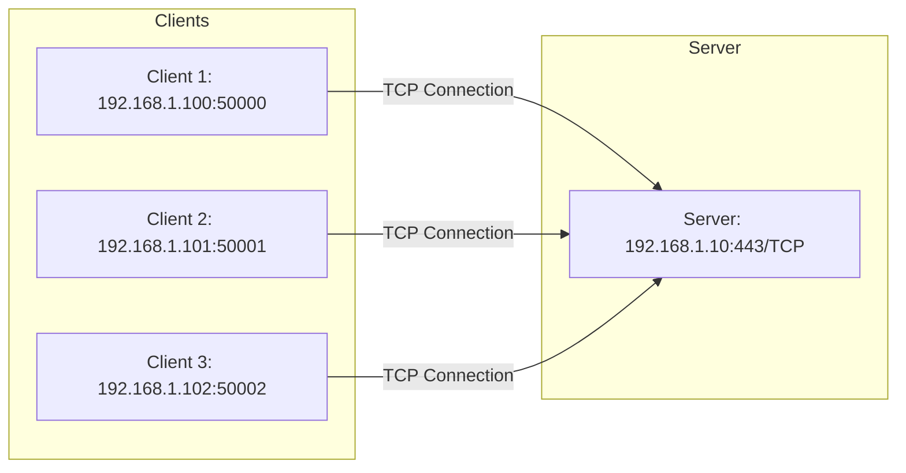
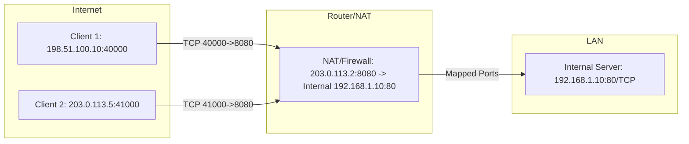

# Ports

## Table of Contents

1. [What is a Port](#1-what-is-a-port)
2. [Port Ranges](#2-port-ranges)
3. [TCP vs. UDP Ports](#3-tcp-vs-udp-ports)
4. [Port and Socket](#4-port-and-socket)
5. [Well-Known Ports](#5-well-known-ports)
6. [Useful Commands](#6-useful-commands-linux)
7. [Port Forwarding and NAT](#7-port-forwarding-and-nat)
8. [Summary](#8-summary)

---

## 1. What is a Port?

A **port** is a **numeric identifier** in a network protocol (e.g., TCP or UDP) that identifies a specific application or service on a host.  
Ports enable multiple services to communicate simultaneously over a single IP address.

- **Port numbers**: 16 bit -> values from 0 to 65535
- **Protocols**: TCP or UDP
- Combination of **IP address + port + protocol** = **Socket**

Example:

- `192.168.1.10:80/TCP` -> HTTP server on port 80
- `192.168.1.10:53/UDP` -> DNS resolver on port 53

---

## 2. Port Ranges

| Range        | Name                  | Usage |
|--------------|-----------------------|-------|
| 0–1023       | Well-known Ports      | Standard services (e.g., 22 SSH, 80 HTTP, 443 HTTPS, 25 SMTP) |
| 1024–49151   | Registered Ports      | Applications or services that don't require system privileges |
| 49152–65535  | Dynamic / Ephemeral Ports | Client-side temporary ports for outgoing connections |

---

## 3. TCP vs. UDP Ports

- **TCP Ports**
  - Connection-oriented (handshake, ACKs, sequence numbers)
  - Examples: SSH (22), HTTP (80), HTTPS (443), SMTP (25)

- **UDP Ports**
  - Connectionless, no handshake, no guaranteed delivery
  - Examples: DNS (53), DHCP (67/68), SNMP (161)

---

## 4. Port and Socket

A **socket** is the combination of:

IP address + port number + protocol

**Example:**  

- `192.168.1.10:443/TCP` -> HTTPS server

Multiple clients can establish a connection to this server port via different **source ports** simultaneously:

Client1: 192.168.1.100:50000 -> Server:192.168.1.10:443
Client2: 192.168.1.101:50001 -> Server:192.168.1.10:443

---

## 5. Well-Known Ports

| Port | Protocol       | Description |
|------|---------------|-------------|
| 20   | FTP (Data)    | File transfer (data channel) |
| 21   | FTP (Control) | File transfer (control channel) |
| 22   | SSH           | Secure remote access |
| 23   | Telnet        | Unencrypted remote access |
| 25   | SMTP          | Email sending |
| 53   | DNS           | Name resolution |
| 67   | DHCP (Server) | IP address assignment (server) |
| 68   | DHCP (Client) | IP address assignment (client) |
| 69   | TFTP          | Trivial File Transfer Protocol |
| 80   | HTTP          | Web pages (unencrypted) |
| 110  | POP3          | Email retrieval |
| 123  | NTP           | Time synchronization |
| 143  | IMAP          | Email retrieval |
| 161  | SNMP          | Network management |
| 194  | IRC           | Internet Relay Chat |
| 443  | HTTPS         | Web pages (encrypted) |
| 465  | SMTPS         | Email sending over SSL/TLS |
| 514  | Syslog        | System message logging |
| 587  | SMTP (Submission) | Email sending with authentication |
| 993  | IMAPS         | Email retrieval over SSL/TLS |
| 995  | POP3S         | Email retrieval over SSL/TLS |

---

## 6. Useful Commands (Linux)

```bash
# Show all open TCP/UDP ports
ss -tuln

# Check specific ports (e.g., SSH)
nc -vz 192.168.1.10 22

# Check firewall rules for ports
sudo iptables -L -n
sudo ufw status

# Mapping of ports to services
cat /etc/services | grep 80
```

---

## 7. Port Forwarding and NAT

- Port Forwarding: Forward requests to public port to internal host/port.
- NAT (Network Address Translation): Translates private IPs/ports to public IPs/ports.  

**Example:**

```text
External IP:203.0.113.2:8080 -> Internal:192.168.1.10:80
```

---

## Multiple Clients Access the Same Server Port



**Explanation:**  
• Each client uses its own source port.
• All connections go to the same server port (e.g., HTTPS 443).
• Combination of client IP + client port + server IP + server port = socket, allowing the server to uniquely distinguish connections.

## Data Flow: Internet -> NAT/Firewall -> Internal Server



**Explanation:**

- Clients on the internet each use their own source ports (40000, 41000) for the connection.
- Router/NAT receives packets at the public IP/port (203.0.113.2:8080).
- NAT translates the destination address to the internal server IP (192.168.1.10:80) and maintains a mapping table for return responses.
- The internal server sees all requests on port 80 but can uniquely distinguish each connection through the combination of client IP + port.
- Responses from the server are routed back to the corresponding clients via NAT.

---

## 8. Summary

- Ports identify services on a host.
- TCP/UDP have separate port number spaces.
- Well-known ports (0–1023) for standard services.
- Registered (1024–49151) and dynamic/ephemeral (49152–65535) for clients/applications.
- Combination of IP + port + protocol = socket.
- Important concepts: Port forwarding, NAT, firewall rules
