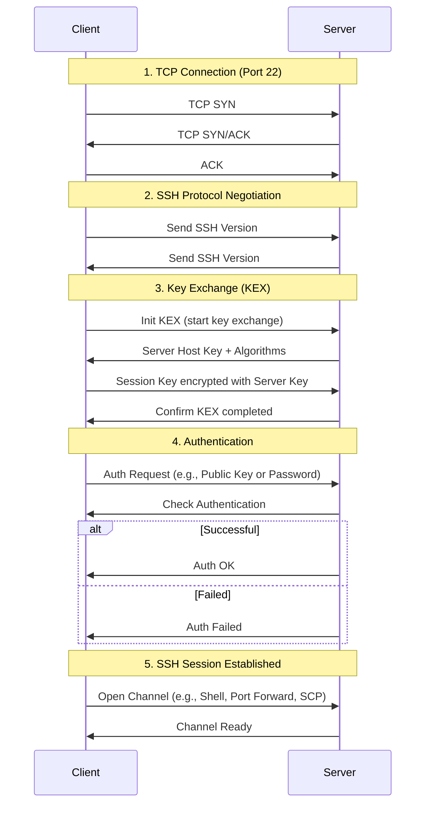

# SSH

SSH (Secure Shell) is a protocol that allows you to **securely access a remote computer**. It encrypts the connection so that no one can intercept your data or passwords.

---

## Table of Contents

1. [Basic Concept](#1-basic-concept)
2. [Advantages of SSH](#2-advantages-of-ssh)
3. [Establishing an SSH Connection](#3-establishing-an-ssh-connection)  
   3.1 [Username/Password](#31-usernamepassword-authentication)  
   3.2 [Passwordless Login](#32-passwordless-login-with-ssh-key)  
4. [Typical SSH Commands](#4-typical-ssh-commands)
5. [Detailed Process](#5-detailed-process-of-an-ssh-connection-with-existing-key-pair)
6. [Summary](#6-summary)

---

## 1. Basic Concept

Think of SSH as a **secure telephone**:

- You (client) want to log into a remote server.
- Instead of sending passwords unencrypted, SSH encrypts everything.
- There are two common login methods:
    1. **Username + password**
    2. **SSH keys** (more secure)

---

## 2. Advantages of SSH

- **Secure**: Encrypted connection, data and passwords are protected
- **Remote access**: Execute commands on a remote machine
- **File transfer**: Easily upload and download files
- **Automatable**: With keys without password, ideal for scripts

---

## 3. Establishing an SSH Connection

### 3.1 Username/Password Authentication

**Syntax:**

ssh [username]@[server-IP]

**Explanation:**

ssh -> The CLI command to start the SSH client

username -> The username on the target system

server-IP -> The IP or hostname of the target system

**Example:**

```bash
ssh bob@192.168.1.10
```

After entering the password, you'll be logged in and can **execute terminal commands on the server**.

### 3.2 Passwordless Login (with SSH Key)

SSH keys consist of **two parts**:

1. **Private key** -> remains secret on your computer
2. **Public key** -> goes on the server (`~/.ssh/authorized_keys`)

#### Process

1. Generate a key pair on your computer:

   ```bash
    ssh-keygen -t ed25519 -C "my-key"
   ```

2. Copy the public key to the server:

3. ```bash
   ssh-copy-id -i ~/.ssh/id_ed25519.pub bob@192.168.1.10
   ```

3. Now you can log in **without a password**:

4. ```bash
   ssh bob@192.168.1.10
   ```

---

## 4. Typical SSH Commands

- Test connection:
  ssh -v bob@192.168.1.10

- Copy files:
  scp file.txt bob@192.168.1.10:/home/bob/

- Copy directory:
  scp -r project bob@192.168.1.10:/home/bob/

- Alternative: rsync for fast, synchronized copies:
  rsync -avz project/ bob@192.168.1.10:/home/bob/project/

---

## 5. Detailed Process of an SSH Connection with Existing Key Pair

Assuming you have already created an **SSH key pair** (private + public) and the public key is on the server in the directory `~/.ssh/authorized_keys`.

### Connection Establishment

- You enter `ssh USER@IP` on your client machine
- The SSH client starts the connection to the SSH server
- The server accepts the TCP connection and announces its **host key** (public host key).
- The SSH client checks if the **host key** is already known (in `~/.ssh/known_hosts`).
- If the key is new:
  - The client asks if the server should be trusted.
  - After confirmation, the key is stored locally.  
      (This prevents **man-in-the-middle attacks**.)
- Client and server negotiate:
  - **Cryptographic algorithms** (e.g., AES, ChaCha20)
  - **Hash functions** (e.g., SHA256)
- The goal: generate a **secure symmetric session key** known only to client and server.
- This key is used for the entire session to encrypt data.

### User Authentication

Since a key pair exists:

1. **Client offers the public key** to the server (only the reference, not the private key).
2. **Server checks** if this public key is in `~/.ssh/authorized_keys` for `user`.
3. **Server sends a challenge** (random message) to the client.
4. **Client signs the challenge** with its private key.
5. **Server verifies the signature** with the public key:
    - If valid -> user is authenticated.
    - If invalid -> connection is rejected.

### Session Setup

- After successful authentication:
  - The SSH server creates a **shell for the user** (`user`).
  - The client receives the encrypted channel for:
    - Terminal commands
    - File transfers (scp, sftp)
    - Port forwarding

### Encrypted Data Transfer

- All data between client and server is encrypted:
  - Commands, outputs, file transfers
  - Protection against eavesdropping and manipulation

### Connection Termination

- When you enter `exit` or close the shell:
  - SSH session is terminated
  - Symmetric session key is discarded
  - Connection to server is cleanly closed

### Summary

1. SSH client starts connection.
2. Server host is verified.
3. Encryption and session keys are negotiated.
4. User is authenticated via key pair.
5. Encrypted session is established.
6. Data is securely transmitted.
7. Connection is cleanly terminated.



## 6. Summary

SSH is like a **secure tunnel** between your computer and a server.

- Everything you type or transmit is **encrypted**.
- Only the server with the matching key can decrypt the data.

You can:

- Execute terminal commands
- Transfer files
- Use automated scripts

**Security tip:** Use SSH keys instead of passwords, and set strong passphrases for private keys.
