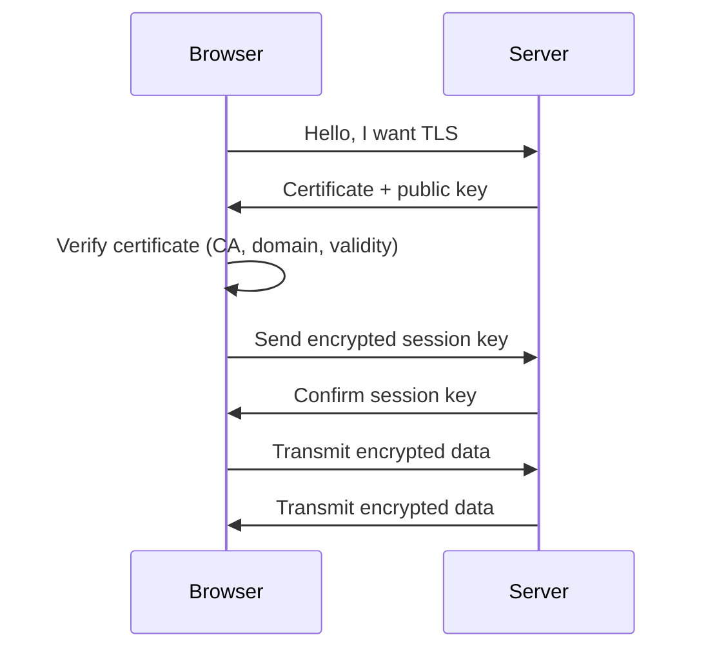

# SSL/TLS

**SSL (Secure Sockets Layer)** and **TLS (Transport Layer Security)** are protocols that enable **secure connections on the internet**. TLS is the more modern successor to SSL and is almost always used today.

---

## Table of Contents

1. [Basic Concept](#1-basic-concept)
2. [Why SSL/TLS](#2-why-ssltls)
3. [Connection Process (Handshake)](#3-ssltls-connection-process-handshake)
4. [Practical Example](#4-practical-example)
5. [Simplified Analogy](#5-simplified-analogy)
6. [Summary](#6-summary)

---

## 1. Basic Concept

Imagine SSL/TLS as an **encrypted tunnel between two computers**:

- Your browser (client) wants to load a website: `https://example.com`
- The connection should be **private** and **tamper-proof**.
- SSL/TLS encrypts the communication and verifies that the server is authentic.

---

## 2. Why SSL/TLS?

- **Confidentiality**: No one can intercept your data (passwords, credit card info).
- **Integrity**: Data is not modified in transit.
- **Authenticity**: You are certain you're communicating with the real server.

---

## 3. SSL/TLS Connection Process (Handshake)

Suppose you open `https://example.com`:

### Step 1: Start Connection

- Your browser says: "Hello server, I want to establish a secure connection."
- Browser sends supported encryption algorithms (cipher suites).

### Step 2: Server Responds

- Server selects the appropriate encryption.
- Server sends its **SSL/TLS certificate** (contains public key and identity).

### Step 3: Verify Certificate

- Browser checks:
  - Is the certificate from a **trusted Certificate Authority (CA)**?
  - Does the domain name match?
  - Is the certificate still valid?
- If everything is correct -> connection is accepted.

### Step 4: Negotiate Session Key

- Browser and server generate a **random session key** (symmetric encryption) known only to both parties.
- This key is used to **encrypt all data transmission**.

### Step 5: Encrypted Communication

- All data sent by browser and server is encrypted.
- Attackers cannot read or modify the data.

### Graphical Representation

- **Key Encryption**:
  - Public key: Everyone can see it, provided by the server.
  - Private key: Only the server knows it.
  - Session key: Generated once, for fast symmetric encryption.

---

## 4. Practical Example

- Browser shows `https://example.com` with a **green lock** -> connection via TLS.
- Data such as passwords, forms, or credit cards are **transmitted encrypted**.
- Even if someone monitors the network, they only see unreadable data.

---

## 5. Simplified Analogy

Imagine you're sending a **letter**:

- Without TLS: Letter lies open on the street -> anyone can read it.
- With TLS:
  - The envelope is sealed (encrypted)
  - Only the recipient can open the envelope (private key)
  - No one can change the content (integrity)

---

## 6. Summary

- **SSL/TLS = secure tunnel for data on the internet**
- **Steps**:
  1. Browser says hello
  2. Server sends certificate
  3. Browser verifies certificate
  4. Session key is generated
  5. All data is transmitted encrypted
- **Benefits**:
  - Confidentiality
  - Integrity
  - Authenticity

> TLS is the standard today, SSL is rarely used anymore. All modern browsers and servers use TLS automatically.
