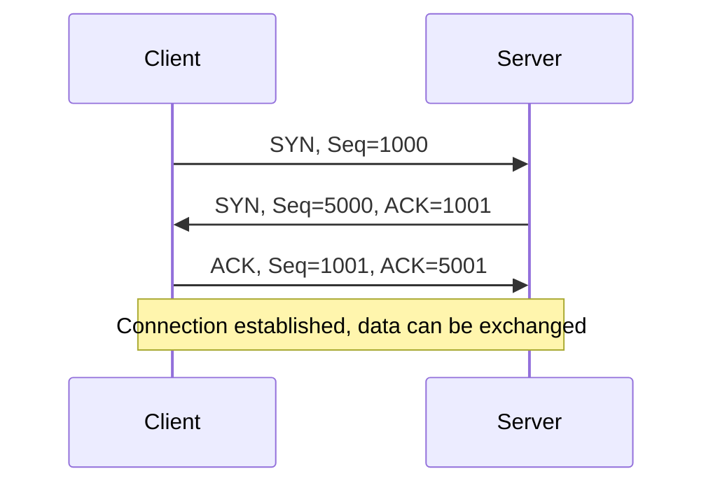

# TCP 3-Way Handshake

Before two computers **exchange data over TCP**, they perform a **3-way handshake**. This ensures that:

- Both sides are ready to send and receive data.
- A connection is reliably established.

---

## Table of Contents

1. [Basic Concept](#1-basic-concept)
2. [Process](#2-process-step-by-step)
3. [Graphical Representation](#3-graphical-representation)
4. [Important Points](#4-important-points)
5. [Analogy](#5-analogy)

---

## 1. Basic Concept

TCP (Transmission Control Protocol) is **connection-oriented**.  
The 3-way handshake consists of **three steps**:

1. **SYN** -> Synchronization
2. **SYN-ACK** -> Acknowledgment of synchronization
3. **ACK** -> Acknowledgment of acknowledgment

---

## 2. Process Step by Step

### Step 1: SYN (Synchronization)

- Client wants to establish a connection to server on port e.g. 80 (HTTP).
- Client sends a TCP packet with the **SYN flag** and an **Initial Sequence Number (ISN)**.

**Example:**
Client -> Server: SYN, Seq=1000

---

### Step 2: SYN-ACK (Synchronization + Acknowledgment)

- Server receives the SYN packet.
- Server reserves resources for the connection.
- Server responds with:
  - **SYN** -> own Initial Sequence Number (e.g., 5000)
  - **ACK** -> Acknowledgment of client ISN (1000+1)

**Example:**
Server -> Client: SYN, Seq=5000, ACK=1001

---

### Step 3: ACK (Acknowledgment)

- Client receives SYN-ACK from server.
- Client sends an **ACK packet**:
  - Acknowledgment of server ISN (5000+1)
- Connection is now **fully established**.

**Example:**
Client -> Server: ACK, Seq=1001, ACK=5001

---

## 3. Graphical Representation

---

## 4. Important Points

- Sequence Numbers (Seq): Numbering of bytes to ensure order.

- ACK: Acknowledgment that packets were received.
- Connection is only fully established after the third step.
- After the 3-way handshake, the client can send data, and the server is ready to receive it.

---

## 5. Analogy

- Phone call:  
    1. Client: "Hello, want to talk?" -> SYN  
    2. Server: "Yes, I'm ready, let's go!" -> SYN-ACK  
    3. Client: "Great, let's start!" -> ACK  
          - Only now is the conversation-capable connection active.

- When you run `curl http://example.com`:  
    1. Your computer sends SYN to port 80 of the server.  
    2. Server responds with SYN-ACK.  
    3. Your computer sends ACK -> TCP connection is established.  
          - After that, HTTP communication begins over this secure TCP channel.
