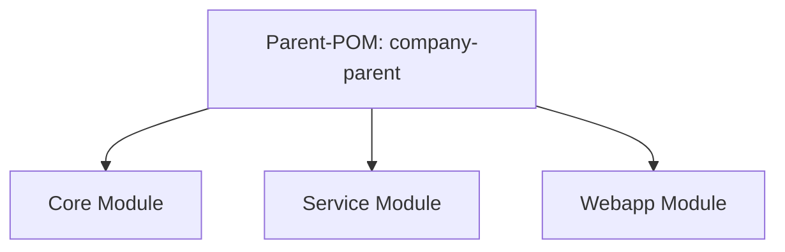

# Multi-Module Maven Project with Parent-POM



## Table of Contents

1. [Project Structure](#project-structure)
2. [Example Parent-POM](#example-parent-pom)
3. [Example Submodules](#example-submodules)
4. [Explanation](#explanation)

---

## Project Structure

```bash
company-parent/
├── pom.xml              # Parent-POM
├── core/
│   └── pom.xml          # Module Core
├── service/
│   └── pom.xml          # Module Service
└── webapp/
└── pom.xml          # Module Webapp
```

---

- `company-parent/pom.xml` → defines versions, plugins, DependencyManagement
- `core/pom.xml`, `service/pom.xml`, `webapp/pom.xml` → inherit from Parent-POM

---

## Example Parent-POM

```xml
<project>
<modelVersion>4.0.0</modelVersion>
<groupId>com.company</groupId>
<artifactId>company-parent</artifactId>
<version>1.0.0</version>
<packaging>pom</packaging>

    <modules>
        <module>core</module>
        <module>service</module>
        <module>webapp</module>
    </modules>

    <properties>
        <java.version>17</java.version>
    </properties>

    <dependencyManagement>
        <dependencies>
            <dependency>
                <groupId>org.springframework.boot</groupId>
                <artifactId>spring-boot-starter</artifactId>
                <version>3.2.1</version>
            </dependency>
        </dependencies>
    </dependencyManagement>
</project>
```

---

## Example Submodules

```xml
<project>
<modelVersion>4.0.0</modelVersion>

    <parent>
        <groupId>com.company</groupId>
        <artifactId>company-parent</artifactId>
        <version>1.0.0</version>
    </parent>

    <artifactId>core</artifactId>
    <version>1.0.0</version>

    <dependencies>
        <dependency>
            <groupId>org.springframework.boot</groupId>
            <artifactId>spring-boot-starter</artifactId>
        </dependency>
    </dependencies>
</project>
```

- Same pattern applies to `service/pom.xml` and `webapp/pom.xml`

---

## Explanation

1. **Parent-POM**
    - Contains common versions, plugins, properties
    - Lists all submodules in the `<modules>` section

2. **Submodules**
    - Inherit settings and version information
    - Can add their own specific dependencies

3. **Dependencies between modules**
    - `Service` can use `Core` as a dependency
    - `Webapp` can use both `Core` and `Service`

4. **Advantage**
    - Central management
    - Consistent build configuration
    - Easy multi-module builds (`mvn clean install` from Parent)
