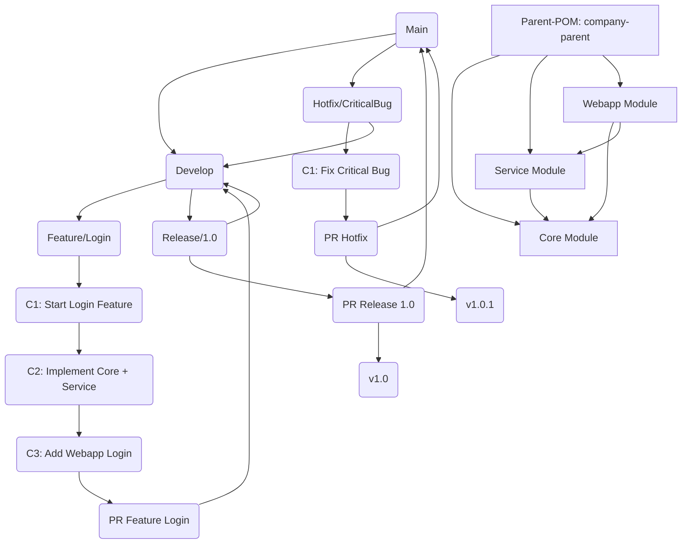
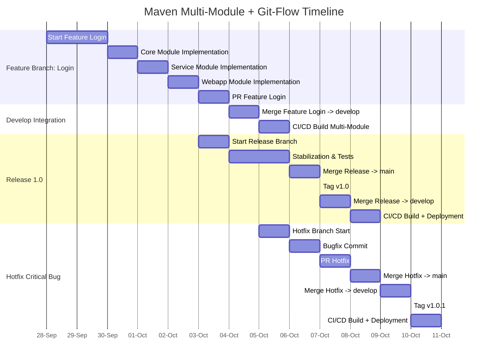

# Maven Multi-Module + Git-Flow Workflow Overview

## Table of Contents

1. [Project Overview](#project-overview)
2. [Parent-POM](#parent-pom)
3. [Submodules](#submodule-beispiel-core)
4. [Git-Flow Branches](#git-flow-branches)
5. [Mermaid Diagram: Multi-Module + Git-Flow](#mermaid-diagram-multi-module--git-flow)
6. [Workflow Explanation](#workflow-explanation)
7. [Timeline](#maven-multi-module--git-flow-timeline)

---

## Project Overview

- **Parent-POM**: Central management of dependencies, plugins and versions
- **Submodules**: `core`, `service`, `webapp`
- **Git-Flow**: `main`, `develop`, `feature/*`, `release/*`, `hotfix/*`
- **CI/CD**: Build and test of multi-module projects on merge into `develop` or `main`

```bash
company-parent/
├── pom.xml              # Parent-POM
├── core/
│   └── pom.xml          # Modul Core
├── service/
│   └── pom.xml          # Modul Service
└── webapp/
└── pom.xml          # Modul Webapp
```

---

## Parent-POM

```xml
<project>
<modelVersion>4.0.0</modelVersion>
<groupId>com.company</groupId>
<artifactId>company-parent</artifactId>
<version>1.0.0</version>
<packaging>pom</packaging>

    <modules>
        <module>core</module>
        <module>service</module>
        <module>webapp</module>
    </modules>

    <properties>
        <java.version>17</java.version>
        <spring.boot.version>3.2.1</spring.boot.version>
    </properties>

    <dependencyManagement>
        <dependencies>
            <dependency>
                <groupId>org.springframework.boot</groupId>
                <artifactId>spring-boot-starter</artifactId>
                <version>${spring.boot.version}</version>
            </dependency>
        </dependencies>
    </dependencyManagement>

    <build>
        <plugins>
            <plugin>
                <groupId>org.apache.maven.plugins</groupId>
                <artifactId>maven-compiler-plugin</artifactId>
                <version>3.11.0</version>
                <configuration>
                    <source>${java.version}</source>
                    <target>${java.version}</target>
                </configuration>
            </plugin>
        </plugins>
    </build>
</project>
```

---

## Submodule Beispiel (Core)

```xml
<project>
<modelVersion>4.0.0</modelVersion>

    <parent>
        <groupId>com.company</groupId>
        <artifactId>company-parent</artifactId>
        <version>1.0.0</version>
    </parent>

    <artifactId>core</artifactId>
    <version>1.0.0</version>

    <dependencies>
        <dependency>
            <groupId>org.springframework.boot</groupId>
            <artifactId>spring-boot-starter</artifactId>
        </dependency>
    </dependencies>
</project>
```

---

## Git-Flow Branches

- **main** → Production code
- **develop** → Integration of all features
- **feature/login** → Login feature development
- **release/1.0** → Release 1.0 preparation
- **hotfix/critical-bug** → Critical fix

---

## Mermaid Diagram: Multi-Module + Git-Flow



---

## Workflow Explanation

1. **Feature Branch**
    - Branch off from `develop`
    - Development in multiple submodules (`core`, `service`, `webapp`)
    - PR merge back into `develop`

2. **Release Branch**
    - Branch off from `develop`
    - Stabilization, tests, bugfixes
    - Merge into `main` and tagging (`v1.0`)
    - Merge back into `develop`

3. **Hotfix Branch**
    - Branch off from `main`
    - Critical bugfixes
    - Merge into `main` + `develop`
    - Tagging (`v1.0.1`)

4. **Parent-POM**
    - Unified management of dependencies, plugins, properties
    - Submodules inherit all settings, can add their own dependencies

5. **Advantages**
    - Parallel feature development on submodules
    - Consistent build configuration
    - Easy CI/CD integration
    - Clean versioning through releases and tags

---

## Maven Multi-Module + Git-Flow Timeline

### Introduction

This timeline shows the **chronological progression of a feature**, from development in submodules through PR, merge, release and hotfixes:

- Multi-module builds (`core`, `service`, `webapp`)
- Feature branch with multiple commits
- Pull requests (PR)
- Release branch with tagging
- Hotfix branch with critical fix

---

### Timeline



---

### Explanation

1. **Feature Branch**
    - Multiple commits on submodules (`core`, `service`, `webapp`)
    - PR merge into `develop`

2. **Develop Integration**
    - Multi-module build via CI/CD
    - Automatic test and package

3. **Release 1.0**
    - Release branch for stabilization & tests
    - Merge into `main` + tagging (`v1.0`)
    - Merge back into `develop`
    - CI/CD deployment

4. **Hotfix Critical Bug**
    - Hotfix branch directly from `main`
    - Commit + PR + merge into `main` + `develop`
    - Tag v1.0.1
    - CI/CD deployment

5. **Timeline Advantages**
    - Chronological overview of feature development
    - CI/CD build processes visualized
    - Release and hotfix activities clearly visible
    - Multi-module dependencies and sequence visible

---
