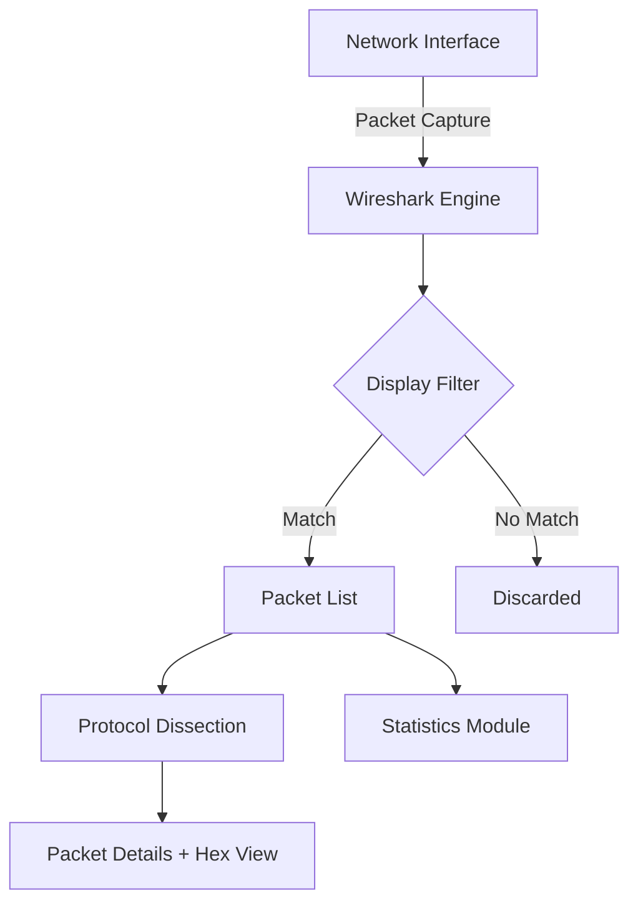

# 🧠 Wireshark  

**Topic:** Network Analysis, Troubleshooting & Security

Wireshark is one of the most powerful tools for network analysis, troubleshooting, and security research.  
It allows you to **capture network packets live**, **filter**, **decode**, and **interpret** them.

---

## Table of Contents

1. [Basics](#basics)
2. [Installation](#installation)
3. [Basics of Packet Capture](#basics-of-packet-capture)
4. [User Interface Layout](#user-interface-layout)
5. [Filter Basics](#filter-basics)
6. [Typical Protocols and Their Analysis](#typical-protocols-and-their-analysis)
7. [Analysis Examples](#analysis-examples)
8. [Color Rules](#color-rules)
9. [Statistics Functions](#statistics-functions)
10. [CLI Version: TShark](#cli-version-tshark)
11. [Performance Tips](#performance-tips)
12. [Security & Privacy](#security--privacy)
13. [Integration in CI/CD or Forensics](#integration-in-cicd-or-forensics)
14. [Visualization with Mermaid](#visualization-with-mermaid)
15. [Troubleshooting Checklist](#troubleshooting-checklist)
16. [Best Practices](#best-practices)
17. [Advanced Tools](#advanced-tools)
18. [Conclusion](#conclusion)

---

## Basics

### What is Wireshark?

- An **open-source network protocol analyzer**
- Designed to:
  - Record network traffic in real time
  - Analyze packets on layers 2-7
  - Identify communication problems
  - Investigate security events

### Typical Use Cases

| Use Case           | Description                                  |
|--------------------|----------------------------------------------|
| 🧩 Troubleshooting | Packet loss, latency, DNS problems           |
| 🔒 Security Audits | Detection of suspicious communication        |
| 🧰 Performance     | Measurement of throughput and RTT            |
| 🎓 Learning        | Understanding TCP/IP, HTTP, TLS, DNS, etc.   |

---

## Installation

### macOS (e.g., on an M1 Mac)

```bash
brew install wireshark --cask
```

👉 Then start Wireshark via `/Applications/Wireshark.app`.

### Linux (Debian/Ubuntu)

```bash
sudo apt update && sudo apt install wireshark -y
sudo usermod -aG wireshark $USER
```

Then log in again so the user can sniff without `sudo`.

### Windows

- Download at [https://www.wireshark.org/download.html](https://www.wireshark.org/download.html)
- Install with **Npcap** (enables packet capture)
- Optional: **TShark** for CLI usage

---

## 🔹Basics of Packet Capture

### Start Capture

1. Select interface (e.g., `en0` for WLAN)
2. Click "Start Capturing Packets"
3. Observe live traffic in real time

### Stop Capture

- Button 🟥 (Stop)
- Save file:  
  **File -> Save As -> capture.pcapng**

---

## User Interface Layout

| Area                    | Description                                                     |
|-------------------------|-----------------------------------------------------------------|
| **Packet List Pane**    | Overview of all packets (number, time, source, dest, protocol)  |
| **Packet Details Pane** | Structured display of protocol layers                           |
| **Packet Bytes Pane**   | Hex and ASCII view of packet content                            |
| **Display Filter Bar**  | Filters for targeted analysis (`http`, `tcp.port==80`, etc.)    |

---

## Filter Basics

Wireshark uses two types of filters:

| Filter Type        | Syntax                              | Example                  |
|--------------------|-------------------------------------|--------------------------|
| **Capture Filter** | BPF (before capture)                | `host 10.10.0.1`         |
| **Display Filter** | Wireshark syntax (after capture)    | `ip.src == 192.168.1.10` |

### Capture Filter Examples

| Purpose                  | Filter              |
|--------------------------|---------------------|
| Only traffic to/from host| `host 192.168.0.10` |
| Only TCP port 80         | `tcp port 80`       |
| Only ICMP (Ping)         | `icmp`              |
| Everything except DNS    | `not port 53`       |

### Display Filter Examples

| Purpose                        | Filter                                                   |
|--------------------------------|----------------------------------------------------------|
| Only HTTP packets              | `http`                                                   |
| Only DNS queries               | `dns.qry.name`                                           |
| Show TCP resets                | `tcp.flags.reset==1`                                     |
| Only failed TLS handshakes     | `tls.handshake.type==2 and tls.handshake.failure_reason`|

---

## Typical Protocols and Their Analysis

### 🌐 HTTP

```text
Filter: http
```

- Allows insight into GET/POST requests, headers, and status codes
- Example:  
  "Follow -> HTTP Stream" -> Shows complete HTTP dialog

---

### 🔐 HTTPS / TLS

```text
Filter: tls
```

- Shows TLS handshakes, certificates, cipher suites
- If you have private keys:
  **Preferences -> Protocols -> TLS -> RSA Keys** -> Decrypt TLS

---

### 📡 DNS

```text
Filter: dns
```

- Analysis of domain queries
- Fields like `dns.qry.name` or `dns.resp.name`

---

### 📦 TCP

```text
Filter: tcp
```

- Control of connections: SYN, ACK, FIN, RST
- Identify retransmissions, out-of-order packets, latency

---

### 🧭 ICMP

```text
Filter: icmp
```

- Control of ping requests and responses
- Helpful for diagnosing reachability problems

---

## Analysis Examples

### Example 1: Make HTTP Communication Visible

```bash
# Step 1: Start capture
# Step 2: Open browser and visit http://example.com
# Step 3: Set filter: http
```

You see:

- `GET /index.html`
- `Host: example.com`
- `200 OK` response
- Packet sizes, RTT, etc.

---

### Example 2: Check DNS Resolution

```bash
# Filter:
dns
```

You see:

- Query to `8.8.8.8`
- `Query: example.com`
- `Response: 93.184.216.34`

---

### Example 3: Follow TCP Handshake

```text
Filter: tcp.port == 443
```

1️⃣ SYN (Client -> Server)  
2️⃣ SYN, ACK (Server -> Client)  
3️⃣ ACK (Client -> Server)

This forms the **3-way handshake**.

---

## Color Rules

Wireshark highlights packets with colors:

| Color      | Meaning                                     |
|------------|---------------------------------------------|
| Light green| TCP                                         |
| Light blue | UDP                                         |
| Dark blue  | DNS                                         |
| Black      | Faulty packets (e.g., checksum failures)    |

These rules can be adjusted under  
**View -> Coloring Rules**.

---

## Statistics Functions

### a) Protocol Hierarchy

**Statistics -> Protocol Hierarchy**  
-> Shows how many packets exist per protocol.

### b) Conversations

**Statistics -> Conversations**  
-> Shows communication relationships between IPs and ports.

### c) I/O Graphs

**Statistics -> I/O Graphs**  
-> Shows traffic volume over time.

Example: Display throughput over time.

---

## CLI Version: TShark

Wireshark provides a terminal version called **TShark**.

### Start Capture

```bash
tshark -i en0 -w capture.pcap
```

### Display Packets

```bash
tshark -r capture.pcap -Y "http"
```

### Output Only Source IP + Destination IP

```bash
tshark -r capture.pcap -T fields -e ip.src -e ip.dst
```

---

## Performance Tips

- Limit large captures with:
  - **File -> Capture Options -> Limit File Size**
- Use display filters instead of manual scrolling
- **Time Display Format -> Seconds since previous displayed packet**
- Hide old packets: **Edit -> Preferences -> Capture**

---

## Security & Privacy

⚠️ Wireshark can show **sensitive data**:

- Passwords in plain text (HTTP, FTP, Telnet)
- Session cookies
- Certificate information

👉 Therefore:

- Never capture foreign networks without permission
- Don't share sensitive captures
- Anonymization possible with **editcap --remove**

---

## Integration in CI/CD or Forensics

### Example: Automated Analysis with TShark

```bash
#!/bin/bash
# check_dns.sh

tshark -r capture.pcap -Y "dns" -T fields -e dns.qry.name > dns_queries.txt

echo "Analyzed DNS queries:"
cat dns_queries.txt
```

Usage:

```bash
./check_dns.sh
```

---

## Visualization with Mermaid



---

## Troubleshooting Checklist

✅ DNS resolution not working  
-> Filter: `dns`  
-> Check query and response

✅ Connection hangs  
-> Filter: `tcp.analysis.retransmission`  
-> TCP retransmissions?

✅ No response from server  
-> Filter: `ip.addr == <server>`  
-> Check if response packets arrive

✅ Suspicious traffic  
-> Filter: `http contains "malware"`  
-> Check unencrypted payloads

---

## Best Practices

- Use **capture filters** to keep data volume low
- Document filter expressions and observations
- Compare packets from **client** and **server perspective**
- Save important sessions as `.pcapng`
- Use **profiles** for different analyses (HTTP, DNS, TLS, etc.)

---

## Advanced Tools

| Tool         | Description                           |
|--------------|---------------------------------------|
| **TShark**   | CLI version of Wireshark              |
| **tcpdump**  | Lightweight capture tool              |
| **editcap**  | Split and filter PCAP files           |
| **mergecap** | Merge multiple PCAPs                  |
| **ngrep**    | Text search in network traffic        |

---

## Conclusion

Wireshark is **the** standard tool for network analysis:

- 📡 Live capture and filtering
- 🧩 Deep analysis up to layer 7
- 🔍 Visualization and statistics
- 🛡️ Indispensable for security analysts, admins, and developers

Anyone who masters Wireshark **really** understands networks –  
from TCP handshakes to TLS certificates, from DNS to HTTP2.

---
