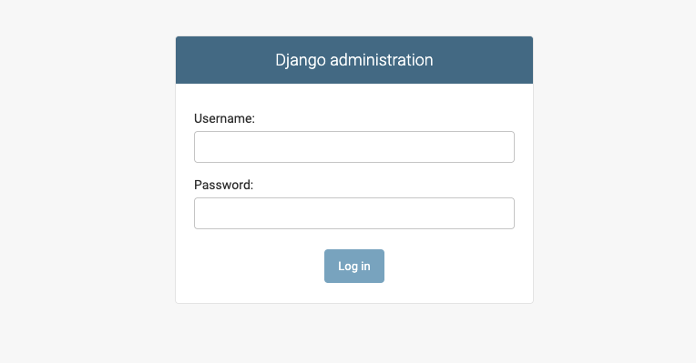
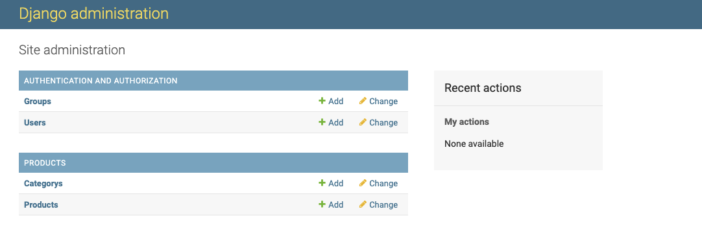

# Baby Tools Shop

The goal of this project is to containerize a Django app. This includes creation of a virtual Python environment in the Docker container and creation of a Django superuser (for admin interface).

## Table of content

1. [Prerequisites](#prerequisites)
2. [Quickstart](#quickstart)
3. [Usage](#usage)
4. [Photos](#photos)

### Prerequisites

- Git
- Docker

### Quickstart

- Open a terminal

- Navigate to a folder of choice

```bash
cd my/test/folder
```

- Clone the project

```bash
git clone https://github.com/reiloe/baby-tools-shop.git
```

- Navigate into the root folder (named baby-tools-shop)

```bash
cd baby-tools-shop
```

- run the following command:

```bash
./setup.sh example.env
```

:::caution
The file [example.env](example.env) is only for testing !!!
:::

The container is ready for use after a short time and can be accessed at localhost:8025.
You can visit the admin interface of the web server at localhost:8025/admin (username/password is in example.env)

### Usage

The example.env file from the [Quickstart](#quickstart) contains settings for the web server (e.g.: the admin user).  
For your own (and more secure) use, you must copy the example.env file and rename the copy to .env.  

```bash
cp example.env .env
```

You should then replace the example values in the copied .env file with your own values.  
Now you can run the project with your own settings:

```bash
./setup.sh .env
```

:::note
After the first start, there are no products, categories nor shop users in the shop system  
You must create products and categories in the admin panel.  
Users have to register via registration page
:::

### Photos

#### Shop Home Page with login


#### Shop Home Page with filter


#### Shop Product Detail Page


#### Shop Home Page with no login


#### Shop Register Page


#### Shop Login Page


#### Admin Login Page



#### Admin Page


