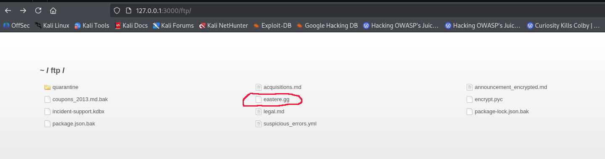
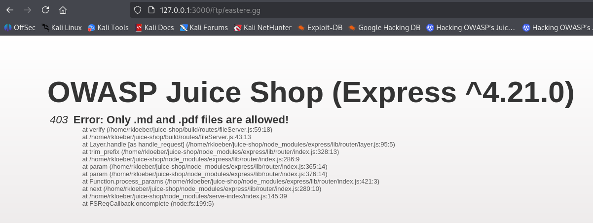
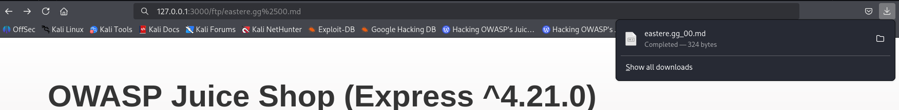
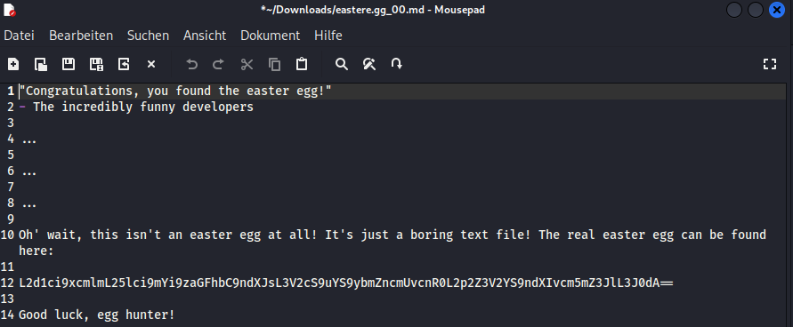
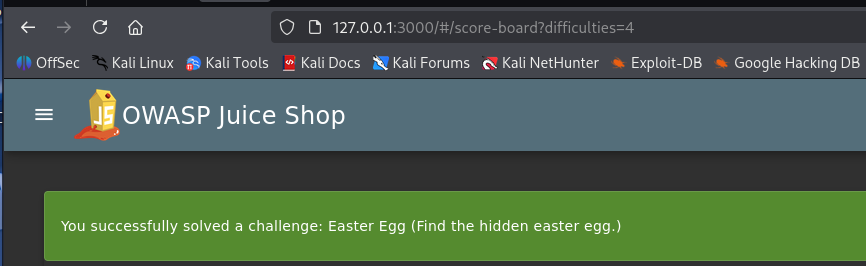

# Easter Egg

Find the hidden easter egg.

**Type:** Broken Access Control  
**Difficulty:** 4 Stars

## Procedure

In another challenge I found a folder "ftp" with some files in it. One of the files was named **easter.egg**.  

  

When you try to open or download the file, an error occurs.  

  

This error is already known from another challenge, as is the solution: **Poison Null Byte**

## Solution

After clicking the **easter.egg** file, add **%2500.md** at the end of the URL and hit Enter. The file will be downloaded immediately.  

  

Now you can open the downloaded file

  

and the challenge is solved.

  
