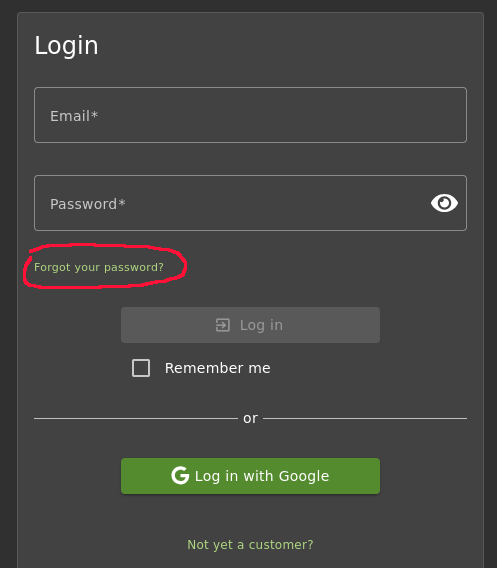
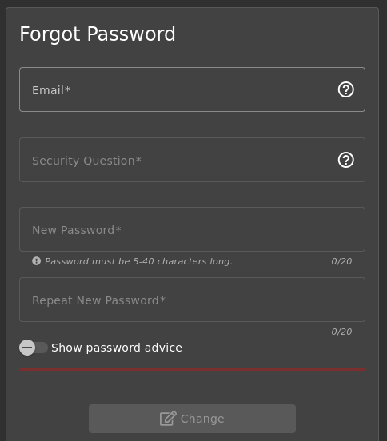
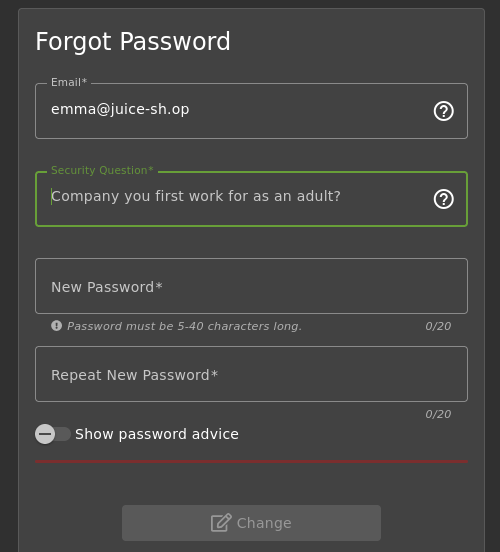
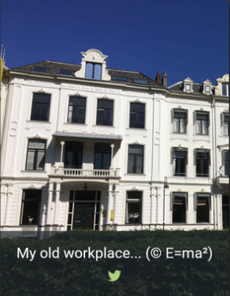
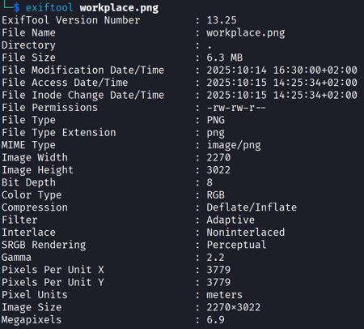
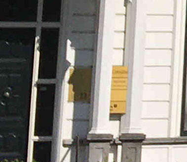
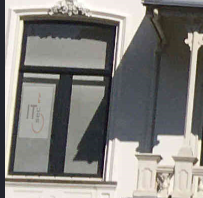
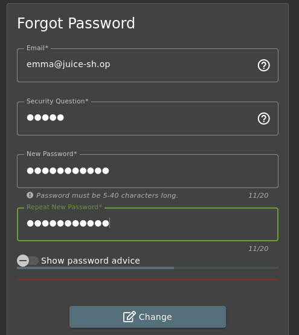
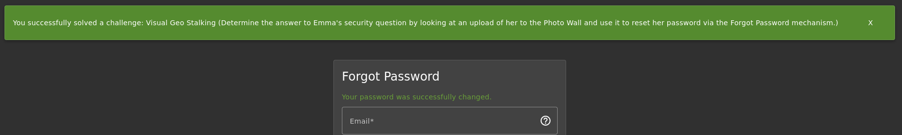

# Visual Geo Stalking

Determine the answer of Emma’s security question by looking at an upload of her to the Photo Wall and use it to reset her password via the „Forgot Password“ mechanism

**Type:** Sensitive Data Exposure  
**Difficulty:** 2 Stars

## Procedure

### Retrieving the security question

The security question is part of the "Forgot Password"-form, so you have to go to this form.  
To do so you have to click on Account and Login.  
On the Login-form you find a link "Forgot your password".  

  

By clicking this link you will be forwarded to the "Forgot Password"-form.  

  

Since Emma's login (email) is unknown, but there is a pattern for logins in the Juice Shop, simply apply this template to Emma as well.  
And voilà, the security question is displayed.  

  

### Finding clues on the Photo Wall

According to the description of this challenge, there should be clues to the answer to the “security question” in a photo that Emma uploaded to the Photo Wall.
You can find the Photo Wall by opening the side menu (top left) and clicking on “Photo Wall.”  
Some research on the photo wall led me to the last photo, on which the copyright looks like the name Emma and the description is something about a workplace.  

  

### Finding hints for the answer of the security question

Remembering another challenge, I downloaded the photo to examine it more closely.

#### Reading metadata with exiftool

Perhaps, as in the other challenge, there are clues hidden in the photo's metadata. So I gave exiftool a try and entered the following on the console:  

```bash
exiftool workplace.png
```

Unfortunately, no useful information could be found in the metadata.

  

#### Inspect the photo

Since there was no clue hidden in the metadata, I examined the photo more closely.  
I noticed a sign right next to the door. Perhaps it contains important information. Unfortunately, the sign is partially obscured and illegible.  



I found another sign on the window on the first floor near the balcony.  
Zoom into the window, and a sign with letters became visible that could possibly be a company name.

  

## Give it a try

With the name from the sign on the window, it's time to see if it's the answer to Emma's security question.  
So go back to the “Forgot Password” form, enter Emma's login and the name on the sign, “ITsec,” as the answer. Assign any password and repeat it.  

  

Click on the “Change” button and voilà, the challenge is solved.  

  
