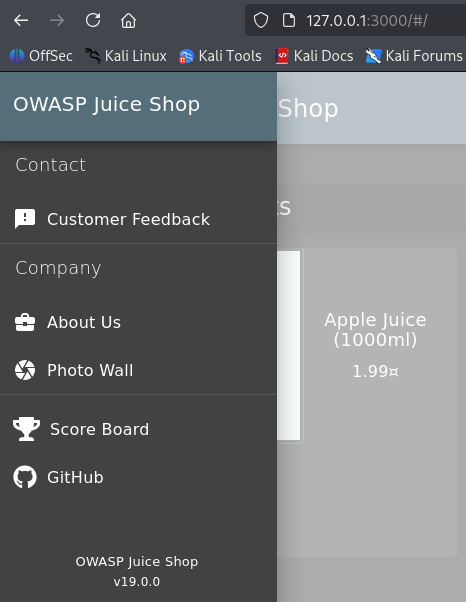
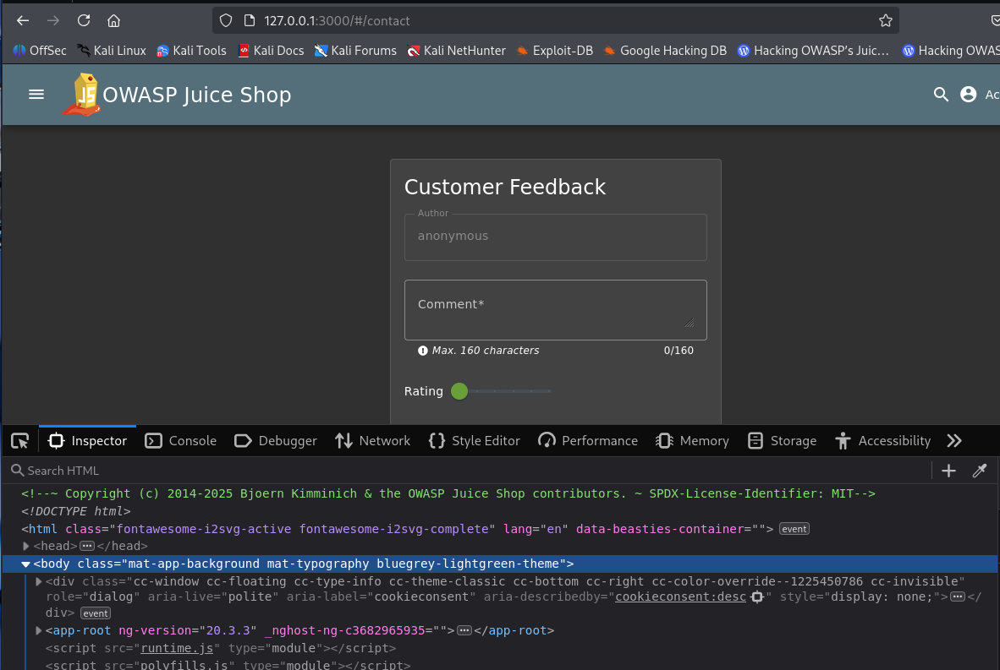
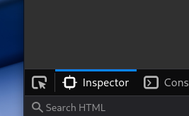
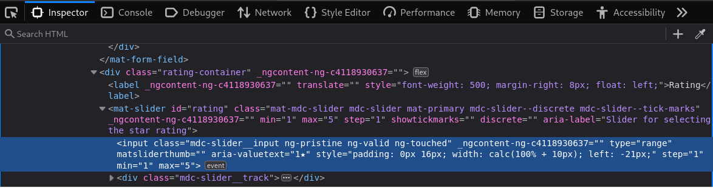
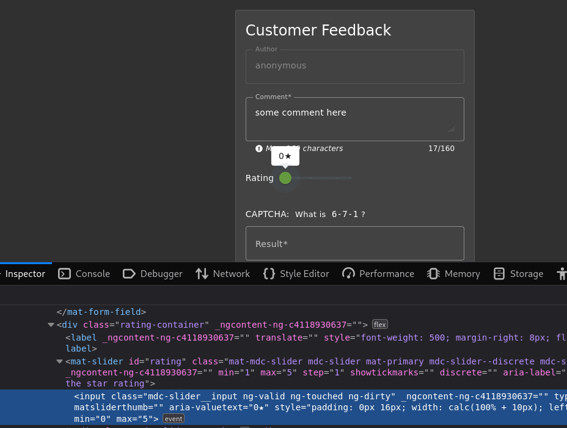
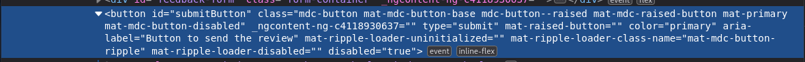
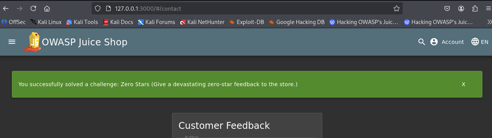

# Zero Stars (alternative solution)

Give a devasting zero-star feedback to the store

**Type:** Improper Input Validation  
**Difficulty:** 1 Stars

## Procedure

Instead of BurpSuite or similar tools, I will only use Firefox and its built-in developer tools to solve this challenge.

First, open the “Customer Feedback” page by clicking on the burger menu in the top left corner and then on “Customer Feedback.”  

  

When the page with the “Customer Feedback” form is open, open the developer tools and select the “Inspector” tab.  

  

Fill in some comment.  

After that, click the arrow next to the "Inspector"-tab.  

Click on the slider in the feedback form. HTML code will be highlighted in the Inspector tab. In this code, you will find the settings for the slider (min=‘1’ max=‘5’).  

  

Change the minimum value to 0, and as you can see, the minimum value of the slider in the feedback form has also changed to 0.  

  

Now solve the captcha. You will notice that the “Submit” button is still disabled and will only be activated once you have awarded at least one star.  

To solve this problem, let's check the button in the Inspector.

  

By moving the slider, you can observe the differences between the enabled and disabled buttons. As you can see, the disabled button has a class **mat-mdc-button-disabled** and a property **disabled=“true”**.
If you remove both, the button will be enabled and can be clicked.  

  

Now you can click on the button and the challenge is solved.
  
