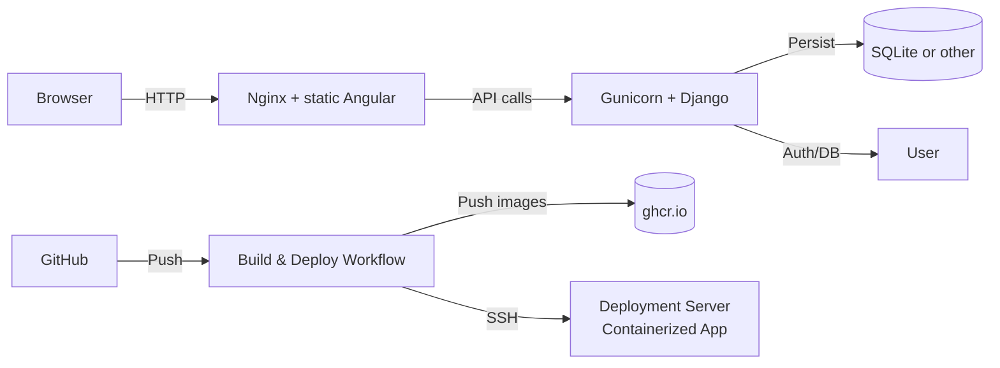

# Conduit CI/CD

This project involves creating a CI/CD workflow (with GitHub Actions) in GitHub, including deployment and execution of a containerized application on a remote server.

## Table of Contents

- [Project description](#project-description)
- [Repository contents](#repository-contents)
- [Quickstart](#quickstart)
  - [Prerequisites](#prerequisites)
  - [Local quick start](#local-quick-start)
- [Usage / Configuration](#usage--configuration)
  - [Environment variables (.env)](#environment-variables-env)
  - [Frontend runtime config (env-config.js)](#frontend-runtime-config-env-configjs)
  - [Backend initialization and migrations](#backend-initialization-and-migrations)
  - [Docker Compose notes](#docker-compose-notes)
- [CI/CD pipeline (GitHub Actions)](#cicd-pipeline-github-actions)
  - [Tagging rules](#tagging-rules)
  - [Secrets required in GitHub](#secrets-required-in-github)
  - [How deploy works (high level)](#how-deploy-works-high-level)
  - [Notes about GHCR permissions and testing locally (act)](#notes-about-ghcr-permissions-and-testing-locally-act)
- [Architecture diagram](#architecture-diagram)
- [Troubleshooting](#troubleshooting)
- [Development tips and recommended improvements](#development-tips-and-recommended-improvements)

---

## Project description

This repository contains a full example of containerized local development and a GitHub Actions CI/CD pipeline for the **Conduit** demo application. The stack includes:

- an Angular frontend (served by Nginx)
- a Django backend (served by Gunicorn)
- a small CI/CD pipeline that builds images, pushes them to GHCR and deploys them to a remote v-server over SSH
- on-the-fly generation of the `docker-compose.yml` and `.env` files on the remote host so **no secrets or environment files are stored in the repo**

The goal is to provide a practical template you can adapt to your own small full‑stack projects.

---

## Repository contents

```
conduit-cicd/
├── .github/
│   └── workflows/
│       └── deployment.yml         # GitHub Actions workflow (build & deploy)
├── compose.yml                    # docker-compose used for local testing
├── docker-compose.deployment.yml  # docker-compose used on server
├── conduit-frontend/
│   ├── Dockerfile                 # frontend multi-stage build + nginx
│   ├── default.conf               # nginx site configuration
│   ├── entrypoint.sh              # writes /assets/env-config.js at container start
│   └── src/                       # angular source code
├── conduit-backend/
│   ├── Dockerfile                 # django/gunicorn image
│   ├── manage.py
│   ├── requirements.txt
│   ├── <django app files>
│   └── db/                         # folder to hold the sqlite db file (created after first start)
├── example.env                     # example environment file for local testing
└── README.md
```

> Note: The deployment path on the remote server used by the workflow is `~/deployments/<repo-name>`. The workflow will create this directory and write `docker-compose.yml` and `.env` there.

---

## Quickstart

### Prerequisites

- Docker + Docker Compose (local)
- Node.js + npm (optional — run frontend outside Docker during dev)
- Python 3.6+ (optional — run backend outside Docker during dev)
- A GitHub repository with Actions enabled
- A v-server reachable by SSH (you need to create a `deploymentuser` there and add the public key)

### Local quick start

1. Clone the repository:

```bash
git clone https://github.com/<your-user-or-org>/conduit-cicd.git
cd conduit-cicd
```

2. Create `.env` from `example.env` and adjust values if needed:

```bash
cp example.env .env
# edit .env to suit local ports and flags
```

3. Start locally:

```bash
docker compose up --build
```

4. Open the frontend: `http://localhost:8282` and the backend API at `http://localhost:8000/api`.

---

## Usage / Configuration

### Environment variables (.env)

All runtime values come from an `.env` file used by `docker compose`. For local testing we use `example.env` as a template — **do not commit** a real `.env` with secrets.

Important variables (examples):

| Variable        | Description                            | Example               |
|-----------------|----------------------------------------|-----------------------|
| FRONTEND_PORT   | Port exposed by Angular frontend       | 8282                  |
| BACKEND_PORT    | Port exposed by Django backend         | 8000                  |
| DJANGO_SU_NAME  | Initial Django superuser username      | admin                 |
| DJANGO_SU_EMAIL | Initial Django superuser email         | `<admin@example.com>`     |
| DJANGO_SU_PASSWORD | Initial Django superuser password   | secret                |
| ALLOWED_HOSTS   | Django allowed hosts (comma separated) | 127.0.0.1,localhost   |
| CORS_ORIGINS    | Allowed frontend origins               | `<http://localhost:8282>` |
| SECRET_KEY      | Django secret key                      | +3@v7$v1f8yt0!s)3     |
| DEBUG           | Debug mode (True/False)                | True                  |
| SERVERIP        | IP/Hostname of vServer                 | 1.2.3.4               |
| CORS_ORIGINS    | IP/Hostnames of vServer                | 1.2.3.4               |

Example:

```text
FRONTEND_PORT=8282
BACKEND_PORT=8000
DJANGO_SU_NAME=admin
DJANGO_SU_EMAIL=admin@example.com
DJANGO_SU_PASSWORD=admin
ALLOWED_HOSTS=localhost,127.0.0.1
CORS_ORIGINS=http://localhost:8282
SECRET_KEY='replace-with-a-random-secret'
DEBUG=True
SERVERIP=localhost
CORS_ORIGINS=localhost,http://localhost:8282
```

The GitHub Actions deployment will generate an `.env` on the remote server populated from GitHub Secrets (names are listed in the “Secrets required” section).

### Frontend runtime config (env-config.js)

To avoid rebuilding the Angular app on every environment change, the frontend uses a tiny runtime file `assets/env-config.js` that sets a `window.__env` object read by the app at runtime.

The Nginx entrypoint (in the container) writes `assets/env-config.js` using environment variables provided to the container. Example `entrypoint.sh` (in repo):

```sh
#!/bin/sh
set -e
ENV_FILE=/usr/share/nginx/html/assets/env-config.js
cat <<EOF > $ENV_FILE
(function (window) {
  window.__env = window.__env || {};
  window.__env.apiUrl = "http://${SERVERIP}:${BACKEND_PORT}";
})(this);
EOF
exec "$@"
```

Make sure variable names match your `.env` (`BACKEND_PORT` not `BACKENDPORT`). With this approach you **do not** need `environment.ts` inside the Angular build — the build is environment-agnostic and the runtime file sets the API base URL.

> Local dev: if you run `ng serve`, create a small local `src/environments/environment.ts` that exports `environment.apiUrl` to point to your local backend; the runtime file only matters when serving the built static files via Nginx.

### Backend initialization and migrations

The project includes a `backend-init` service used to run migrations and create a superuser on first deploy. This can be implemented as a short-lived container that mounts the same volume used by the backend DB file. Example `docker-compose` snippet (production/remote):

```yaml
backend-init:
  image: ghcr.io/<owner>/<repo>/backend:${TAG}
  restart: "no"
  env_file: .env
  command: >
    sh -c "python manage.py migrate --noinput && \
           DJANGO_SUPERUSER_PASSWORD=\"${DJANGO_SU_PASSWORD}\" \
           python manage.py createsuperuser --noinput \
           --username \"${DJANGO_SU_NAME}\" --email \"${DJANGO_SU_EMAIL}\" \
           || echo 'superuser exists or create returned non-zero (ignored)'"
  volumes:
    - backend-db:/app/db
```

`backend` then uses the same named volume for `/app/db` (or whatever path you place SQLite in). This ensures the DB file survives container restarts but does not override application code contained in the image (do not mount `/app` entirely if you want to keep image content).

### Docker Compose notes

- For local testing you keep `compose.yml` in the repo. For remote deploy, the workflow generates an inline `docker-compose.yml` and writes it to the remote server; that compose references images by `ghcr.io/<owner>/<repo>/frontend:<TAG>` and `.../backend:<TAG>` so the server simply `docker compose pull` and `up -d`.
- Persist only the DB file via a named volume (e.g. `backend-db:/app/db`) to avoid hiding code baked into the image.
- Use `depends_on` carefully — `backend-init` should run before the backend container (or you can run `docker compose run backend python manage.py migrate ...` from the server command line).

---

## CI/CD pipeline (GitHub Actions)

A produced example workflow `deployment.yml` does the following (high level):

- `on: push` for branches `main`, `develop`, `feature/**`, `release/**` (and `pull_request` for checks)
- `build` job (matrix: frontend, backend):
  - checkout code
  - log in to GHCR (`docker/login-action@v2`)
  - compute a tag based on branch:
    - `main` → `main-YYYY-MM-DD-HH-MM`
    - `develop` → `develop-YYYY-MM-DD-HH-MM`
    - `feature/xyz` → `xyz-YYYY-MM-DD-HH-MM`
    - `release/1.2.3` → `v1.2.3`

- `deploy` job (runs after build):
  - uses SSH key (secret) to connect to server
  - creates `~/deployments/<repo-name>/docker-compose.yml` and `.env` from secrets and the computed tag(s)
  - runs `docker compose pull` and `docker compose up -d --force-recreate`

### Tagging rules

- `main`: tag `main-YYYY-MM-DD-HH-MM`
- `develop`: tag `develop-YYYY-MM-DD-HH-MM`
- `feature/*`: tag `feature-name-YYYY-MM-DD-HH-MM`
- `release/*`: tag `vX.Y.Z` (semantic release tag)

This lets you deploy feature-specific images to test environments and keep `main` and `develop` trackable by time-based tags.

### Secrets required in GitHub

Put these keys into your repository Secrets (or Environment secrets if you prefer):

- `DEPLOYMENT_USER` — the SSH user on target server (e.g. `deploymentuser`)
- `DEPLOYMENT_HOST` — the server IP/host
- `DEPLOYMENT_KEY` — private SSH key content for the deployment user
- `FRONTEND_PORT`, `BACKEND_PORT` — ports used on the server
- `DJANGO_SU_NAME`, `DJANGO_SU_EMAIL`, `DJANGO_SU_PASSWORD` — initial superuser creation
- `SECRET_KEY`, `DEBUG`, `ALLOWED_HOSTS` — Django settings
- `CORS_ORIGINS` — comma-separated allowed origins for Django
- `DEPLOYMENT_HOST_FINGERPRINT` - The fingerprint of the deployment server
- Optionally `GHCR_TOKEN` if you want to use a personal access token with `write:packages` instead of `GITHUB_TOKEN` for GHCR pushes (useful for `act` local testing)

> Do not store secrets in the repository. The workflow uses these secrets to generate `.env` on the server at deploy time.

### How deploy works (high level)

1. Build images and push to GHCR
2. SSH to the server and upload a temporary `.env.deploy` and `docker-compose.deployment.yml` file
3. On the server: Copy the temp `docker-compose.deployment.yml` into `~/deployments/<repo>/docker-compose.yml` referencing the pushed images with the computed tag
4. Copy the temp `.env.deploy` into `~/deployments/<repo>/.env`
5. Run `docker compose pull` and `docker compose up -d --force-recreate` so the server pulls the new image and restarts containers

### Notes about GHCR permissions and testing locally (`act`)

- For GHCR pushes `GITHUB_TOKEN` generally works but the workflow must set `permissions: packages: write`. If you use `act` locally you may need to create a PAT (`write:packages`) and set `GHCR_TOKEN` so `docker login` works inside `act`'s runner.
- If you encounter `write:packages` permission errors, verify the repo visibility and token scopes as GHCR ownership/policies differ for personal repos vs orgs.

---

## Architecture diagram



---

## Troubleshooting

**1) GHCR push fails with `write:packages`**

- Ensure workflow sets `permissions: packages: write` and you use a token with matching permissions. In many cases `GITHUB_TOKEN` is sufficient; for `act` use a PAT with `write:packages` and set `GHCR_TOKEN` secret.

**2) SSH failures**

- Ensure the private key in `DEPLOYMENT_HOST_FINGERPRINT` matches the fingerprint of the server and is in GitHub secrets.
- Ensure the private key in `DEPLOYMENT_KEY` matches the public key in the remote user's `~/.ssh/authorized_keys`.
- Ensure `deploymentuser` exists and is in the `docker` group so it can run Docker without sudo (or the workflow uses `sudo` appropriately).

**3) CORS "Missing Allow Origin" in browser**

- Confirm `CORS_ORIGINS` in `.env` contains the frontend origin including port (e.g. `http://94.130.59.211:8282`).
- Verify Django reads the variable correctly (e.g. `os.environ.get("CORS_ORIGINS", "")`). For older Django you may need a tuple: `tuple(os.environ.get("CORS_ORIGINS", "").split(","))`.
- Check that the frontend runtime `env-config.js` points to the correct backend URL (including port). A bug in `entrypoint.sh` where variable names differ (e.g. `BACKENDPORT` vs `BACKEND_PORT`) can break runtime config.

**4) Changes not picked up on server after deploy**

- Confirm that the server actually pulled the new image (check image tags & digests with `docker images` and `docker inspect`).
- If you persist `/app` fully as a volume, the mounted directory will mask files baked into the image. Persist only the DB file or a `db/` directory instead.

**5) SQLite DB file & volumes**

- Create a `db/` directory in the project and point SQLite to `db/db.sqlite3` in `settings.py`. Then mount only that file/directory as a volume: `- backend-db:/app/db`. This preserves DB across redeploys without hiding app code.

---

## Development tips and recommended improvements

- **Use a production-grade DB** (Postgres) for any real deployments rather than SQLite. SQLite is fine for demo and learning.
- **Health checks and readiness probes**: consider adding `HEALTHCHECK` to Dockerfiles or use an external monitoring job (or docker-compose `depends_on` conditions) to ensure the app is healthy before marking deployment successful.
- **Blue/Green or Canary** deployments: for increased safety, push new images to a different tag and test them before switching traffic. The current pipeline uses timestamped tags and overwrites `latest` (or sets `develop-latest`) for convenience.
- **Secrets**: rotate and manage them via GitHub Environments or a secret manager for multiple environments.
- **Unit & integration tests**: add a PR-triggered job that runs the test matrix (lint, unit tests, integration tests) and prevents pushing images when tests are failing.

---

:::important
Keep secrets out of commits; use `example.env` for sample values.
:::
