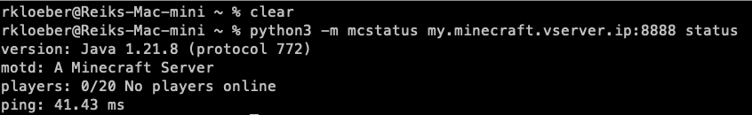

# Minecraft Server

The goal of this project is to dockerize a Minecraft Server.

## Table of content

1. [Prerequisites](#prerequisites)
2. [Quickstart](#quickstart)
3. [Usage](#usage)

### Prerequisites

- Git
- Docker
- Docker Compose v2

### Quickstart

- Open a terminal

- Navigate to a folder of choice

```bash
cd my/test/folder
```

- Clone the project

```bash
git clone https://github.com/reiloe/minecraft.git
```

- Navigate into the root folder (named minecraft)

```bash
cd minecraft
```

- Create a folder named server

```bash
mkdir server
```

- copy and rename [example.server.properties](example.server.properties) into server folder

```bash
cp example.server.properties ./server/server.properties
```

:::caution  
You have to accept the [EULA](https://www.minecraft.net/de-de/eula) to run the Minecraft server !
To do so you have to provide a file eula.txt with eula=true inside
:::

- copy and rename [example.eula.txt](example.eula.txt) into server folder

```bash
cp example.eula.txt ./server/eula.txt
```

- run the following command:

```bash
docker compose up
```

### Usage

After the [Quickstart](#quickstart) the Minecraft server is up and running with default settings.

You can ckeck by connecting to the server via your minecraft launcher with the IP of your server.

:::tip
Use a tool (eg. [mcstatus](https://github.com/py-mine/mcstatus) to test that your server is up and running.  
After the installation of the mcstatus tool run[^1]

```bash
python3 -m mcstatus hereComesTheAddressOfYourMinecraftServer status
```

eg: python3 -m mcstatus 1.2.3.4:8888 status

:::

[^1]: To use this tool you need Python installed on your maschine

Changes to the server.properties file can be used to customize the Minecraft server ([Read more](https://minecraft.wiki/w/Server.properties))

Before changing the settings, you should shut down the Minecraft server.

```bash
docker compose stop
```

After you have customized the file, start the server with the new settings.

```bash
docker compose start
```

For other settings like Whitelist visit the [Minecraft-Wiki](https://minecraft.wiki/w/Tutorial:Setting_up_a_Java_Edition_server)
